# Product Requirements Document (PRD) — HeriStepAI v1.0

| Thuộc tính | Giá trị |
|------------|---------|
| **Phiên bản** | 1.0 |
| **Ngày** | 2026-04-22 |
| **Trạng thái** | Hoàn thành|

---

## 1. Overview & Goals

### 1.1 Tổng quan sản phẩm

HeriStepAI là hệ thống **thuyết minh / khám phá địa điểm** kết hợp **GPS & geofencing**, **bản đồ**, **nội dung đa ngôn ngữ**, **TTS**, và **ghi nhận lượt ghé** (`VisitLogs`) phục vụ **Admin**, **ShopOwner** (Web) và **khách du lịch** (Mobile).

### 1.2 Mục tiêu (Goals)

| ID | Goal | Đo lường gợi ý |
|----|------|----------------|
| **G-01** | Khách **nghe thuyết minh** khi vào vùng POI (geofence) hoặc khi tương tác bản đồ | Visit có `VisitType = Geofence` / `MapClick` |
| **G-02** | **Vận hành nội dung POI** (ảnh, mô tả, đa ngôn ngữ) qua Web | CRUD POI thành công; ảnh lên Supabase |
| **G-03** | **Thống kê** từ dữ liệu thật (dashboard, analytics) | Truy vấn `VisitLogs`; summary / top POI |
| **G-04** | **Offline-first POI** trên Mobile | Sync API → SQLite; không xóa cache khi API null/empty |

---

## 2. In-scope / Out-of-scope (MVP theo repo)

### 2.1 Trong phạm vi (đã có trong codebase)

| # | Module | Mô tả ngắn |
|---|--------|------------|
| 1 | **Auth (Web)** | Đăng nhập email/password → API `auth/login` → Cookie + JWT `AuthToken`; redirect Admin vs ShopOwner |
| 2 | **Subscription (Mobile)** | Chọn gói (Daily/Weekly/Monthly/Yearly) → quét QR VietQR → xác nhận → `SecureStorage` |
| 3 | **Admin Web** | Dashboard (API), **Duyệt chủ quán** (API), POI **xem/sửa/toggle** (API + DB), Analytics (API), upload ảnh — **không** tạo POI kèm tạo owner |
| 4 | **ShopOwner Web** | **Đăng ký** (API công khai) → chờ duyệt → đăng nhập; Dashboard / **Tạo POI** / Edit / Statistics — **DbContext** PostgreSQL |
| 5 | **API** | JWT, POI, POIContent (trong payload), analytics/visit → `VisitLogs`, analytics summary/top/statistics |
| 6 | **Mobile** | AppShell, Map (Leaflet WebView), POI list/detail, **Tour gợi ý + TourDetail + Bắt đầu tour**, Settings, SQLite cache |
| 7 | **Dữ liệu** | PostgreSQL: `Users`, `POIs`, `POIContents`, `VisitLogs` (nghiệp vụ); bảng `Analytics` entity **legacy, không dùng** |
| 8 | **POI Payment (Web + API)** | ShopOwner tạo POI → báo thanh toán (Web `POST /ShopOwner/ReportPayment`, DbContext) → Admin đối soát (`/POIPayments`) → Xác nhận kích hoạt POI / Từ chối; trạng thái: `Pending / Verified / Rejected` |
| 9 | **Heatmap vị trí (Web + API)** | Admin xem mật độ du khách theo vị trí GPS thực tế; chỉ tính `VisitType = Geofence`; lọc theo 7 ngày / 30 ngày / tất cả; POI markers hover tooltip |
| 10 | **Heartbeat / Online Now (Mobile + API)** | Mobile gửi heartbeat mỗi 5 giây; API dùng `HeartbeatTracker` (ConcurrentDictionary, TTL 15s) để đếm thiết bị đang online; Admin xem qua `GET /analytics/online-now` |

### 2.2 Ngoài phạm vi (hiện không có trong repo — không mô tả như đã ship)

| Mục | Ghi chú |
|-----|---------|
| **Admin “Tour Management”** kiểu CRUD + sắp thứ tự POI lưu DB | Tour trên app là **generate client-side** + `TourId` tùy chọn trên POI trong API; không có màn Web quản lý tour độc lập |
| **POI major/minor** (WC, bán vé, gửi xe, bến thuyền) | Chưa có trong model/UI; đang dùng `Category` (POICategory) + `FoodType` (ẩm thực) |
| **Thanh toán / booking** | Không có |
| **SLA / DR đầy đủ** | Ngoài phạm vi PRD kỹ thuật vận hành |

---

## 3. Personas & Roles

| Role | Giá trị trong hệ thống | Kênh | Quyền chính |
|------|------------------------|------|-------------|
| **Admin** | `Role = 1` (claim) | Web | Dashboard, **duyệt/từ chối** đăng ký ShopOwner, POI **xem/sửa** (API/DbContext), analytics, **xác nhận/từ chối POI Payment** (`/POIPayments`), **xác nhận/từ chối thanh toán gói Mobile** (`/SubscriptionPayments`) — **không** luồng “tạo POI + tạo owner” |
| **ShopOwner** | `Role = 2` | Web | **Đăng ký** (`ApprovalStatus` Pending → Approved); chỉ POI `OwnerId` = mình; **tự tạo POI** sau khi được duyệt; **báo thanh toán kích hoạt POI** (Web `POST /ShopOwner/ReportPayment`); DbContext |
| **Guest/Subscriber (Mobile)** | Không dùng account/role | Mobile | Thanh toán gói, xem POI/map/tour, geofence, visit log |
| **Anonymous API** | — | Mobile/API | Một số `GET /api/poi` và `POST /api/analytics/visit` có thể public (theo cấu hình API) |

---

## 4. Danh mục màn hình & hành vi UI (theo code)

### 4.1 Web (`HeriStepAI.Web`)

| Màn / nhóm | Route chính | State / hành vi |
|------------|-------------|------------------|
| Login | `/Auth/Login` | Form; lỗi `ViewBag.Error`; **403** ShopOwner Pending/Rejected → thông báo từ API; redirect khi OK |
| Đăng ký chủ quán | `/Auth/RegisterShopOwner` | Form công khai → `POST api/auth/register-shop-owner` → chờ Admin duyệt |
| Admin Dashboard | `/Home/Dashboard` | Metrics qua API; nút **Duyệt đăng ký chủ quán** |
| Approvals | `/Approvals` | Danh sách pending; **Duyệt** / **Từ chối** qua API |
| POI Index | `/POI` | Danh sách (sort theo **Priority** rồi thời gian); **GET /POI/Create** redirect về Index (Admin không tạo POI mới) |
| POI Edit / Details | `/POI/...` | Admin sửa POI có sẵn (DbContext/API tùy flow); upload ảnh Supabase |
| Analytics | `/Analytics` | Admin; top POI + breakdown (API) |
| Devices | `/Devices` | Admin; danh sách thiết bị ẩn danh (`dev_XXXXXX`) từ `VisitLogs`; thống kê ActiveToday / 7 ngày / 30 ngày; phân trang 50 item. `XXXXXX` = `SubscriptionService.DeviceKey` → khớp trực tiếp với cột DeviceKey trong `/SubscriptionPayments` |
| POI Payments | `/POIPayments` | Admin; tổng hợp `Pending/Verified/Rejected`; xác nhận → POI.IsActive = true; từ chối → POI vẫn inactive |
| Subscription Payments | `/SubscriptionPayments` | Admin; đối soát gói thanh toán Mobile; xác nhận → tính `SubscriptionExpiresAtUtc`; từ chối → không kích hoạt |
| **Heatmap vị trí** | `/Heatmap` | Admin; bản đồ Leaflet + leaflet-heat; chỉ điểm `Geofence`; lọc 7d/30d/all; chấm POI hover tooltip |
| ShopOwner Dashboard / **Create** / Edit / Statistics | `/ShopOwner/...` | **Tạo POI** mới + DbContext; 403/NotFound nếu không sở hữu POI |

### 4.2 Mobile (`HeriStepAI.Mobile`)

| Màn | Hành vi chính |
|-----|----------------|
| `SubscriptionPage` | Chọn gói, QR thanh toán, xác nhận; lỗi validation |
| `MainPage` | Tour cards từ `TourGeneratorService`; chọn tour → `TourDetailPage` |
| `TourDetailPage` | Danh sách POI tour; **Bắt đầu Tour** → `TourSelectionService` → `//MapPage` |
| `MapPage` | WebView map; geofence; visit log; loading map async |
| `POIListPage` / `POIDetailPage` | List/detail; TTS |
| `SettingsPage` | Ngôn ngữ, logout |

**State chung:** loading / empty / error — theo từng ViewModel (sync POI, API fail vẫn có thể hiện SQLite).

**HeartbeatService:** Khởi động cùng app (`App.xaml.cs`); gửi `POST /api/analytics/heartbeat` mỗi 5 giây; dừng khi app close. Không block UX nếu API fail.

---

## 5. User Stories

| ID | Module | User story | Priority |
|----|--------|------------|----------|
| **US-01** | Auth Web | Là **Admin hoặc ShopOwner**, tôi đăng nhập bằng email/mật khẩu để vào đúng dashboard vai trò của mình. | Must |
| **US-02** | Admin POI | Là **Admin**, tôi xem danh sách POI và trạng thái active để vận hành hệ thống. | Must |
| **US-03** | ShopOwner POI | Là **ShopOwner** (đã duyệt), tôi **tự tạo POI** (form Web + upload ảnh) để khách thấy trên app. | Must |
| **US-03b** | Admin duyệt | Là **Admin**, tôi **duyệt hoặc từ chối** đăng ký chủ quán để họ được đăng nhập hoặc không. | Must |
| **US-04** | Admin POI | Là **Admin**, tôi sửa/xóa/toggle active POI để cập nhật nội dung. | Must |
| **US-05** | Admin Analytics | Là **Admin**, tôi xem tổng quan lượt ghé và top POI (từ `VisitLogs`) để ra quyết định. | Should |
| **US-06** | ShopOwner | Là **ShopOwner**, tôi chỉ thấy và sửa POI của mình và xem thống kê visit. | Must |
| **US-07** | Mobile Subscription | Là **khách**, tôi chọn gói và xác nhận thanh toán để mở khóa app mà không cần đăng nhập. | Must |
| **US-08** | Mobile POI | Là **khách**, tôi xem danh sách/bản đồ POI ngay cả khi offline (cache SQLite). | Must |
| **US-09** | Mobile Geofence | Là **khách**, khi vào vùng POI tôi được thuyết minh và hệ thống ghi nhận visit (nếu API khả dụng). | Must |
| **US-10** | Mobile Tour | Là **khách**, tôi chọn tour gợi ý, xem chi tiết và **bắt đầu tour** để bản đồ chỉ tập POI trong tour. | Should |

---

## 6. Functional Requirements (FR)

### 6.1 Xác thực & phiên

| ID | Yêu cầu |
|----|---------|
| **FR-AUTH-01** | Web: POST login form → gọi `POST /api/auth/login` → set cookie session + `AuthToken` (JWT). |
| **FR-AUTH-02** | Web: sau login, **Admin** → `/Home/Dashboard`; **ShopOwner** → `/ShopOwner/Dashboard`. |
| **FR-AUTH-03** | Mobile: lưu trạng thái subscription (`SecureStorage`); kiểm tra còn hạn khi mở app — không cần đăng nhập. |
| **FR-AUTH-04** | API: mật khẩu hash BCrypt; JWT TTL theo cấu hình (vd. 24h). |
| **FR-AUTH-05** | ShopOwner: `POST api/auth/login` trả **403** nếu `ApprovalStatus` = Pending hoặc Rejected (JSON `Message`). |
| **FR-AUTH-06** | Đăng ký chủ quán công khai: `POST api/auth/register-shop-owner` → `ApprovalStatus = Pending`. Admin: `GET .../pending-shop-owners`, `POST .../approve-shop-owner/{id}`, `POST .../reject-shop-owner/{id}`. |

### 6.2 POI (API + Web)

| ID | Yêu cầu |
|----|---------|
| **FR-POI-01** | `GET /api/poi` trả danh sách **đã sắp xếp**: `OrderByDescending(Priority)`, rồi `Id` (ổn định). Mobile sync dùng thứ tự này. |
| **FR-POI-02** | `POST /api/poi` chỉ **ShopOwner** (JWT); `OwnerId` lấy từ token — Admin **không** tạo POI qua API. |
| **FR-POI-03** | Admin/Web: sửa POI có sẵn qua Web (DbContext) hoặc flow API tùy màn; ảnh upload Supabase. |
| **FR-POI-04** | Trường **`Priority`** (1–3): khi **nhiều POI trong cùng vùng geofence**, app chọn POI có **Priority cao hơn**; **cùng Priority** thì **gần GPS hơn** (Haversine). |
| **FR-POI-05** | Hỗ trợ category (`POICategory`), `FoodType`, giá, `TourId`, `EstimatedMinutes`, `Contents` đa ngôn ngữ. |

### 6.3 ShopOwner (Web + DbContext)

| ID | Yêu cầu |
|----|---------|
| **FR-SHOP-01** | Chỉ truy cập POI có `OwnerId` = user hiện tại. |
| **FR-SHOP-02** | Statistics/Dashboard aggregate từ `VisitLogs` + POI của owner. |
| **FR-SHOP-03** | Tạo POI mới qua `/ShopOwner/Create` (POST DbContext + upload ảnh + đồng bộ dịch nếu có). |

### 6.4 Analytics & visit

| ID | Yêu cầu |
|----|---------|
| **FR-ANA-01** | Mọi metric dashboard/API **tính từ `VisitLogs`** (không dùng bảng entity `Analytics`). |
| **FR-ANA-02** | Mobile/API: `POST .../analytics/visit` ghi `VisitLog` với `VisitType` (Geofence, MapClick, QRCode). Visit được kích hoạt từ 3 điểm: (1) Geofence trigger, (2) Click "Nghe thuyết minh" trên Map popup (JS bridge → `POISelectedCommand`), (3) Click "Nghe thuyết minh" trên `POIDetailPage`. |
| **FR-ANA-03** | Người dùng ẩn danh (không đăng nhập) được nhận diện bằng **Device ID** có dạng `dev_XXXXXX` — trong đó `XXXXXX` là `SubscriptionService.DeviceKey` (6 ký tự hex uppercase, SHA-256 của thông tin thiết bị, lưu trong `SecureStorage["sub_device_key"]`). `UserId` trong `VisitLog` = `"dev_" + DeviceKey` khi ẩn danh, = account ID khi đã đăng nhập. Cách này liên kết trực tiếp visit log (`dev_XXXXXX`) với bản ghi thanh toán gói (`XXXXXX`) mà không cần bảng mapping. |
| **FR-ANA-04** | Admin xem thống kê thiết bị qua `/Devices`: danh sách `DeviceId`, số lượt visit, số POI đã ghé, lần đầu/lần cuối truy cập; tóm tắt ActiveToday / 7 ngày / 30 ngày. |
| **FR-ANA-05** | Admin xem **heatmap vị trí** tại `/Heatmap`: bản đồ Leaflet kết hợp `leaflet-heat`; chỉ lấy điểm có `VisitType = Geofence` và lat/lng không null; hỗ trợ lọc `startDate` (7d/30d/all); POI markers hiển thị tên khi hover. |
| **FR-ANA-06** | **Heartbeat / Online Now**: Mobile gửi `POST /api/analytics/heartbeat` (AllowAnonymous) mỗi 5 giây kèm `UserId`; API lưu vào `HeartbeatTracker` (ConcurrentDictionary in-memory, TTL 15s); Admin gọi `GET /analytics/online-now` để lấy số thiết bị đang hoạt động. Dữ liệu không persist vào DB. |

### 6.5 Mobile — Tour (như đã code)

| ID | Yêu cầu |
|----|---------|
| **FR-TOUR-01** | `TourGeneratorService` tạo danh sách tour từ POI (nhóm theo food type / heuristics hiện có). |
| **FR-TOUR-02** | `StartTour` gán `TourSelectionService.SelectedTour` và điều hướng `//MapPage`. |
| **FR-TOUR-03** | `MapPageViewModel` ưu tiên `SelectedTour.POIs` nếu có; không thì full POI SQLite. |

### 6.6 API (REST) — tối thiểu

| ID | Yêu cầu |
|----|---------|
| **FR-API-01** | `POST /api/auth/login` (Web — Admin/ShopOwner). ShopOwner **403** nếu `ApprovalStatus` ≠ Approved. Mobile không gọi auth. |
| **FR-API-01b** | `POST /api/auth/register-shop-owner` (công khai). `GET /api/auth/pending-shop-owners`, `POST .../approve-shop-owner/{id}`, `POST .../reject-shop-owner/{id}` (Admin JWT). |
| **FR-API-02** | `GET /api/poi` (sort **Priority** desc). `POST /api/poi` — **ShopOwner** JWT. `GET /api/poi/{id}`, `GET /api/poi/{id}/content/{lang}`, `GET /api/poi/my-pois` (ShopOwner). |
| **FR-API-03** | Analytics: `GET .../analytics/summary`, `.../top-pois`, `.../visit`, statistics theo POI. |

---

## 7. Acceptance Criteria (Given – When – Then)

| US ID | Given | When | Then |
|-------|-------|------|------|
| **US-01** | Tôi đang ở `/Auth/Login` | Nhập email/password hợp lệ và submit | Redirect đúng Admin hoặc ShopOwner dashboard; cookie auth có |
| **US-01** | Credentials sai | Submit | Ở lại login; thông báo lỗi |
| **US-03** | Tôi là ShopOwner đã Approved | Submit form **Create POI** (`/ShopOwner/Create`) đủ field | POI gắn `OwnerId` = tôi; sync mobile thấy sau khi pull |
| **US-03b** | Tôi là Admin | Duyệt hoặc từ chối chủ quán pending | Trạng thái `ApprovalStatus` cập nhật; Approved mới đăng nhập được |
| **US-04** | POI tồn tại | Admin toggle active | Trạng thái `IsActive` cập nhật qua API; app phản ánh sau sync |
| **US-06** | Tôi là ShopOwner | Mở Edit POI của người khác | NotFound / không cho sửa |
| **US-08** | Đã sync SQLite trước đó | Mở app không mạng | Vẫn thấy danh sách POI từ `pois.db` |
| **US-09** | GPS trong vòng `Radius` | Geofence trigger | Phát narration (hoặc queue); gọi visit log (best-effort) |
| **US-10** | Đang ở TourDetail | Bấm **Bắt đầu Tour** | `SelectedTour` được set; điều hướng Map; POI trên map là tập tour **nếu** `LoadPOIsAsync` chạy sau khi tour đã set (xem Open Questions) |

---

## 8. Non-functional Requirements (tối thiểu)

| ID | Loại | Yêu cầu |
|----|------|---------|
| **NFR-01** | Bảo mật | JWT bảo vệ endpoint nhạy cảm; không log mật khẩu; secret qua env |
| **NFR-02** | Validation | Web/Mobile validate input bắt buộc; API trả 4xx với message có thể hiển thị |
| **NFR-03** | Lỗi | API lỗi → Web dùng `TempData`/ViewBag; Mobile không block UX vì visit log fail |
| **NFR-04** | Logging | Log server console / debug; mobile `AppLog` / Debug |
| **NFR-05** | Performance | Dashboard Admin gọi song song nhiều API; map HTML generate async tránh ANR |
| **NFR-06** | i18n | Mobile: `LocalizationService` cho label; POI content theo ngôn ngữ |

---

## 9. Data Requirements (field-level)

### 9.0 User (Web/API)

| Field | Kiểu | Ghi chú |
|-------|------|---------|
| `ApprovalStatus` | enum `AccountApprovalStatus` | **Pending** / **Approved** / **Rejected** — đăng ký chủ quán công khai; chỉ **Approved** mới login Web được. |

### 9.1 POI (API `HeriStepAI.API.Models.POI` — cho UI/Web/Mobile sync)

| Field | Kiểu | Ghi chú UI |
|-------|------|------------|
| `Id` | int | PK |
| `Name` | string | Bắt buộc hiển thị |
| `Description` | string | Chi tiết |
| `Latitude`, `Longitude` | double | Bản đồ / geofence |
| `Address` | string? | Địa chỉ |
| `Radius` | double | mét — vòng geofence, mặc định 50 |
| `Priority` | int | **1–3**; **nhiều POI trong cùng geofence** → **cao hơn** trước; **cùng Priority** → **gần GPS hơn** (Haversine) |
| `OwnerId` | int? | ShopOwner |
| `ImageUrl` | string? | Ảnh |
| `MapLink` | string? | Link ngoài (nếu dùng) |
| `IsActive` | bool | Ẩn/hiện |
| `Rating`, `ReviewCount` | double?, int | UI giới thiệu |
| `Category` | int | Enum `POICategory` |
| `TourId` | int? | Gợi ý nhóm; không thay cho “Tour CRUD” |
| `EstimatedMinutes` | int | Thời gian ước tính |
| `FoodType` | int | 0–6 theo model API |
| `PriceMin`, `PriceMax` | long | VND |
| `Contents` | list | `POIContent` |

### 9.2 POIContent

| Field | Kiểu | Ghi chú |
|-------|------|---------|
| `Language` | string | vd. `vi`, `en` |
| `TextContent` | string | TTS / hiển thị |
| `AudioUrl` | string? | Ưu tiên phát file nếu có |

### 9.3 VisitLog (analytics)

| Field | Kiểu | Ghi chú |
|-------|------|---------|
| `POId` | int | FK POI |
| `UserId` | string? | Nullable |
| `VisitTime` | DateTime | UTC |
| `Latitude`, `Longitude` | double? | |
| `VisitType` | enum | Geofence, MapClick, QRCode |
| `DurationSeconds` | int? | |

### 9.4 Tour (Mobile model — **không** là entity PostgreSQL trong PRD này)

| Field | Mô tả |
|-------|--------|
| `Id`, `Name`, `Description` | Hiển thị card tour |
| `EstimatedMinutes`, `POICount`, `PriceMin/Max` | Thống kê gợi ý |
| `POIs` (runtime list) | Thứ tự POI trong tour trên client |

---

## 10. API Assumptions (interface — không bắt buộc implement trong PRD)

Base: `/api/...` — versioning do team quy ước.

| Method | Path | Mục đích |
|--------|------|----------|
| POST | `/auth/login` | JWT + user info; **403** nếu ShopOwner chưa duyệt |
| POST | `/auth/register-shop-owner` | Đăng ký chủ quán công khai → Pending |
| GET | `/auth/pending-shop-owners` | Admin — danh sách chờ duyệt |
| POST | `/auth/approve-shop-owner/{id}` | Admin — duyệt |
| POST | `/auth/reject-shop-owner/{id}` | Admin — từ chối |
| GET | `/poi` | Danh sách POI (sort **Priority** desc) |
| GET | `/poi/{id}` | Chi tiết |
| POST | `/poi` | **ShopOwner** JWT — tạo POI |
| PUT/DELETE | `/poi/{id}` | Sửa/xóa (policy hiện tại) |
| GET | `/poi/{id}/content/{language}` | Nội dung theo ngôn ngữ |
| GET | `/poi/my-pois` | ShopOwner |
| POST | `/analytics/visit` | Ghi visit (AllowAnonymous; userId từ JWT claim nếu authed, từ body nếu ẩn danh) |
| GET | `/analytics/summary`, `/analytics/top-pois`, … | Dashboard (Admin JWT) |
| GET | `/analytics/devices` | Danh sách thiết bị ẩn danh, phân trang (`?page=&pageSize=`) (Admin JWT) |
| GET | `/analytics/devices/summary` | Tóm tắt: TotalDevices, ActiveToday, ActiveThisWeek, ActiveThisMonth (Admin JWT) |
| GET | `/analytics/devices/{deviceId}/details` | Chi tiết thiết bị: danh sách POI đã ghé, số lượt, lần đầu/cuối, thông tin subscription (Admin JWT) |
| GET | `/analytics/heatmap` | Danh sách `[lat, lng]` điểm Geofence; hỗ trợ `?startDate=&endDate=` (Admin JWT) |
| POST | `/analytics/heartbeat` | Mobile ping heartbeat; `UserId` từ JWT claim hoặc body (AllowAnonymous) |
| GET | `/analytics/online-now` | Số thiết bị active trong 15 giây gần nhất từ `HeartbeatTracker` (Admin JWT) |

---

## 11. Dependencies & Risks

| Loại | Mô tả |
|------|--------|
| **Phụ thuộc** | PostgreSQL (Supabase/local); Supabase Storage; port API/Web; cấu hình JWT |
| **Rủi ro R-01** | Hai nguồn Web: Admin → API, ShopOwner → DbContext — logic trùng lặp / lệch version |
| **Rủi ro R-02** | Sync SQLite full-replace — cần kiểm tra khi số POI lớn |
| **Rủi ro R-03** | Tour + Map: thứ tự khởi tạo Map có thể làm lọc POI tour không khớp mong đợi |

---

## 12. Open Questions & Assumptions

| ID | Nội dung |
|----|----------|
| **OQ-01** | Brief BA đề xuất **major/minor POI** (WC, bán vé, …): **chưa có** trong model — cần thiết kế enum/DB hay gộp vào `Category`? |
| **OQ-02** | **Tour CRUD trên Web** + thứ tự POI lưu server: có trong roadmap không? Hiện tour chủ yếu **client-generated**. |
| **OQ-03** | `TourId` trên POI: quy tắc gán và đồng bộ với app tour generator? |
| **AS-01** | Giả định: production dùng HTTPS; dev có thể HTTP local |
| **AS-02** | Giả định: email user unique (đăng nhập) |

---

## 13. Future Enhancements (ngoài scope hiện tại — không bắt buộc dev)

- Module **Admin Tour Builder**: tạo tour, kéo-thả thứ tự POI, lưu DB, API `GET/POST /tours`.
- Taxonomy **major/minor** điểm phụ trợ du lịch (WC, vé, gửi xe, bến thuyền).
- **Incremental sync** SQLite; retry queue visit offline.
- Xóa hẳn migration bảng legacy `Analytics` khỏi schema khi đồng thuận DBA.

---

## 14. Tài liệu liên quan

| File | Nội dung |
|------|----------|
| `docs/system-flow-detailed.md` | Luồng Web/API/Mobile |
| `docs/architecture-web-app-flow.md` | Cấu trúc project |
| `docs/system-flow-mermaid.md` | Sơ đồ Mermaid |
| `README.md` | Chạy local |

---

## Phụ lục A — Sơ đồ tham chiếu (Mermaid)

> Render: VS Code extension, GitHub, [mermaid.live](https://mermaid.live).

### A.1 Tổng quan thành phần

Sơ đồ **đầy đủ** (flowchart + giải thích luồng): xem **Phụ lục B — Sơ đồ B.1**.

### A.2 Mobile: sync POI

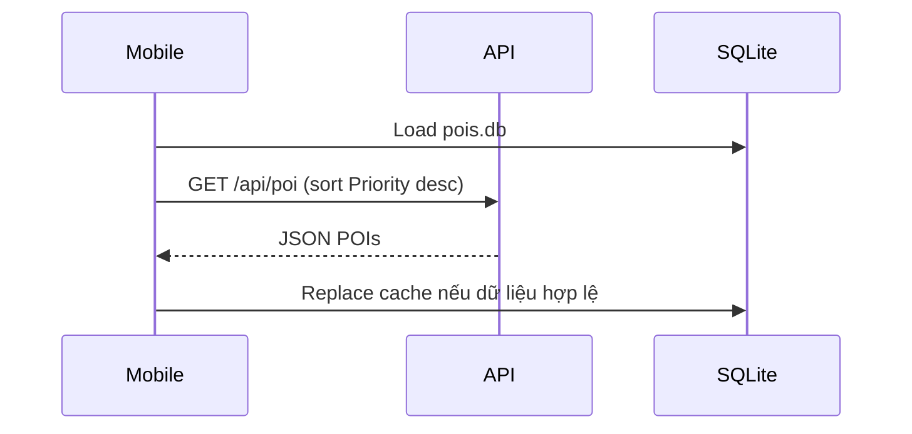
```mermaid
sequenceDiagram
    participant App as Mobile
    participant API as API
    participant SQL as SQLite
    App->>SQL: Load pois.db
    App->>API: GET /api/poi (sort Priority desc)
    API-->>App: JSON POIs
    App->>SQL: Replace cache nếu dữ liệu hợp lệ
```

---

## Phụ lục B — System Flow (Mermaid)

## Sơ đồ B.1: Tổng quan thành phần và luồng dữ liệu

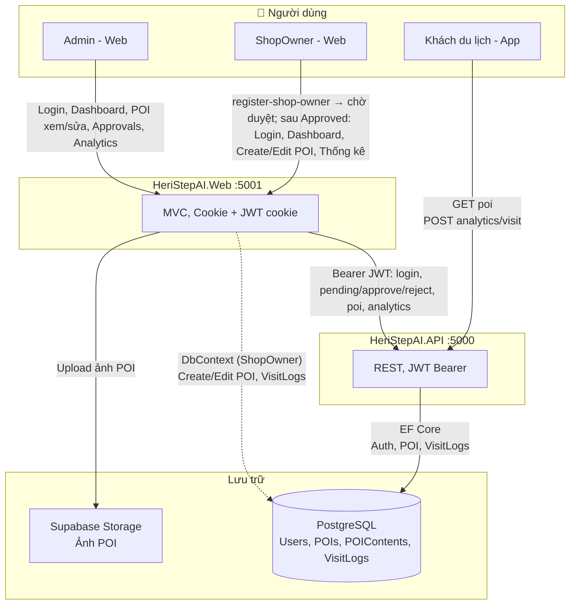
```mermaid
flowchart TB
    subgraph Users["👤 Người dùng"]
        A[Admin - Web]
        S[ShopOwner - Web]
        U[Khách du lịch - App]
    end

    subgraph Web["HeriStepAI.Web :5001"]
        W[MVC, Cookie + JWT cookie]
    end

    subgraph API["HeriStepAI.API :5000"]
        AP[REST, JWT Bearer]
    end

    subgraph Storage["Lưu trữ"]
        DB[(PostgreSQL<br/>Users, POIs, POIContents, VisitLogs)]
        SUP[Supabase Storage<br/>Ảnh POI]
    end

    A -->|"Login, Dashboard, POI xem/sửa, Approvals, Analytics"| W
    S -->|"register-shop-owner → chờ duyệt; sau Approved: Login, Dashboard, Create/Edit POI, Thống kê"| W
    U -->|"GET poi<br/>POST analytics/visit"| AP

    W -->|"Bearer JWT: login, pending/approve/reject, poi, analytics"| AP
    W -.->|"DbContext (ShopOwner)<br/>Create/Edit POI, VisitLogs"| DB
    W -->|"Upload ảnh POI"| SUP
    AP -->|"EF Core<br/>Auth, POI, VisitLogs"| DB
```

### Giải thích chi tiết – Sơ đồ 1

| Thành phần | Ý nghĩa |
|------------|--------|
| **Users** | Ba loại người dùng: **Admin** (quản trị toàn hệ thống qua web), **ShopOwner** (chủ điểm POI, quản lý POI qua web), **Khách du lịch** (dùng app mobile để xem POI và ghi visit). |
| **HeriStepAI.Web :5001** | Ứng dụng web MVC chạy cổng 5001. Dùng **cookie** để lưu session và lưu **JWT trong cookie** (AuthToken) sau khi đăng nhập. Admin và ShopOwner đều truy cập qua đây. |
| **HeriStepAI.API :5000** | API REST chạy cổng 5000. Mọi request từ Web (Admin) và App đều xác thực bằng **JWT Bearer** trong header. |
| **PostgreSQL** | Bảng **Users** (role + **`ApprovalStatus`** cho ShopOwner), **POIs** (**`Priority`**, geofence), **POIContents**, **VisitLogs**. |
| **Supabase Storage** | Lưu **ảnh POI**. Web upload ảnh khi Admin/ShopOwner tạo hoặc sửa POI; URL ảnh lưu trong DB. |

**Các mũi tên (luồng):**

- **Admin → Web:** Đăng nhập → Dashboard, **Duyệt đăng ký chủ quán** (`/Approvals`), POI **xem/sửa/toggle** (không tạo POI mới qua `/POI/Create`), Analytics.
- **ShopOwner → Web:** **Đăng ký** công khai (`register-shop-owner`) → **Pending**; sau khi Admin **Approved** → đăng nhập → Dashboard, **tạo POI** (`/ShopOwner/Create`), sửa POI của mình, thống kê.
- **Khách du lịch → API (qua App):** App không qua Web; không cần đăng nhập. App GET danh sách POI và POST `analytics/visit` khi vào vùng POI. Trạng thái subscription lưu trong **SecureStorage**.
- **Web → API:** Admin gọi **Bearer JWT** tới `auth/login`, `auth/pending-shop-owners`, `approve-shop-owner` / `reject-shop-owner`, `poi`, `analytics/...`. ShopOwner **POST `/api/poi`** có thể dùng khi tích hợp client; luồng Web chính là **DbContext** cho Create/Edit.
- **Web -.-→ DB (nét đứt):** **ShopOwner** đọc/ghi **trực tiếp** DB qua **DbContext** trong Web (cùng connection string với API), không đi qua API. Đây là luồng riêng so với Admin.
- **Web → Supabase Storage:** Khi tạo/sửa POI, Web upload ảnh lên bucket Supabase Storage.
- **API → DB:** API dùng **EF Core** để đọc/ghi Users, POI, VisitLogs (đăng nhập, danh sách POI, ghi visit từ App).

---

## Sơ đồ B.2: Flow đăng nhập Web (Admin / ShopOwner)

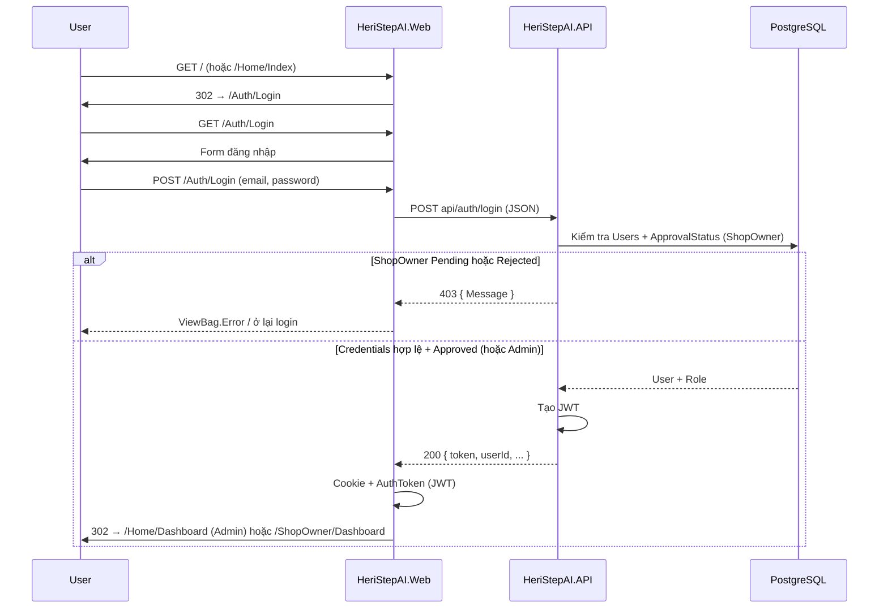
```mermaid
sequenceDiagram
    participant User
    participant Web as HeriStepAI.Web
    participant API as HeriStepAI.API
    participant DB as PostgreSQL

    User->>Web: GET / (hoặc /Home/Index)
    Web->>User: 302 → /Auth/Login
    User->>Web: GET /Auth/Login
    Web->>User: Form đăng nhập
    User->>Web: POST /Auth/Login (email, password)
    Web->>API: POST api/auth/login (JSON)
    API->>DB: Kiểm tra Users + ApprovalStatus (ShopOwner)
    alt ShopOwner Pending hoặc Rejected
        API-->>Web: 403 { Message }
        Web-->>User: ViewBag.Error / ở lại login
    else Credentials hợp lệ + Approved (hoặc Admin)
        DB-->>API: User + Role
        API->>API: Tạo JWT
        API-->>Web: 200 { token, userId, ... }
        Web->>Web: Cookie + AuthToken (JWT)
        Web->>User: 302 → /Home/Dashboard (Admin) hoặc /ShopOwner/Dashboard
    end
```

### Giải thích chi tiết – Sơ đồ 2

| Bước | Hành động | Giải thích |
|------|-----------|------------|
| 1 | User gửi **GET /** (hoặc `/Home/Index`) | Truy cập trang chủ. Nếu chưa đăng nhập, Web trả về redirect. |
| 2 | Web trả **302 → /Auth/Login** | Redirect trình duyệt tới trang đăng nhập. |
| 3 | User gửi **GET /Auth/Login** | Trình duyệt request trang form đăng nhập. |
| 4 | Web trả **form đăng nhập** | Hiển thị form email + password (Razor view). |
| 5 | User gửi **POST /Auth/Login** (email, password) | Submit form. Web nhận dữ liệu từ form. |
| 6 | Web gọi **POST api/auth/login** (JSON) | Web chuyển tiếp sang API (gửi email, password dạng JSON). API là nơi kiểm tra user. |
| 7 | API truy vấn **DB (Users)** | Kiểm tra email, hash mật khẩu, role; với **ShopOwner** kiểm tra **`ApprovalStatus`** (chỉ **Approved** mới cấp JWT). |
| 8 | **403** nếu Pending/Rejected | API trả JSON message; Web hiển thị lỗi, **không** set cookie. |
| 9 | DB trả **User + Role** (khi hợp lệ) | API tạo JWT. |
| 10 | API **tạo JWT** | Ký token chứa userId, role, expiry. |
| 11 | API trả **200 { token, ... }** | Web nhận JWT. |
| 12 | Web ghi **Cookie + AuthToken** | Redirect **Admin** → `/Home/Dashboard`, **ShopOwner Approved** → `/ShopOwner/Dashboard`. |

---

## Sơ đồ B.3: Flow Dashboard Admin (Web → API)

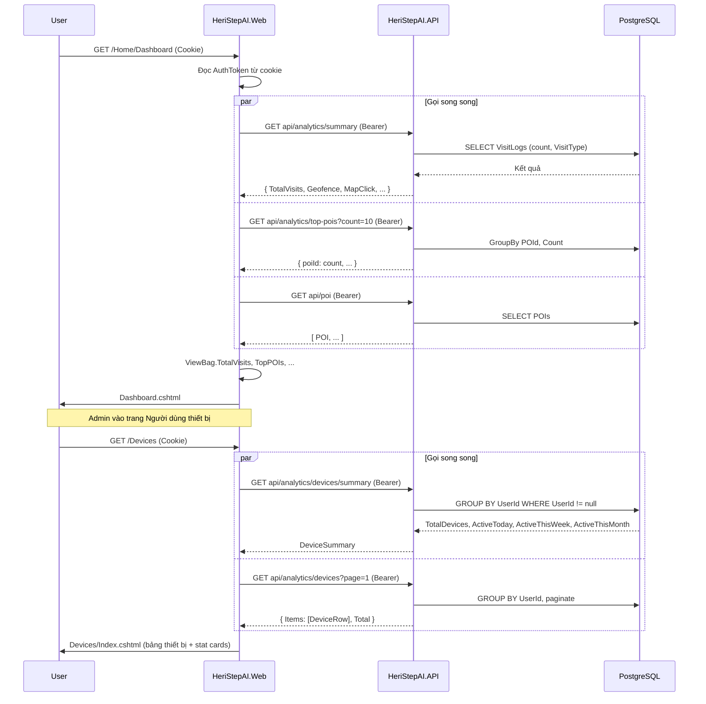
```mermaid
sequenceDiagram
    participant User
    participant Web as HeriStepAI.Web
    participant API as HeriStepAI.API
    participant DB as PostgreSQL

    User->>Web: GET /Home/Dashboard (Cookie)
    Web->>Web: Đọc AuthToken từ cookie
    par Gọi song song
        Web->>API: GET api/analytics/summary (Bearer)
        API->>DB: SELECT VisitLogs (count, VisitType)
        DB-->>API: Kết quả
        API-->>Web: { TotalVisits, Geofence, MapClick, ... }
    and
        Web->>API: GET api/analytics/top-pois?count=10 (Bearer)
        API->>DB: GroupBy POId, Count
        API-->>Web: { poiId: count, ... }
    and
        Web->>API: GET api/poi (Bearer)
        API->>DB: SELECT POIs
        API-->>Web: [ POI, ... ]
    end
    Web->>Web: ViewBag.TotalVisits, TopPOIs, ...
    Web->>User: Dashboard.cshtml

    Note over User,Web: Admin vào trang Người dùng thiết bị
    User->>Web: GET /Devices (Cookie)
    par Gọi song song
        Web->>API: GET api/analytics/devices/summary (Bearer)
        API->>DB: GROUP BY UserId WHERE UserId != null
        DB-->>API: TotalDevices, ActiveToday, ActiveThisWeek, ActiveThisMonth
        API-->>Web: DeviceSummary
    and
        Web->>API: GET api/analytics/devices?page=1 (Bearer)
        API->>DB: GROUP BY UserId, paginate
        API-->>Web: { Items: [DeviceRow], Total }
    end
    Web->>User: Devices/Index.cshtml (bảng thiết bị + stat cards)
```

### Giải thích chi tiết – Sơ đồ 3

| Bước | Hành động | Giải thích |
|------|-----------|------------|
| 1 | User gửi **GET /Home/Dashboard** (kèm Cookie) | Admin đã đăng nhập; trình duyệt gửi cookie chứa session/JWT. |
| 2 | Web **đọc AuthToken từ cookie** | Web lấy JWT từ cookie để gửi lên API dưới dạng header `Authorization: Bearer <token>`. |
| 3 | Web gọi **ba API song song** (par) | Để Dashboard load nhanh, Web gửi đồng thời 3 request thay vì gọi tuần tự. |
| 3a | **GET api/analytics/summary** (Bearer) | Lấy tổng quan: tổng lượt visit, phân loại theo VisitType (Geofence, Manual, …). API truy vấn VisitLogs (count, group by VisitType) rồi trả JSON. |
| 3b | **GET api/analytics/top-pois?count=10** (Bearer) | Lấy top 10 POI có nhiều visit nhất. API group by POId, count, sort, trả về danh sách. |
| 3c | **GET api/poi** (Bearer) | Lấy danh sách POI (để hiển thị bảng, dropdown, v.v.). API SELECT POIs từ DB. |
| 4 | API truy vấn **DB** (VisitLogs, POIs) | Mỗi endpoint dùng EF Core đọc bảng tương ứng. |
| 5 | Web nhận 3 response, gán **ViewBag** | ViewBag.TotalVisits, ViewBag.TopPOIs, danh sách POI để truyền sang view. |
| 6 | Web render **Dashboard.cshtml** | View Razor dùng dữ liệu trong ViewBag/Model để hiển thị số liệu, biểu đồ, bảng POI cho Admin. |

---

## Sơ đồ B.4: Flow App Mobile – Khởi động và ghi visit

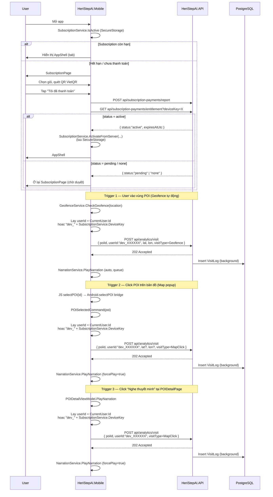
```mermaid
sequenceDiagram
    participant User
    participant App as HeriStepAI.Mobile
    participant API as HeriStepAI.API
    participant DB as PostgreSQL

    User->>App: Mở app
    App->>App: SubscriptionService.IsActive (SecureStorage)
    alt Subscription còn hạn
        App->>User: Hiển thị AppShell (tab)
    else Hết hạn / chưa thanh toán
        App->>User: SubscriptionPage
        User->>App: Chọn gói, quét QR VietQR
    User->>App: Tap "Tôi đã thanh toán"
    App->>API: POST api/subscription-payments/report
    App->>API: GET api/subscription-payments/entitlement?deviceKey=X
    alt status = active
        API-->>App: { status:"active", expiresAtUtc }
        App->>App: SubscriptionService.ActivateFromServer(...)<br/>(luu SecureStorage)
        App->>User: AppShell
    else status = pending / none
        API-->>App: { status:"pending" | "none" }
        App->>User: Ở lại SubscriptionPage (chờ duyệt)
    end
    end

    Note over App,API: Trigger 1 — User vào vùng POI (Geofence tự động)
    App->>App: GeofenceService.CheckGeofence(location)
    App->>App: Lay userId = CurrentUser.Id<br/>hoac "dev_" + SubscriptionService.DeviceKey
    App->>API: POST api/analytics/visit<br/>{ poiId, userId:"dev_XXXXXX", lat, lon, visitType=Geofence }
    API-->>App: 202 Accepted
    API->>DB: Insert VisitLog (background)
    App->>App: NarrationService.PlayNarration (auto, queue)

    Note over App,API: Trigger 2 — Click POI trên bản đồ (Map popup)
    App->>App: JS selectPOI(id) → Android.selectPOI bridge
    App->>App: POISelectedCommand(poi)
    App->>App: Lay userId = CurrentUser.Id<br/>hoac "dev_" + SubscriptionService.DeviceKey
    App->>API: POST api/analytics/visit<br/>{ poiId, userId:"dev_XXXXXX", lat?, lon?, visitType=MapClick }
    API-->>App: 202 Accepted
    API->>DB: Insert VisitLog (background)
    App->>App: NarrationService.PlayNarration (forcePlay=true)

    Note over App,API: Trigger 3 — Click “Nghe thuyết minh” tại POIDetailPage
    App->>App: POIDetailViewModel.PlayNarration
    App->>App: Lay userId = CurrentUser.Id<br/>hoac "dev_" + SubscriptionService.DeviceKey
    App->>API: POST api/analytics/visit<br/>{ poiId, userId:"dev_XXXXXX", visitType=MapClick }
    API-->>App: 202 Accepted
    API->>DB: Insert VisitLog (background)
    App->>App: NarrationService.PlayNarration (forcePlay=true)
```

### Giải thích chi tiết – Sơ đồ 4

| Bước | Hành động | Giải thích |
|------|-----------|------------|
| 1 | User **mở app** | Ứng dụng mobile (HeriStepAI.Mobile) khởi động. |
| 2 | App gọi **SubscriptionService.IsActive** | Đọc trạng thái subscription từ **SecureStorage**. Nếu còn hạn → vào AppShell ngay. |
| 3a | **Subscription còn hạn** | App chuyển thẳng tới **AppShell** (màn hình chính với tab). |
| 3b | **Hết hạn / chưa thanh toán** | Hiển thị **SubscriptionPage**. User chọn gói, quét QR VietQR, tap xác nhận để **report**; app chỉ vào AppShell khi API entitlement trả `active` (sau khi Admin duyệt). |
| 4 | **Trigger 1 — Geofence tự động** | GPS cập nhật 5s/lần; khi user vào bán kính POI, `GeofenceService` kích hoạt. App lấy userId (đã đăng nhập → User.Id; ẩn danh → `SecureStorage “dev_<guid>”`). Gọi `LogVisitAsync(visitType=Geofence)` bất đồng bộ, phát thuyết minh tự động. |
| 5 | **Trigger 2 — Click POI trên bản đồ** | Tap marker → JS `selectPOI(id)` gọi `Android.selectPOI` bridge (JavascriptInterface) → `POISelectedCommand` → `LogVisitAsync(visitType=MapClick)`. Phát thuyết minh ngay (forcePlay). |
| 6 | **Trigger 3 — Nút “Nghe thuyết minh” tại POIDetailPage** | `POIDetailViewModel.PlayNarration` → `LogVisitAsync(visitType=MapClick)` → phát thuyết minh (forcePlay). |
| 7 | **userId ẩn danh** | Khi chưa đăng nhập, app dùng `”dev_” + SubscriptionService.DeviceKey`. `DeviceKey` = 6 ký tự hex uppercase (SHA-256 của `DeviceName\|Model\|Platform\|Guid`), lưu vĩnh viễn trong `SecureStorage[“sub_device_key”]`. Định dạng `dev_XXXXXX` trong `VisitLogs` khớp trực tiếp với `XXXXXX` trong bảng `MobileSubscriptionPayments` — Admin có thể đối chiếu 2 bảng mà không cần mapping table. |
| 8 | API trả **202 Accepted** | API chấp nhận request và ghi vào DB bất đồng bộ. |
| 9 | API **Insert VisitLog** | Ghi vào bảng `VisitLogs` để Admin/ShopOwner xem thống kê. Admin có thể xem theo thiết bị ẩn danh qua trang Devices. |

---

## Sơ đồ B.5: Phân tách nguồn dữ liệu (Web)

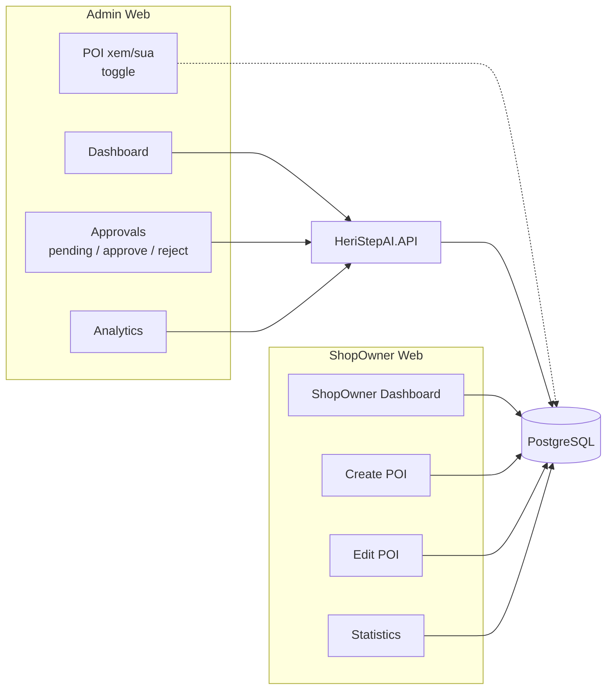
```mermaid
flowchart LR
    subgraph Admin["Admin Web"]
        D[Dashboard]
        AP[Approvals<br/>pending / approve / reject]
        P[POI xem/sua<br/>toggle]
        AN[Analytics]
    end

    subgraph ShopOwner["ShopOwner Web"]
        SD[ShopOwner Dashboard]
        SC[Create POI]
        SE[Edit POI]
        ST[Statistics]
    end

    API[HeriStepAI.API]
    DB[(PostgreSQL)]

    D --> API
    AP --> API
    AN --> API
    P -.-> DB
    API --> DB

    SD --> DB
    SC --> DB
    SE --> DB
    ST --> DB
```

### Giải thích chi tiết – Sơ đồ 5

Sơ đồ này nhấn mạnh **hai cách Web lấy dữ liệu** tùy vai trò:

| Nhánh | Thành phần | Nguồn dữ liệu | Giải thích |
|-------|------------|----------------|------------|
| **Admin Web** | Dashboard, **Approvals** (duyệt chủ quán), Analytics | **Qua API** | Gọi **HeriStepAI.API** với Bearer JWT. |
| **Admin Web** | POI **danh sách / sửa / toggle** (không có Create mới cho Admin) | **DbContext** (theo codebase) | Một số màn Admin đọc/ghi **trực tiếp PostgreSQL** qua `ApplicationDbContext` (cùng DB với API). |
| **ShopOwner Web** | Dashboard, **Create POI**, Edit, Statistics | **Trực tiếp DB** | ShopOwner tạo/sửa POI **của mình** qua DbContext; có thể đồng bộ dịch nội dung sau khi lưu. |

**Tóm tắt:** Admin (phần lớn) → Web → **API** → DB; Admin POI + ShopOwner → Web → **DB** trực tiếp. App luôn dùng API → DB.

---

**Chú thích:**
- **Admin:** JWT cho Dashboard, Approvals, Analytics; POI có thể DbContext.
- **ShopOwner:** Đọc/ghi POI qua DbContext (Create/Edit/Statistics).
- **App:** Không đăng nhập; subscription trong SecureStorage. Gọi API (`GET /poi` đã sort **Priority**).

## Phụ lục B.2 — Use Case Diagrams

> Mô tả tất cả ca sử dụng theo từng tác nhân, phản ánh đúng codebase hiện tại.

---

### B.1 Use Case — Toàn hệ thống

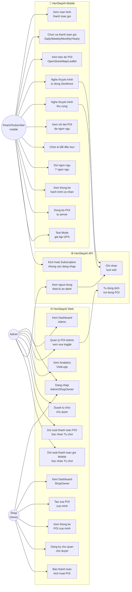
```mermaid
graph LR
    Guest((Khach/Subscriber<br/>mobile))
    ShopOwner((Shop<br/>Owner))
    Admin((Admin))

    subgraph Mobile["📱 HeriStepAI Mobile"]
        UC1[Xem man hinh<br/>thanh toan goi]
        UC2[Chon va thanh toan goi<br/>Daily/Weekly/Monthly/Yearly]
        UC3[Xem ban do POI<br/>OpenStreetMap/Leaflet]
        UC4[Nghe thuyet minh<br/>tu dong Geofence]
        UC5[Nghe thuyet minh<br/>thu cong]
        UC6[Xem chi tiet POI<br/>da ngon ngu]
        UC7[Chọn & bắt đầu tour]
        UC8[Doi ngon ngu<br/>7 ngon ngu]
        UC9[Xem thong ke<br/>hanh trinh ca nhan]
        UC10[Dong bo POI<br/>tu server]
        UC11[Test Mode<br/>gia lap GPS]
    end

    subgraph Web["🌐 HeriStepAI Web"]
        UC12[Dang nhap<br/>Admin/ShopOwner]
        UC13[Xem Dashboard<br/>Admin]
        UC14[Quan ly POI Admin<br/>xem sua toggle]
        UC15[Xem Analytics<br/>VisitLogs]
        UC16[Xem Dashboard<br/>ShopOwner]
        UC17[Tao sua POI<br/>cua minh]
        UC18[Xem thong ke<br/>POI cua minh]
        UC22[Dang ky chu quan<br/>cho duyet]
        UC23[Duyet tu choi<br/>chu quan]
        UC24[Bao thanh toan<br/>kich hoat POI]
        UC25[Doi soat thanh toan POI<br/>Xac nhan Tu choi]
        UC26[Doi soat thanh toan goi Mobile<br/>Xac nhan Tu choi]
    end

    subgraph API["⚙️ HeriStepAI API"]
        UC19[Kich hoat Subscription<br/>khong can dang nhap]
        UC20[Ghi nhan<br/>luot visit]
        UC21[Tu dong dich<br/>noi dung POI]
        UC27[Xem nguoi dung<br/>thiet bi an danh]
    end

    Guest --> UC1
    Guest --> UC2
    Guest --> UC3
    Guest --> UC4
    Guest --> UC5
    Guest --> UC6
    Guest --> UC7
    Guest --> UC8
    Guest --> UC9
    Guest --> UC10
    Guest --> UC19
    Guest --> UC11

    ShopOwner --> UC12
    ShopOwner --> UC16
    ShopOwner --> UC17
    ShopOwner --> UC18
    ShopOwner --> UC22
    ShopOwner --> UC24

    Admin --> UC12
    Admin --> UC13
    Admin --> UC14
    Admin --> UC15
    Admin --> UC23
    Admin --> UC25
    Admin --> UC26
    Admin --> UC27

    UC4 --> UC20
    UC5 --> UC20
    UC14 --> UC21
    UC27 --> UC20
```

---

### B.2 Use Case — Mobile (chi tiết)

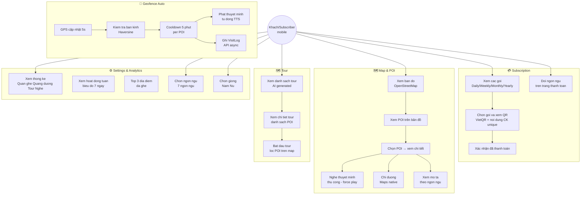
```mermaid
graph TB
    Guest((Khach/Subscriber<br/>mobile))

    subgraph Subscription["💳 Subscription"]
        S1[Xem cac goi<br/>Daily/Weekly/Monthly/Yearly]
        S2[Chon goi va xem QR<br/>VietQR + noi dung CK unique]
        S3[Xác nhận đã thanh toán]
        S4[Doi ngon ngu<br/>tren trang thanh toan]
        S1 --> S2 --> S3
    end

    subgraph Map["🗺️ Map & POI"]
        M1[Xem ban do<br/>OpenStreetMap]
        M2[Xem POI trên bản đồ]
        M3[Chọn POI → xem chi tiết]
        M4[Nghe thuyet minh<br/>thu cong - force play]
        M5[Chi duong<br/>Maps native]
        M6[Xem mo ta<br/>theo ngon ngu]
        M1 --> M2 --> M3 --> M4
        M3 --> M5
        M3 --> M6
    end

    subgraph Geofence["📡 Geofence Auto"]
        G1[GPS cập nhật 5s]
        G2[Kiem tra ban kinh<br/>Haversine]
        G3[Cooldown 5 phut<br/>per POI]
        G4[Phat thuyet minh<br/>tu dong TTS]
        G5[Ghi VisitLog<br/>API async]
        G1 --> G2 --> G3 --> G4
        G3 --> G5
    end

    subgraph Tour["🗺️ Tour"]
        T1[Xem danh sach tour<br/>AI generated]
        T2[Xem chi tiet tour<br/>danh sach POI]
        T3[Bat dau tour<br/>loc POI tren map]
        T1 --> T2 --> T3
    end

    subgraph Settings["⚙️ Settings & Analytics"]
        A1[Xem thong ke<br/>Quan ghe Quang duong Tour Nghe]
        A2[Xem hoat dong tuan<br/>bieu do 7 ngay]
        A3[Top 3 dia diem<br/>da ghe]
        A4[Chon ngon ngu<br/>7 ngon ngu]
        A5[Chon giong<br/>Nam Nu]
    end

    Guest --> S1
    Guest --> S4
    Guest --> M1
    Guest --> T1
    Guest --> A1
    Guest --> A4
    Guest --> A5
```

---

## Phụ lục C — Sequence Diagrams

> Mô tả chi tiết luồng tương tác giữa các thành phần theo thứ tự thời gian, phản ánh đúng code hiện tại.

---

### C.1 Mobile Access Gate — Kiểm tra Subscription + cho phép vào app

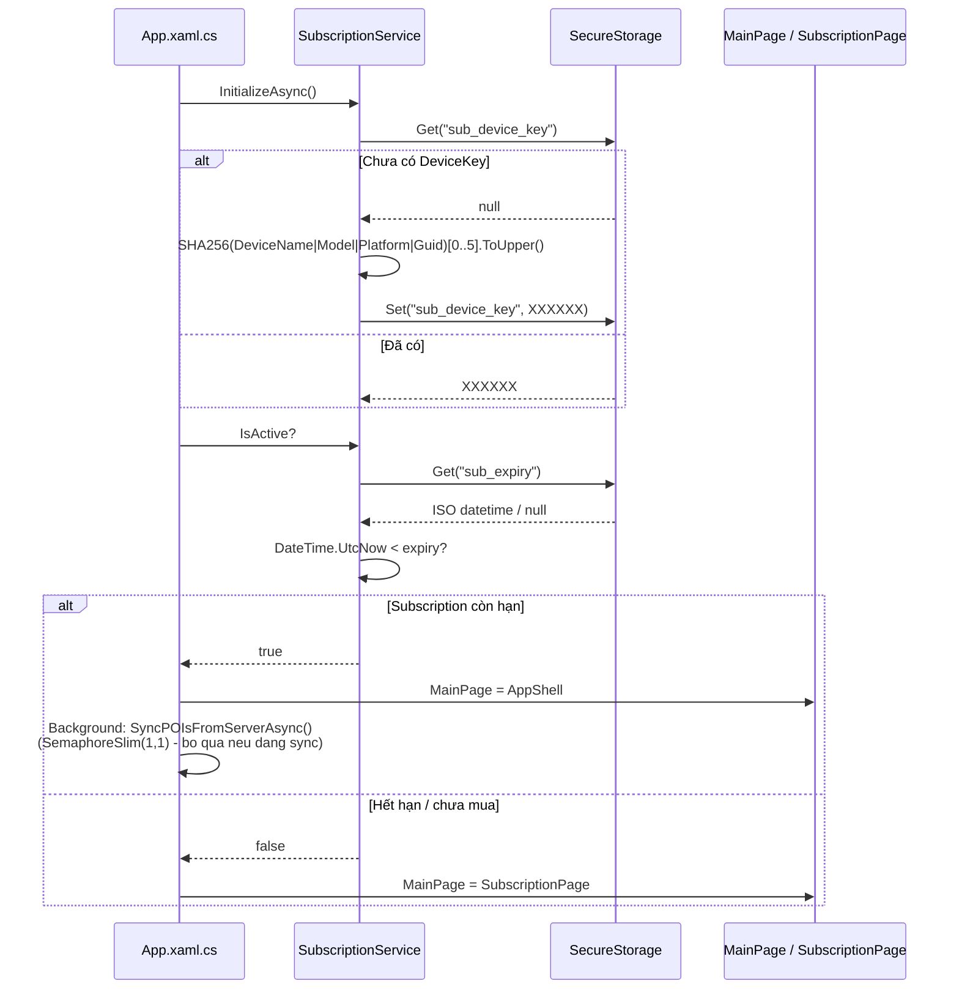
```mermaid
sequenceDiagram
    participant App as App.xaml.cs
    participant Sub as SubscriptionService
    participant Sec as SecureStorage
    participant UI as MainPage / SubscriptionPage

    App->>Sub: InitializeAsync()
    Sub->>Sec: Get("sub_device_key")
    alt Chưa có DeviceKey
        Sec-->>Sub: null
        Sub->>Sub: SHA256(DeviceName|Model|Platform|Guid)[0..5].ToUpper()
        Sub->>Sec: Set("sub_device_key", XXXXXX)
    else Đã có
        Sec-->>Sub: XXXXXX
    end
    App->>Sub: IsActive?
    Sub->>Sec: Get("sub_expiry")
    Sec-->>Sub: ISO datetime / null
    Sub->>Sub: DateTime.UtcNow < expiry?
    alt Subscription còn hạn
        Sub-->>App: true
        App->>UI: MainPage = AppShell
        App->>App: Background: SyncPOIsFromServerAsync()<br/>(SemaphoreSlim(1,1) - bo qua neu dang sync)
    else Hết hạn / chưa mua
        Sub-->>App: false
        App->>UI: MainPage = SubscriptionPage
    end
```

---

### C.2 Thanh toán Subscription

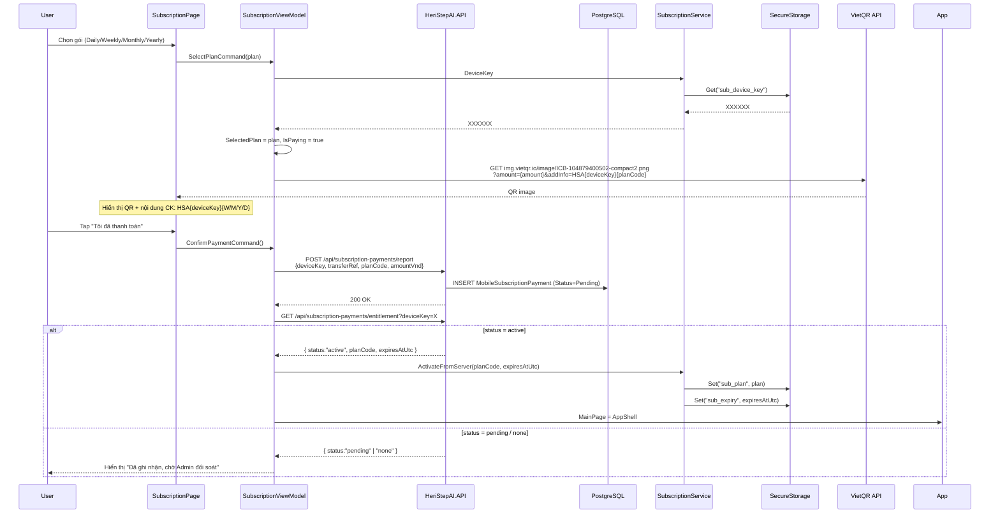
```mermaid
sequenceDiagram
    participant User
    participant SubPage as SubscriptionPage
    participant VM as SubscriptionViewModel
    participant API as HeriStepAI.API
    participant DB as PostgreSQL
    participant Sub as SubscriptionService
    participant Sec as SecureStorage
    participant VietQR as VietQR API
    participant App as App

    User->>SubPage: Chọn gói (Daily/Weekly/Monthly/Yearly)
    SubPage->>VM: SelectPlanCommand(plan)
    VM->>Sub: DeviceKey
    Sub->>Sec: Get("sub_device_key")
    Sec-->>Sub: XXXXXX
    Sub-->>VM: XXXXXX
    VM->>VM: SelectedPlan = plan, IsPaying = true
    VM->>VietQR: GET img.vietqr.io/image/ICB-104879400502-compact2.png<br/>?amount={amount}&addInfo=HSA{deviceKey}{planCode}
    VietQR-->>SubPage: QR image
    Note over SubPage: Hiển thị QR + nội dung CK: HSA{deviceKey}{W/M/Y/D}
    User->>SubPage: Tap "Tôi đã thanh toán"
    SubPage->>VM: ConfirmPaymentCommand()
    VM->>API: POST /api/subscription-payments/report<br/>{deviceKey, transferRef, planCode, amountVnd}
    API->>DB: INSERT MobileSubscriptionPayment (Status=Pending)
    API-->>VM: 200 OK
    VM->>API: GET /api/subscription-payments/entitlement?deviceKey=X
    alt status = active
        API-->>VM: { status:"active", planCode, expiresAtUtc }
        VM->>Sub: ActivateFromServer(planCode, expiresAtUtc)
        Sub->>Sec: Set("sub_plan", plan)
        Sub->>Sec: Set("sub_expiry", expiresAtUtc)
        VM->>App: MainPage = AppShell
    else status = pending / none
        API-->>VM: { status:"pending" | "none" }
        VM-->>User: Hiển thị "Đã ghi nhận, chờ Admin đối soát"
    end
```

---

### C.3 Đăng nhập Web (Admin / ShopOwner)

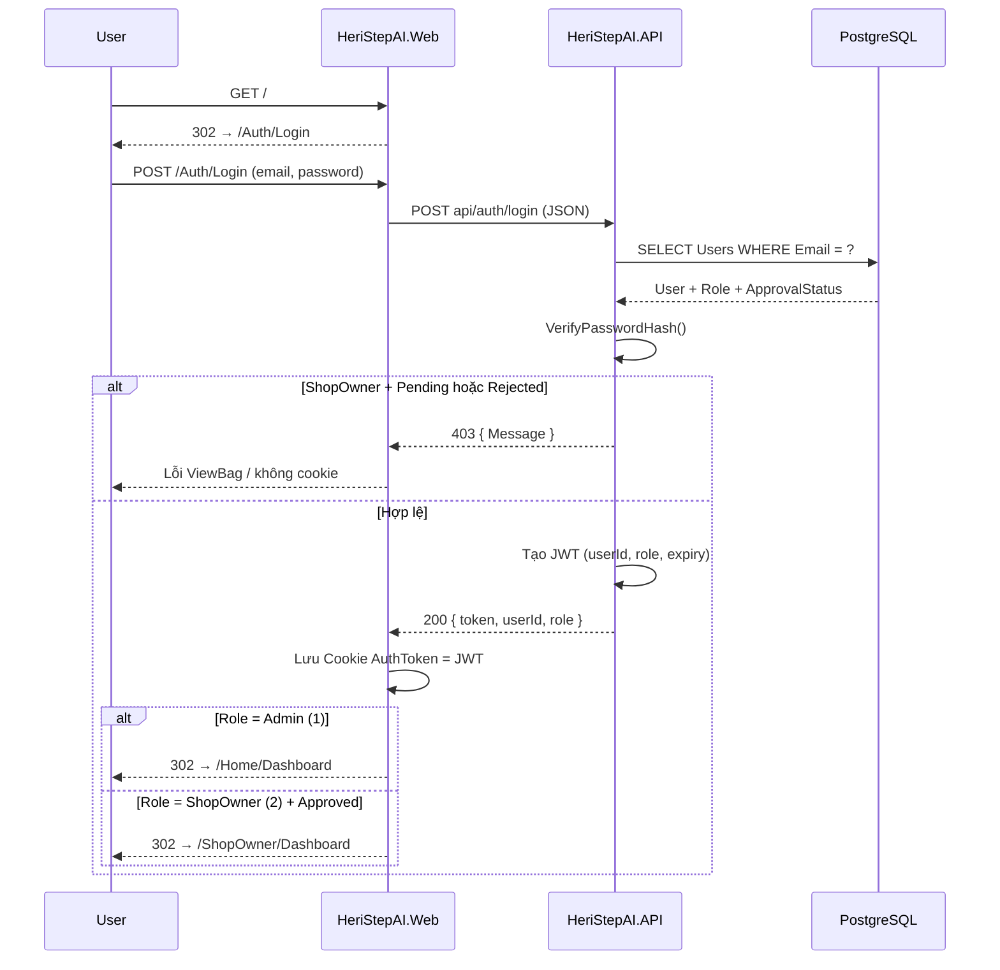
```mermaid
sequenceDiagram
    participant User
    participant Web as HeriStepAI.Web
    participant API as HeriStepAI.API
    participant DB as PostgreSQL

    User->>Web: GET / 
    Web-->>User: 302 → /Auth/Login
    User->>Web: POST /Auth/Login (email, password)
    Web->>API: POST api/auth/login (JSON)
    API->>DB: SELECT Users WHERE Email = ?
    DB-->>API: User + Role + ApprovalStatus
    API->>API: VerifyPasswordHash()
    alt ShopOwner + Pending hoặc Rejected
        API-->>Web: 403 { Message }
        Web-->>User: Lỗi ViewBag / không cookie
    else Hợp lệ
        API->>API: Tạo JWT (userId, role, expiry)
        API-->>Web: 200 { token, userId, role }
        Web->>Web: Lưu Cookie AuthToken = JWT
        alt Role = Admin (1)
            Web-->>User: 302 → /Home/Dashboard
        else Role = ShopOwner (2) + Approved
            Web-->>User: 302 → /ShopOwner/Dashboard
        end
    end
```

---

### C.4 ShopOwner tạo POI mới (+ đồng bộ dịch từ tiếng Việt)

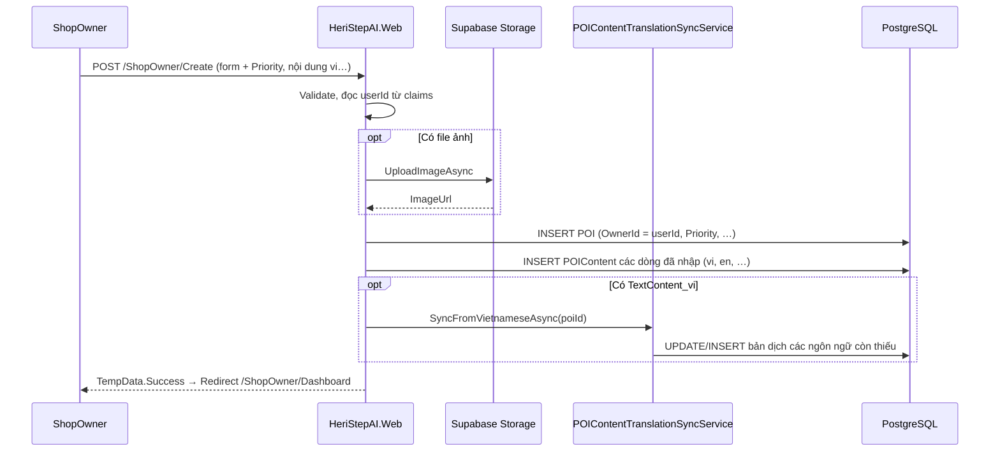
```mermaid
sequenceDiagram
    participant SO as ShopOwner
    participant Web as HeriStepAI.Web
    participant Store as Supabase Storage
    participant Sync as POIContentTranslationSyncService
    participant DB as PostgreSQL

    SO->>Web: POST /ShopOwner/Create (form + Priority, nội dung vi…)
    Web->>Web: Validate, đọc userId từ claims
    opt Có file ảnh
        Web->>Store: UploadImageAsync
        Store-->>Web: ImageUrl
    end
    Web->>DB: INSERT POI (OwnerId = userId, Priority, …)
    Web->>DB: INSERT POIContent các dòng đã nhập (vi, en, …)
    opt Có TextContent_vi
        Web->>Sync: SyncFromVietnameseAsync(poiId)
        Sync->>DB: UPDATE/INSERT bản dịch các ngôn ngữ còn thiếu
    end
    Web-->>SO: TempData.Success → Redirect /ShopOwner/Dashboard
```

> **Ghi chú:** `POST /api/poi` vẫn dành cho **ShopOwner JWT** (mobile/tooling); luồng Web chính là **DbContext** như trên.

---

### C.5 Admin cập nhật POI

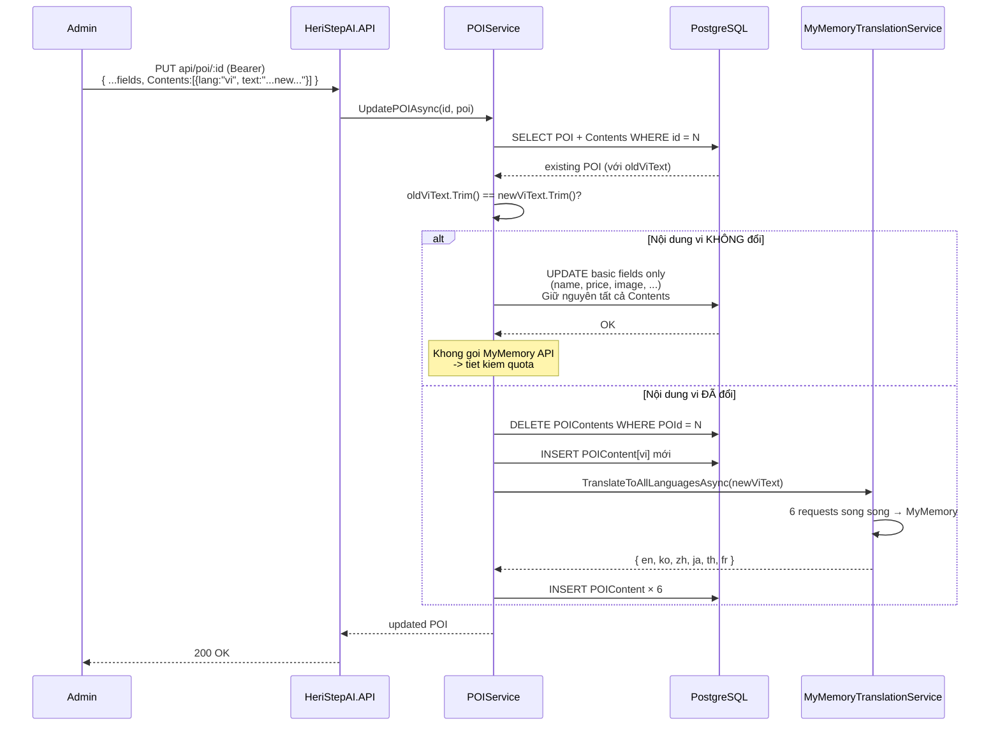
```mermaid
sequenceDiagram
    participant Admin
    participant API as HeriStepAI.API
    participant POISvc as POIService
    participant DB as PostgreSQL
    participant TransSvc as MyMemoryTranslationService

    Admin->>API: PUT api/poi/:id (Bearer)<br/>{ ...fields, Contents:[{lang:"vi", text:"...new..."}] }
    API->>POISvc: UpdatePOIAsync(id, poi)
    POISvc->>DB: SELECT POI + Contents WHERE id = N
    DB-->>POISvc: existing POI (với oldViText)
    POISvc->>POISvc: oldViText.Trim() == newViText.Trim()?
    alt Nội dung vi KHÔNG đổi
        POISvc->>DB: UPDATE basic fields only<br/>(name, price, image, ...)<br/>Giữ nguyên tất cả Contents
        DB-->>POISvc: OK
        Note over POISvc: Khong goi MyMemory API<br/>-> tiet kiem quota
    else Nội dung vi ĐÃ đổi
        POISvc->>DB: DELETE POIContents WHERE POId = N
        POISvc->>DB: INSERT POIContent[vi] mới
        POISvc->>TransSvc: TranslateToAllLanguagesAsync(newViText)
        TransSvc->>TransSvc: 6 requests song song → MyMemory
        TransSvc-->>POISvc: { en, ko, zh, ja, th, fr }
        POISvc->>DB: INSERT POIContent × 6
    end
    POISvc-->>API: updated POI
    API-->>Admin: 200 OK
```

---

### C.6 Geofence — Tự động phát thuyết minh (3 lớp anti-spam)

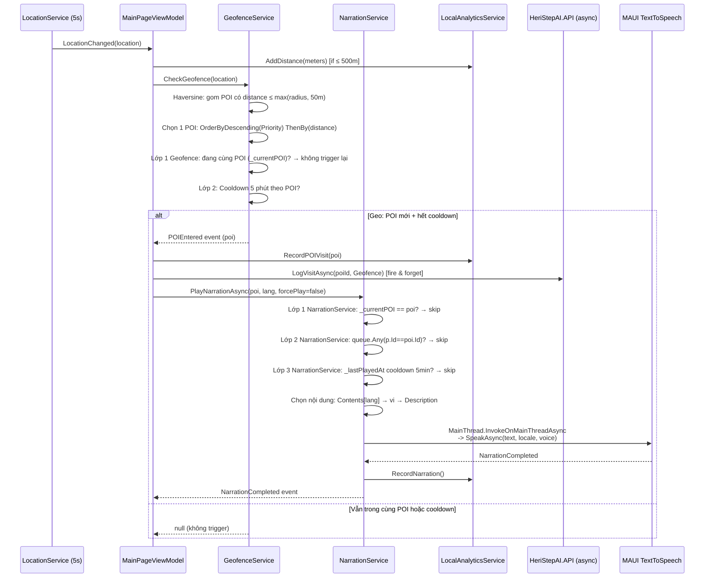
```mermaid
sequenceDiagram
    participant GPS as LocationService (5s)
    participant Main as MainPageViewModel
    participant Geo as GeofenceService
    participant Narr as NarrationService
    participant Analytics as LocalAnalyticsService
    participant API as HeriStepAI.API (async)
    participant TTS as MAUI TextToSpeech

    GPS->>Main: LocationChanged(location)
    Main->>Analytics: AddDistance(meters) [if ≤ 500m]
    Main->>Geo: CheckGeofence(location)
    Geo->>Geo: Haversine: gom POI có distance ≤ max(radius, 50m)
    Geo->>Geo: Chọn 1 POI: OrderByDescending(Priority) ThenBy(distance)
    Geo->>Geo: Lớp 1 Geofence: đang cùng POI (_currentPOI)? → không trigger lại
    Geo->>Geo: Lớp 2: Cooldown 5 phút theo POI?
    alt Geo: POI mới + hết cooldown
        Geo-->>Main: POIEntered event (poi)
        Main->>Analytics: RecordPOIVisit(poi)
        Main->>API: LogVisitAsync(poiId, Geofence) [fire & forget]
        Main->>Narr: PlayNarrationAsync(poi, lang, forcePlay=false)
        Narr->>Narr: Lớp 1 NarrationService: _currentPOI == poi? → skip
        Narr->>Narr: Lớp 2 NarrationService: queue.Any(p.Id==poi.Id)? → skip
        Narr->>Narr: Lớp 3 NarrationService: _lastPlayedAt cooldown 5min? → skip
        Narr->>Narr: Chọn nội dung: Contents[lang] → vi → Description
        Narr->>TTS: MainThread.InvokeOnMainThreadAsync<br/>-> SpeakAsync(text, locale, voice)
        TTS-->>Narr: NarrationCompleted
        Narr->>Analytics: RecordNarration()
        Narr-->>Main: NarrationCompleted event
    else Vẫn trong cùng POI hoặc cooldown
        Geo-->>Main: null (không trigger)
    end
```

---

### C.7 Người dùng nghe thuyết minh thủ công (POI Detail)

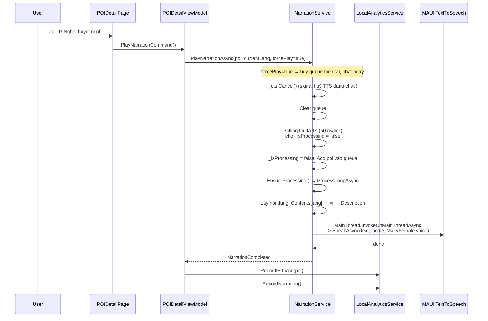
```mermaid
sequenceDiagram
    participant User
    participant Page as POIDetailPage
    participant VM as POIDetailViewModel
    participant Narr as NarrationService
    participant Analytics as LocalAnalyticsService
    participant TTS as MAUI TextToSpeech

    User->>Page: Tap "🔊 Nghe thuyết minh"
    Page->>VM: PlayNarrationCommand()
    VM->>Narr: PlayNarrationAsync(poi, currentLang, forcePlay=true)
    Note over Narr: forcePlay=true → hủy queue hiện tại, phát ngay
    Narr->>Narr: _cts.Cancel() (signal huỷ TTS đang chạy)
    Narr->>Narr: Clear queue
    Narr->>Narr: Polling toi da 1s (50ms/tick)<br/>cho _isProcessing = false
    Narr->>Narr: _isProcessing = false, Add poi vào queue
    Narr->>Narr: EnsureProcessing() → ProcessLoopAsync
    Narr->>Narr: Lấy nội dung: Contents[lang] → vi → Description
    Narr->>TTS: MainThread.InvokeOnMainThreadAsync<br/>-> SpeakAsync(text, locale, Male/Female voice)
    TTS-->>Narr: done
    Narr-->>VM: NarrationCompleted
    VM->>Analytics: RecordPOIVisit(poi)
    VM->>Analytics: RecordNarration()
```

---

### C.8 Chọn Tour & lọc POI trên Map

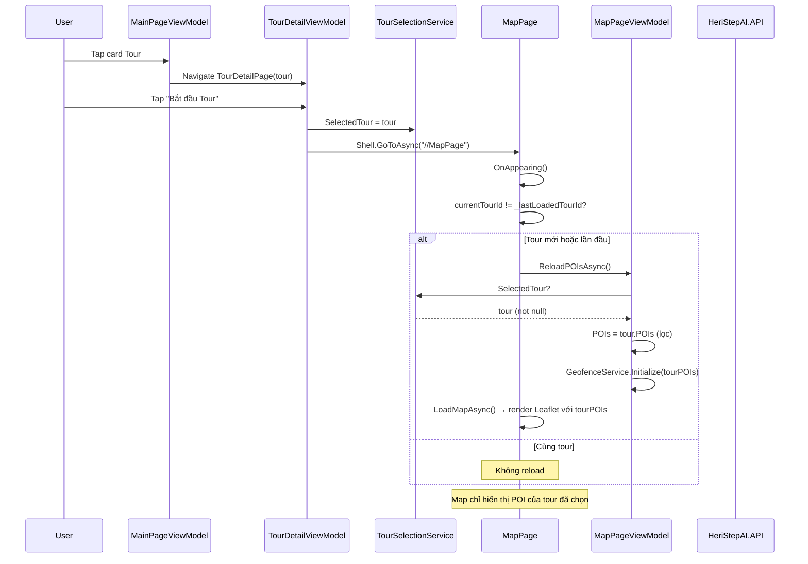
```mermaid
sequenceDiagram
    participant User
    participant MainVM as MainPageViewModel
    participant TourVM as TourDetailViewModel
    participant TourSvc as TourSelectionService
    participant MapPage as MapPage
    participant MapVM as MapPageViewModel
    participant API as HeriStepAI.API

    User->>MainVM: Tap card Tour
    MainVM->>TourVM: Navigate TourDetailPage(tour)
    User->>TourVM: Tap "Bắt đầu Tour"
    TourVM->>TourSvc: SelectedTour = tour
    TourVM->>MapPage: Shell.GoToAsync("//MapPage")
    MapPage->>MapPage: OnAppearing()
    MapPage->>MapPage: currentTourId != _lastLoadedTourId?
    alt Tour mới hoặc lần đầu
        MapPage->>MapVM: ReloadPOIsAsync()
        MapVM->>TourSvc: SelectedTour?
        TourSvc-->>MapVM: tour (not null)
        MapVM->>MapVM: POIs = tour.POIs (lọc)
        MapVM->>MapVM: GeofenceService.Initialize(tourPOIs)
        MapPage->>MapPage: LoadMapAsync() → render Leaflet với tourPOIs
    else Cùng tour
        Note over MapPage: Không reload
    end
    Note over MapPage: Map chỉ hiển thị POI của tour đã chọn
```

---

### C.9 Analytics — Ghi & hiển thị thống kê

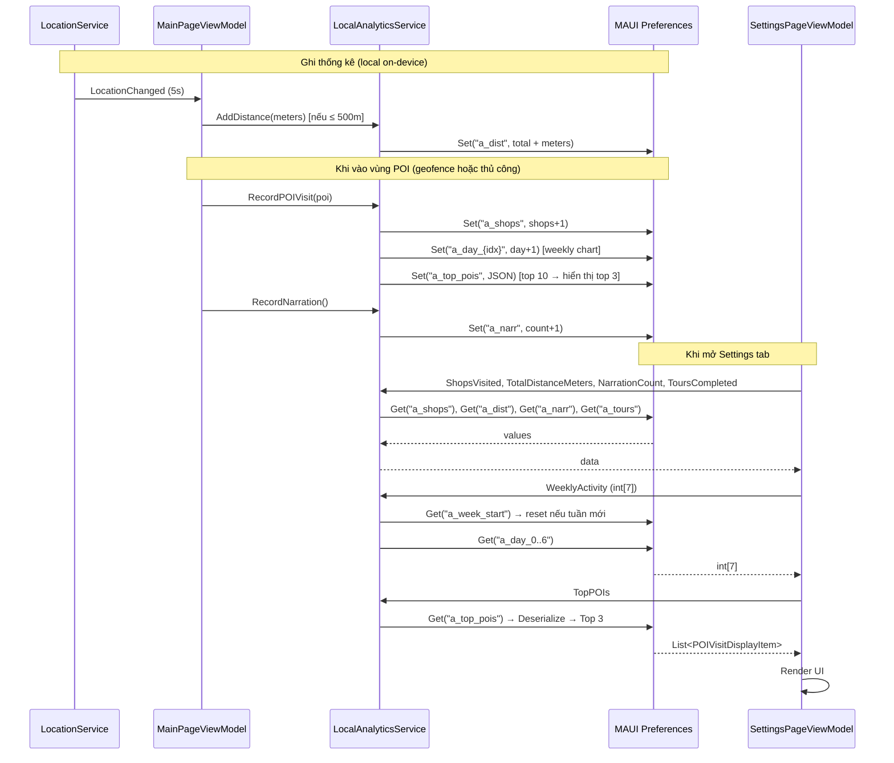
```mermaid
sequenceDiagram
    participant GPS as LocationService
    participant Main as MainPageViewModel
    participant Analytics as LocalAnalyticsService
    participant Prefs as MAUI Preferences
    participant Settings as SettingsPageViewModel

    Note over GPS,Prefs: Ghi thống kê (local on-device)

    GPS->>Main: LocationChanged (5s)
    Main->>Analytics: AddDistance(meters) [nếu ≤ 500m]
    Analytics->>Prefs: Set("a_dist", total + meters)

    Note over Main,Prefs: Khi vào vùng POI (geofence hoặc thủ công)
    Main->>Analytics: RecordPOIVisit(poi)
    Analytics->>Prefs: Set("a_shops", shops+1)
    Analytics->>Prefs: Set("a_day_{idx}", day+1) [weekly chart]
    Analytics->>Prefs: Set("a_top_pois", JSON) [top 10 → hiển thị top 3]

    Main->>Analytics: RecordNarration()
    Analytics->>Prefs: Set("a_narr", count+1)

    Note over Settings,Prefs: Khi mở Settings tab
    Settings->>Analytics: ShopsVisited, TotalDistanceMeters, NarrationCount, ToursCompleted
    Analytics->>Prefs: Get("a_shops"), Get("a_dist"), Get("a_narr"), Get("a_tours")
    Prefs-->>Analytics: values
    Analytics-->>Settings: data
    Settings->>Analytics: WeeklyActivity (int[7])
    Analytics->>Prefs: Get("a_week_start") → reset nếu tuần mới
    Analytics->>Prefs: Get("a_day_0..6")
    Prefs-->>Settings: int[7]
    Settings->>Analytics: TopPOIs
    Analytics->>Prefs: Get("a_top_pois") → Deserialize → Top 3
    Prefs-->>Settings: List<POIVisitDisplayItem>
    Settings->>Settings: Render UI
```

---

### C.10 Admin Dashboard (Web → API song song)

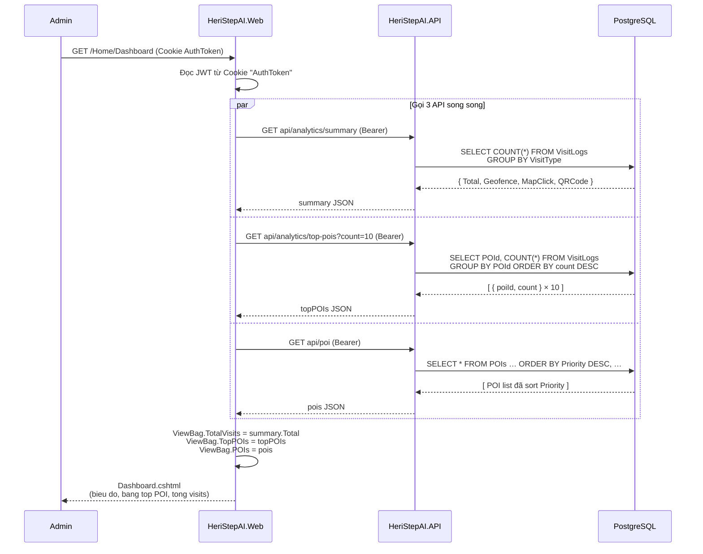
```mermaid
sequenceDiagram
    participant Admin
    participant Web as HeriStepAI.Web
    participant API as HeriStepAI.API
    participant DB as PostgreSQL

    Admin->>Web: GET /Home/Dashboard (Cookie AuthToken)
    Web->>Web: Đọc JWT từ Cookie "AuthToken"

    par Gọi 3 API song song
        Web->>API: GET api/analytics/summary (Bearer)
        API->>DB: SELECT COUNT(*) FROM VisitLogs<br/>GROUP BY VisitType
        DB-->>API: { Total, Geofence, MapClick, QRCode }
        API-->>Web: summary JSON
    and
        Web->>API: GET api/analytics/top-pois?count=10 (Bearer)
        API->>DB: SELECT POId, COUNT(*) FROM VisitLogs<br/>GROUP BY POId ORDER BY count DESC
        DB-->>API: [ { poiId, count } × 10 ]
        API-->>Web: topPOIs JSON
    and
        Web->>API: GET api/poi (Bearer)
        API->>DB: SELECT * FROM POIs … ORDER BY Priority DESC, …
        DB-->>API: [ POI list đã sort Priority ]
        API-->>Web: pois JSON
    end

    Web->>Web: ViewBag.TotalVisits = summary.Total<br/>ViewBag.TopPOIs = topPOIs<br/>ViewBag.POIs = pois
    Web-->>Admin: Dashboard.cshtml<br/>(bieu do, bang top POI, tong visits)
```

---

### C.11 ShopOwner Dashboard

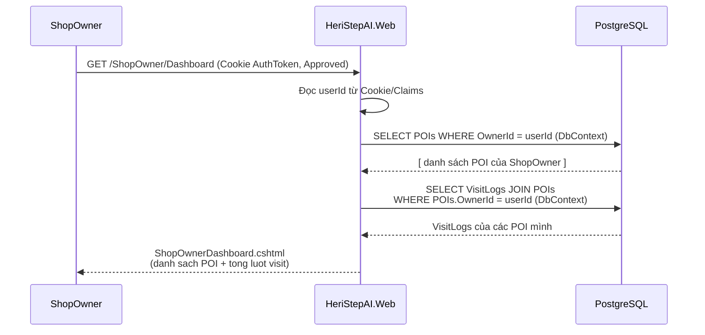
```mermaid
sequenceDiagram
    participant SO as ShopOwner
    participant Web as HeriStepAI.Web
    participant DB as PostgreSQL

    SO->>Web: GET /ShopOwner/Dashboard (Cookie AuthToken, Approved)
    Web->>Web: Đọc userId từ Cookie/Claims
    Web->>DB: SELECT POIs WHERE OwnerId = userId (DbContext)
    DB-->>Web: [ danh sách POI của ShopOwner ]
    Web->>DB: SELECT VisitLogs JOIN POIs<br/>WHERE POIs.OwnerId = userId (DbContext)
    DB-->>Web: VisitLogs của các POI mình
    Web-->>SO: ShopOwnerDashboard.cshtml<br/>(danh sach POI + tong luot visit)
```

---

### C.11b ShopOwner Edit POI

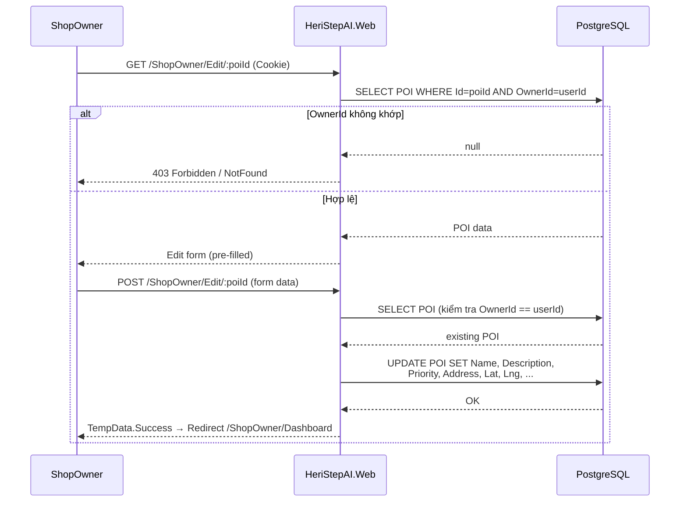
```mermaid
sequenceDiagram
    participant SO as ShopOwner
    participant Web as HeriStepAI.Web
    participant DB as PostgreSQL

    SO->>Web: GET /ShopOwner/Edit/:poiId (Cookie)
    Web->>DB: SELECT POI WHERE Id=poiId AND OwnerId=userId
    alt OwnerId không khớp
        DB-->>Web: null
        Web-->>SO: 403 Forbidden / NotFound
    else Hợp lệ
        DB-->>Web: POI data
        Web-->>SO: Edit form (pre-filled)
        SO->>Web: POST /ShopOwner/Edit/:poiId (form data)
        Web->>DB: SELECT POI (kiểm tra OwnerId == userId)
        DB-->>Web: existing POI
        Web->>DB: UPDATE POI SET Name, Description,<br/>Priority, Address, Lat, Lng, ...
        DB-->>Web: OK
        Web-->>SO: TempData.Success → Redirect /ShopOwner/Dashboard
    end
```

---

### C.11c ShopOwner Statistics POI

```mermaid
sequenceDiagram
    participant SO as ShopOwner
    participant Web as HeriStepAI.Web
    participant DB as PostgreSQL

    SO->>Web: GET /ShopOwner/Statistics/:poiId (Cookie)
    Web->>DB: SELECT POI WHERE Id=poiId AND OwnerId=userId
    alt OwnerId không khớp
        DB-->>Web: null
        Web-->>SO: 403 / NotFound
    else Hợp lệ
        Web->>DB: SELECT VisitLogs WHERE POIId=poiId<br/>ORDER BY VisitTime
        DB-->>Web: visit logs
        Web->>Web: Group by DATE(VisitTime)<br/>-> daily visit counts
        Web-->>SO: Statistics.cshtml<br/>(bieu do cot theo ngay)
    end
```

---

### C.12 Đổi ngôn ngữ & cập nhật nội dung POI

```mermaid
sequenceDiagram
    participant User
    participant VM as ViewModel (any page)
    participant LangSvc as LocalizationService
    participant Prefs as MAUI Preferences
    participant POIDetailVM as POIDetailViewModel

    User->>VM: SwitchLanguageCommand() hoặc SettingsPage picker
    VM->>LangSvc: SetLanguage("en")
    LangSvc->>Prefs: Set("AppLanguage", "en")
    LangSvc->>LangSvc: _currentLanguage = "en"
    LangSvc-->>VM: LanguageChanged event (broadcast toàn app)

    Note over VM: Tất cả ViewModels subscribe LanguageChanged
    VM->>VM: RefreshTranslations()
    VM->>LangSvc: GetString("StartTour") → "Start Tour"
    VM->>VM: OnPropertyChanged(nameof(LblStartTour))

    Note over POIDetailVM: POIDetailViewModel cập nhật mô tả POI
    POIDetailVM->>POIDetailVM: OnPropertyChanged(nameof(LocalizedDescription))
    POIDetailVM->>POIDetailVM: LocalizedDescription getter
    POIDetailVM->>POIDetailVM: SelectedPoi.Contents.FirstOrDefault<br/>(c => c.Language == "en")
    alt Có content tiếng Anh
        POIDetailVM-->>User: Hiển thị mô tả tiếng Anh
    else Không có en, fallback vi
        POIDetailVM->>POIDetailVM: Contents.FirstOrDefault(c => c.Language == "vi")
        POIDetailVM-->>User: Hiển thị mô tả tiếng Việt
    else Không có gì
        POIDetailVM->>POIDetailVM: Dùng POI.Description (field gốc)
        POIDetailVM-->>User: Hiển thị Description gốc
    end
```

---

### C.13 Admin xóa POI (Soft Delete)

```mermaid
sequenceDiagram
    participant Admin
    participant Web as HeriStepAI.Web
    participant API as HeriStepAI.API
    participant POISvc as POIService
    participant DB as PostgreSQL

    Admin->>Web: POST /POI/Delete/:poiId (Bearer Cookie)
    Web->>API: DELETE api/poi/:poiId (Bearer JWT)
    API->>API: Authorize(Roles="Admin,ShopOwner")
    alt ShopOwner
        API->>POISvc: GetPOIByIdAsync(poiId)
        POISvc->>DB: SELECT POI WHERE Id=poiId
        DB-->>POISvc: poi
        API->>API: poi.OwnerId != userId? → 403 Forbid
    end
    API->>POISvc: DeletePOIAsync(poiId)
    POISvc->>DB: SELECT POI WHERE Id=poiId
    DB-->>POISvc: poi
    POISvc->>DB: UPDATE POIs SET IsActive=false<br/>WHERE Id=poiId
    Note over DB: Soft delete - du lieu van con trong DB<br/>khong xoa POIContents, VisitLogs
    DB-->>POISvc: OK
    POISvc-->>API: true
    API-->>Web: 204 No Content
    Web-->>Admin: Redirect /POI (danh sach)<br/>TempData.Success
```

---

### C.14 Chọn giọng đọc (Voice Preference)

```mermaid
sequenceDiagram
    participant User
    participant SettingsPage as SettingsPage
    participant SettingsVM as SettingsPageViewModel
    participant VoiceSvc as VoicePreferenceService
    participant Prefs as MAUI Preferences
    participant Narr as NarrationService
    participant TTS as MAUI TextToSpeech

    User->>SettingsPage: Chọn "Giọng Nam" hoặc "Giọng Nữ"
    SettingsPage->>SettingsVM: SelectedVoiceGender changed
    SettingsVM->>VoiceSvc: SaveVoiceGender(VoiceGender.Male / Female)
    VoiceSvc->>Prefs: Set("VoiceGender", "Male")

    Note over Narr,TTS: Lần tiếp theo phát TTS
    Narr->>VoiceSvc: VoiceGender (get)
    VoiceSvc->>Prefs: Get("VoiceGender")
    Prefs-->>VoiceSvc: "Male"
    VoiceSvc-->>Narr: VoiceGender.Male
    Narr->>TTS: GetVoicesAsync()
    TTS-->>Narr: [ available voices ]
    Narr->>Narr: Filter: locale starts with lang code<br/>+ Name contains "male" / khong chua "female"
    alt Tìm được giọng phù hợp
        Narr->>TTS: SpeakAsync(text, SpeechOptions { Voice = matchedVoice })
    else Không tìm được
        Narr->>TTS: SpeakAsync(text, SpeechOptions { Pitch=1.0, Volume=1.0 })
    end
```

---

### C.15 ShopOwner báo thanh toán kích hoạt POI

```mermaid
sequenceDiagram
    participant SO as ShopOwner
    participant Web as HeriStepAI.Web
    participant DB as PostgreSQL

    SO->>Web: POST /ShopOwner/Create (tạo POI thành công)
    Web->>DB: INSERT POI (IsActive = false, Priority = N)
    DB-->>Web: POI.Id = X
    Web-->>SO: Redirect Dashboard + hướng dẫn báo thanh toán

    Note over SO,Web: Luồng hiện tại dùng Web + DbContext trực tiếp
    SO->>Web: POST /ShopOwner/ReportPayment (poiId=X)
    Web->>DB: SELECT POI WHERE Id=X AND OwnerId=userId
    DB-->>Web: poi (Priority = N)
    Web->>DB: SELECT POIPayments WHERE POIId=X<br/>AND Status IN (Pending, Verified)
    DB-->>Web: existing? (null = không có)
    alt Đã có bản ghi Pending/Verified
        Web-->>SO: TempData PaymentReported + redirect PaymentPending
    else Chưa có
        Web->>Web: amount = POIPricing.GetPrice(Priority)<br/>transferRef = "POIPAY-X-XXXXXX"
        Web->>DB: INSERT POIPayment<br/>(Status=Pending, ReportedAtUtc=now)
        DB-->>Web: payment.Id = Y
        Web-->>SO: TempData PaymentReported + redirect PaymentPending
    end
    Note over SO: ShopOwner chuyển khoản ngân hàng<br/>với nội dung = transferRef
```

---

### C.16 Admin đối soát & xác nhận / từ chối POI Payment

```mermaid
sequenceDiagram
    participant Admin
    participant Web as HeriStepAI.Web
    participant API as HeriStepAI.API
    participant DB as PostgreSQL

    Admin->>Web: GET /POIPayments (Cookie AuthToken)
    Web->>API: GET api/poi-payments (Bearer)
    API->>DB: SELECT POIPayments JOIN POIs JOIN Users<br/>ORDER BY ReportedAtUtc DESC
    DB-->>API: [ { id, poiId, poiName, ownerName, priority, amount,<br/>transferRef, status, reportedAt } ]
    API-->>Web: list JSON
    Web->>API: GET api/poi-payments/summary (Bearer)
    API->>DB: COUNT(*) GROUP BY Status
    DB-->>API: { pending, verified, rejected, totalAmountVndVerified }
    API-->>Web: summary JSON
    Web-->>Admin: /POIPayments/Index.cshtml<br/>(stat cards + bảng danh sách)

    alt Admin xác nhận (Verify)
        Admin->>Web: POST /POIPayments/Verify (id=Y, AntiForgeryToken)
        Web->>API: POST api/poi-payments/Y/verify (Bearer)<br/>{ note: null }
        API->>DB: SELECT POIPayments.AsTracking()<br/>INCLUDE POI WHERE Id=Y
        DB-->>API: row (tracked)
        API->>API: row.Status = Verified<br/>row.VerifiedAtUtc = now<br/>row.VerifiedByUserId = adminId
        API->>API: row.POI.IsActive = true<br/>row.POI.UpdatedAt = now
        API->>DB: SaveChangesAsync()<br/>UPDATE POIPayments + POIs
        DB-->>API: OK
        API-->>Web: 200 { Message: "Đã xác nhận. POI đã được kích hoạt." }
        Web-->>Admin: TempData.Success → Redirect /POIPayments
    else Admin từ chối (Reject)
        Admin->>Web: POST /POIPayments/Reject (id=Y, AntiForgeryToken)
        Web->>API: POST api/poi-payments/Y/reject (Bearer)<br/>{ note: "Lý do" }
        API->>DB: SELECT POIPayments.AsTracking() WHERE Id=Y
        DB-->>API: row (tracked)
        API->>API: row.Status = Rejected<br/>row.VerifiedAtUtc = now<br/>row.AdminNote = note
        API->>DB: SaveChangesAsync()<br/>UPDATE POIPayments
        DB-->>API: OK
        API-->>Web: 200 { Message: "Đã từ chối." }
        Web-->>Admin: TempData.Success → Redirect /POIPayments
    end
```

---

### C.17 Mobile báo & Admin đối soát thanh toán gói Subscription

```mermaid
sequenceDiagram
    participant App as HeriStepAI Mobile
    participant API as HeriStepAI.API
    participant DB as PostgreSQL
    participant Admin
    participant Web as HeriStepAI.Web

    Note over App,DB: Sau khi user tap "Tôi đã thanh toán"
    App->>API: POST api/subscription-payments/report (AllowAnonymous)<br/>{ deviceKey, transferRef, planCode, amountVnd, platform }
    API->>DB: SELECT MobileSubscriptionPayments<br/>WHERE DeviceKey=X AND TransferRef=Y AND ReportedAt >= now-48h
    DB-->>API: existing?
    alt Đã báo trong 48h
        API-->>App: 200 { duplicate: true }
    else Chưa có
        API->>DB: INSERT MobileSubscriptionPayment<br/>(Status=Pending, SubscriptionExpiresAtUtc=null)
        DB-->>API: row.Id
        API-->>App: 200 { id, duplicate: false }
    end

    Note over App,DB: App poll để biết trạng thái
    App->>API: GET api/subscription-payments/entitlement?deviceKey=X
    DB-->>API: status = "pending" / "active" / "none"
    API-->>App: { status, planCode?, expiresAtUtc? }

    Note over Admin,Web: Admin mở trang đối soát
    Admin->>Web: GET /SubscriptionPayments (Cookie AuthToken)
    Web->>API: GET api/subscription-payments (Bearer)
    API->>DB: SELECT MobileSubscriptionPayments ORDER BY ReportedAtUtc DESC
    DB-->>API: list
    API-->>Web: list JSON
    Web->>API: GET api/subscription-payments/summary (Bearer)
    API-->>Web: { pending, verified, rejected, reportsLast7Days, totalAmountVndVerified }
    Web-->>Admin: SubscriptionPayments/Index.cshtml

    alt Admin xác nhận
        Admin->>Web: POST /SubscriptionPayments/Verify (id, note)
        Web->>API: POST api/subscription-payments/id/verify<br/>{ note }
        API->>DB: SELECT AsTracking WHERE Id=id
        DB-->>API: row (tracked)
        API->>API: row.Status = Verified<br/>row.VerifiedAtUtc = now<br/>row.SubscriptionExpiresAtUtc = now + planDays
        API->>DB: SaveChangesAsync()
        DB-->>API: OK
        API-->>Web: 200 "Đã xác nhận đối soát"
        Web-->>Admin: TempData.Success → Redirect
    else Admin từ chối
        Admin->>Web: POST /SubscriptionPayments/Reject (id, note)
        Web->>API: POST api/subscription-payments/id/reject<br/>{ note }
        API->>DB: SELECT AsTracking WHERE Id=id
        API->>API: row.Status = Rejected
        API->>DB: SaveChangesAsync()
        API-->>Web: 200 "Đã đánh dấu từ chối"
        Web-->>Admin: TempData.Success → Redirect
    end

    Note over App,DB: App poll lại sau khi Admin xác nhận
    App->>API: GET api/subscription-payments/entitlement?deviceKey=X
    API->>DB: SELECT Verified WHERE DeviceKey=X AND ExpiresAt > now
    DB-->>API: active row
    API-->>App: { status: "active", planCode: "M", expiresAtUtc }
    App->>App: SubscriptionService.ActivateFromServer(plan, expiresAtUtc)<br/>-> SecureStorage
```

---

### C.18 ShopOwner đăng ký tài khoản

```mermaid
sequenceDiagram
    participant SO as "ShopOwner (chưa có tài khoản)"
    participant Web as HeriStepAI.Web
    participant API as HeriStepAI.API
    participant DB as PostgreSQL

    SO->>Web: GET /Auth/RegisterShopOwner (AllowAnonymous)
    Web-->>SO: Form đăng ký (Username, Email, Password, FullName, Phone)
    SO->>Web: POST /Auth/RegisterShopOwner (form data)
    Web->>Web: ModelState.IsValid?
    alt Thiếu / sai field
        Web-->>SO: Trả lại form + lỗi validation
    else Hợp lệ
        Web->>API: POST api/auth/register-shop-owner (AllowAnonymous)<br/>{ username, email, password, fullName, phone }
        API->>DB: SELECT Users WHERE Email = email
        alt Email đã tồn tại
            DB-->>API: User exists
            API-->>Web: 400 { Message: "Email đã tồn tại" }
            Web-->>SO: ModelState lỗi
        else Chưa có
            API->>API: HashPassword(password)
            API->>DB: INSERT User<br/>(Role=ShopOwner, ApprovalStatus=Pending, IsActive=false)
            DB-->>API: userId
            API-->>Web: 200 OK
            Web-->>SO: TempData["LoginInfo"] -> Redirect /Auth/Login<br/>"Đăng ký thành công. Vui lòng chờ Admin duyệt."
        end
    end
```

---

### C.19 Admin duyệt / từ chối ShopOwner

```mermaid
sequenceDiagram
    participant Admin
    participant Web as HeriStepAI.Web
    participant API as HeriStepAI.API
    participant DB as PostgreSQL

    Admin->>Web: GET /Approvals (Cookie AuthToken, Role=Admin)
    Web->>API: GET api/auth/pending-shop-owners (Bearer)
    API->>DB: SELECT Users WHERE Role=ShopOwner<br/>AND ApprovalStatus=Pending
    DB-->>API: [ { id, username, email, fullName, phone, createdAt } ]
    API-->>Web: list JSON
    Web-->>Admin: Approvals/Index.cshtml (danh sách chờ duyệt)

    alt Admin duyệt
        Admin->>Web: POST /Approvals/Approve (id, AntiForgeryToken)
        Web->>API: POST api/auth/approve-shop-owner/{id} (Bearer)
        API->>DB: UPDATE Users SET ApprovalStatus=Approved, IsActive=true<br/>WHERE Id=id AND Role=ShopOwner
        DB-->>API: OK
        API-->>Web: 200 OK
        Web-->>Admin: TempData.Success "Đã duyệt tài khoản chủ quán." → Redirect /Approvals
        Note over Admin: ShopOwner có thể đăng nhập bình thường
    else Admin từ chối
        Admin->>Web: POST /Approvals/Reject (id, AntiForgeryToken)
        Web->>API: POST api/auth/reject-shop-owner/{id} (Bearer)
        API->>DB: UPDATE Users SET ApprovalStatus=Rejected<br/>WHERE Id=id AND Role=ShopOwner
        DB-->>API: OK
        API-->>Web: 200 OK
        Web-->>Admin: TempData.Success "Đã từ chối đăng ký." → Redirect /Approvals
        Note over Admin: ShopOwner đăng nhập → API trả 403
    end
```

---

### C.20 Admin xem Heatmap vị trí

```mermaid
sequenceDiagram
    participant Admin
    participant Web as HeriStepAI.Web
    participant API as HeriStepAI.API
    participant DB as PostgreSQL

    Admin->>Web: GET /Heatmap (Cookie AuthToken)
    Web->>Web: Đọc JWT từ Cookie "AuthToken"
    Web->>API: GET api/analytics/heatmap?startDate=&endDate= (Bearer)
    API->>DB: SELECT Latitude, Longitude FROM VisitLogs<br/>WHERE VisitType = Geofence<br/>AND Latitude IS NOT NULL AND Longitude IS NOT NULL<br/>AND VisitTime >= startDate (nếu có)
    DB-->>API: [ { lat, lng } × N ]
    API-->>Web: JSON array [ [lat, lng], ... ]
    Web->>API: GET api/poi (Bearer)
    API->>DB: SELECT Id, Name, Latitude, Longitude FROM POIs
    DB-->>API: [ POI list ]
    API-->>Web: pois JSON
    Web-->>Admin: Heatmap/Index.cshtml<br/>(Leaflet map + leaflet-heat layer + POI markers tooltip)

    Note over Admin: Admin chọn filter (7 ngày / 30 ngày / Tất cả)
    Admin->>Web: GET /Heatmap?range=7d (Cookie)
    Web->>API: GET api/analytics/heatmap?startDate={now-7d} (Bearer)
    API->>DB: SELECT lat, lng WHERE VisitTime >= now-7d AND VisitType=Geofence
    DB-->>API: filtered points
    API-->>Web: JSON array
    Web-->>Admin: Cập nhật heat layer trên bản đồ
```

| Bước | Hành động | Giải thích |
|------|-----------|------------|
| 1 | Admin mở `/Heatmap` | Trang chỉ dành cho Admin (Bearer JWT). |
| 2 | Web gọi `GET api/analytics/heatmap` | Truyền `startDate`/`endDate` tùy filter đang chọn. |
| 3 | API query VisitLogs | Chỉ lấy `VisitType = Geofence` (geofence tự động) và lat/lng không null. |
| 4 | Web gọi thêm `GET api/poi` | Lấy danh sách POI để vẽ marker + tooltip tên POI trên bản đồ. |
| 5 | Render Leaflet + leaflet-heat | Điểm lat/lng từ API → heat layer; POI markers hover hiển thị tên. |
| 6 | Filter 7d/30d/all | Mỗi lần đổi filter → gọi lại API với `startDate` mới, cập nhật heat layer. |

---

### C.21 Heartbeat / Online Now

```mermaid
sequenceDiagram
    participant App as HeriStepAI.Mobile
    participant HB as HeartbeatService
    participant API as HeriStepAI.API
    participant Tracker as HeartbeatTracker (in-memory)
    participant Admin
    participant Web as HeriStepAI.Web

    Note over App,HB: App khởi động (App.xaml.cs)
    App->>HB: Start()
    HB->>API: POST api/analytics/heartbeat { userId } (AllowAnonymous)
    API->>Tracker: ConcurrentDictionary[userId] = DateTime.UtcNow
    API-->>HB: 200 OK (fire & forget, lỗi bị bỏ qua)

    loop Mỗi 5 giây
        HB->>API: POST api/analytics/heartbeat { userId }
        API->>Tracker: ConcurrentDictionary[userId] = DateTime.UtcNow
        API-->>HB: 200 OK
    end

    Note over API,Tracker: TTL cleanup (passive — khi query)
    Note over Tracker: Khi GET online-now được gọi:<br/>lọc entries có timestamp > now - 15s

    Note over Admin,Web: Admin xem trang Devices
    Admin->>Web: GET /Devices (Cookie AuthToken)
    par Gọi song song
        Web->>API: GET api/analytics/online-now (Bearer)
        API->>Tracker: Đếm entries WHERE value > now - 15s
        Tracker-->>API: count
        API-->>Web: { count: N }
    and
        Web->>API: GET api/analytics/devices/summary (Bearer)
        API->>API: Query VisitLogs GROUP BY UserId
        API-->>Web: { TotalDevices, ActiveToday, ActiveThisWeek, ActiveThisMonth }
    and
        Web->>API: GET api/analytics/devices?page=1 (Bearer)
        API->>API: Query VisitLogs GROUP BY UserId, paginate
        API-->>Web: { Items: [DeviceRow], Total }
    end
    Web-->>Admin: Devices/Index.cshtml<br/>(stat cards: Live=count, Today, 7d, 30d + bảng thiết bị)

    Note over App,HB: App đóng / background
    App->>HB: Stop()
    HB->>HB: _timer.Stop(), _timer = null
    Note over Tracker: userId tự hết hạn sau 15s<br/>(không có cleanup chủ động)
```

| Bước | Hành động | Giải thích |
|------|-----------|------------|
| 1 | `HeartbeatService.Start()` | Gửi heartbeat ngay lập tức khi app mở, sau đó mỗi 5 giây. |
| 2 | `POST /analytics/heartbeat` | AllowAnonymous; body `{ userId }` — userId = `CurrentUser.Id` hoặc `"dev_XXXXXX"`. |
| 3 | `HeartbeatTracker` cập nhật | `ConcurrentDictionary<string, DateTime>` lưu timestamp cuối cùng của mỗi userId. **Không ghi DB.** |
| 4 | TTL 15 giây | Khi Admin query `online-now`, API lọc entries có `timestamp > now - 15s`. Thiết bị ngừng gửi → tự "offline" sau 15s. |
| 5 | `GET /analytics/online-now` | Trả `{ count: N }` — số thiết bị đang thực sự mở app. Khác với `ActiveToday` (từ VisitLogs). |
| 6 | `Devices/Index` hiển thị | Card **"Đang dùng app"** = `online-now`; **"Hoạt động hôm nay"** = VisitLogs trong ngày — hai metric độc lập. |
| 7 | `HeartbeatService.Stop()` | Khi app close; userId hết TTL 15s → không còn tính là online. |

---

## Phụ lục D — Activity Diagrams

> Sơ đồ hoạt động mô tả luồng xử lý nghiệp vụ của từng use case.

---

### D.1 App Startup — Subscription Gate

```mermaid
flowchart TD
    Start([Mở app]) --> CheckSub[SubscriptionService.IsActive?]
    CheckSub --> SubActive{Còn hạn?}
    SubActive -->|Có| LoadShell[Hiển thị AppShell]
    LoadShell --> SyncBG[Background: SyncPOIsFromServerAsync]
    SyncBG --> InitMain[MainPageViewModel.InitializeAsync]
    InitMain --> ReqPerm[Xin quyền GPS]
    ReqPerm --> PermOK{Cấp quyền?}
    PermOK -->|Có| StartGPS[LocationService.StartLocationUpdates<br/>GPS poll 5 giây]
    PermOK -->|Không| ShowWarn[Hiển thị cảnh báo<br/>không có vị trí]
    StartGPS --> LoadPOI[Load POI từ SQLite cache<br/>Sync từ API]
    SubActive -->|Không| ShowSubPage[Hiển thị SubscriptionPage]
    ShowSubPage --> UserPay[User chọn gói & quét QR]
    UserPay --> Confirm[Tap Tôi đã thanh toán]
    Confirm --> Report[POST /subscription-payments/report]
    Report --> CheckEntitlement[GET /subscription-payments/entitlement]
    CheckEntitlement --> ActiveNow{status = active?}
    ActiveNow -->|Có| Activate["ActivateFromServer - plan, expiresAtUtc<br/>Lưu vào SecureStorage"]
    Activate --> LoadShell
    ActiveNow -->|Không| WaitAdmin[Giữ ở SubscriptionPage<br/>chờ Admin duyệt]
```

---

### D.2 Geofence — Kích hoạt thuyết minh (3 lớp chống spam)

```mermaid
flowchart TD
    Start([GPS update 5s]) --> GetLoc[Get location]
    GetLoc --> AddDist[Add distance if <= 500m]
    AddDist --> FindPOI[Find POI by radius priority distance]
    FindPOI --> InRadius{Any POI in radius}
    InRadius -->|No| ResetCurrent[Set currentPOI null]
    ResetCurrent --> Wait[Wait 5s]
    Wait --> Start
    InRadius -->|Yes| Layer1{Same current POI}
    Layer1 -->|Yes| Wait
    Layer1 -->|No| Layer2{Cooldown 5m active}
    Layer2 -->|Yes| Wait
    Layer2 -->|No| FireEvent[Emit POIEntered]
    FireEvent --> RecordVisit[Record visit and distance]
    RecordVisit --> LogAPI[Post analytics visit async]
    LogAPI --> Layer3{Narration queue cooldown}
    Layer3 -->|Blocked| Wait
    Layer3 -->|OK| GetContent[Resolve content by language]
    GetContent --> HasAudio{Has audio url}
    HasAudio -->|Yes| PlayAudio[Play audio]
    HasAudio -->|No| TTS[Speak by TTS]
    PlayAudio --> RecordNarr[Record narration]
    TTS --> RecordNarr
    RecordNarr --> Wait
```

---

### D.3 ShopOwner tạo POI mới (+ đồng bộ dịch)

```mermaid
flowchart TD
    Start([ShopOwner approved open create page]) --> FillForm[Fill POI form]
    FillForm --> HasImg{Has image file}
    HasImg -->|Yes| UploadImg[Upload to storage]
    UploadImg --> ImgOK{Upload success}
    ImgOK -->|No| ShowImgErr[Show image error]
    ShowImgErr --> FillForm
    ImgOK -->|Yes| SetUrl[Set image url]
    SetUrl --> Submit
    HasImg -->|No| Submit[Post create request]
    Submit --> ValidSrv{Server validation}
    ValidSrv -->|Invalid| ShowErr[Show validation errors]
    ShowErr --> FillForm
    ValidSrv -->|Valid| SaveDB[Insert POI with owner id]
    SaveDB --> SaveContent[Insert POI content rows]
    SaveContent --> HasVi{Has Vietnamese text}
    HasVi -->|Yes| SyncTrans[Sync translations]
    HasVi -->|No| RedirectOK
    SyncTrans --> RedirectOK[Redirect dashboard success]
    RedirectOK --> End([Done])
```

---

### D.4 Mobile — Chọn Tour & bắt đầu khám phá

```mermaid
flowchart TD
    Start([Open main page]) --> LoadTours[Generate tours from POI cache]
    LoadTours --> HasTours{Has tours}
    HasTours -->|No| ShowEmpty[Show empty state]
    ShowEmpty --> End([Done])
    HasTours -->|Yes| ShowCards[Show tour cards]
    ShowCards --> SelectTour[Select one tour]
    SelectTour --> OpenDetail[Open tour detail page]
    OpenDetail --> Decision{Start tour}
    Decision -->|Back| ShowCards
    Decision -->|Start| SetSelection[Set SelectedTour]
    SetSelection --> NavMap[Navigate to MapPage]
    NavMap --> OnAppearing[Map page appearing]
    OnAppearing --> CheckTour{Tour changed}
    CheckTour -->|No| KeepMap[Keep current map]
    CheckTour -->|Yes| ReloadPOI[Reload tour POIs]
    ReloadPOI --> InitGeo[Init geofence with tour POIs]
    InitGeo --> RenderMap[Render map with filtered POIs]
    RenderMap --> StartTrack[Start location tracking]
    KeepMap --> End2([Tour mode active])
    StartTrack --> End2([Tour mode active])
```

---

### D.5 Đăng nhập Web (Admin / ShopOwner)

```mermaid
flowchart TD
    Start([Truy cập /]) --> Redirect[302 → /Auth/Login]
    Redirect --> EnterCreds[Nhập email & mật khẩu]
    EnterCreds --> Submit[POST /Auth/Login]
    Submit --> Validate{Validate client side}
    Validate -->|Thiếu field| ShowValErr[Hiển thị lỗi]
    ShowValErr --> EnterCreds
    Validate -->|Hợp lệ| CallAPI[POST api/auth/login]
    CallAPI --> APIResult{Kết quả API?}
    APIResult -->|401 sai credentials| ShowLoginErr[ViewBag.Error]
    ShowLoginErr --> EnterCreds
    APIResult -->|403 ShopOwner Pending/Rejected| ShowPending[Thông báo chờ duyệt / bị từ chối]
    ShowPending --> EnterCreds
    APIResult -->|500 / network| ShowSrvErr[Lỗi hệ thống]
    ShowSrvErr --> End2([Thử lại sau])
    APIResult -->|200 OK + JWT| SaveCookie[Lưu Cookie AuthToken = JWT]
    SaveCookie --> CheckRole{Role?}
    CheckRole -->|Admin = 1| GoAdmin[Redirect /Home/Dashboard]
    CheckRole -->|ShopOwner = 2| GoShop[Redirect /ShopOwner/Dashboard]
    GoAdmin --> End([Kết thúc])
    GoShop --> End
```

---

### D.6 Thanh toán Subscription (Mobile)

```mermaid
flowchart TD
    Start([Open app with expired plan]) --> ShowPlans[Show 4 plans]
    ShowPlans --> SwitchLang{Change language}
    SwitchLang -->|Yes| CycleLang[Cycle app language]
    CycleLang --> ShowPlans
    SwitchLang -->|No| SelectPlan[Select plan]
    SelectPlan --> ShowQR[Show VietQR]
    ShowQR --> UserTransfer[User bank transfer]
    UserTransfer --> TapConfirm[Tap confirm payment]
    TapConfirm --> Report[Post report payment]
    Report --> WaitApprove[Show waiting state]
    WaitApprove --> CheckBtn[Tap check status]
    CheckBtn --> Poll[Get entitlement]
    Poll --> Entitled{Status active}
    Entitled -->|No| WaitApprove
    Entitled -->|Yes| Activate[Activate from server and save]
    Activate --> LoadApp[Open app shell]
    LoadApp --> End([Done])
```

---

### D.7 POI Payment — Luồng kích hoạt POI qua thanh toán

```mermaid
flowchart TD
    Start([ShopOwner creates POI]) --> POIInactive[POI created inactive]
    POIInactive --> CallReport[Report payment for POI]
    CallReport --> HasExisting{Has pending verified record}
    HasExisting -->|Yes| ReturnExisting[Reuse existing payment record]
    ReturnExisting --> ShowRef[Show existing transfer ref]
    HasExisting -->|No| CalcPrice[Calculate amount by priority]
    CalcPrice --> GenRef[Generate transfer reference]
    GenRef --> SavePending[Insert pending POI payment]
    SavePending --> ShowQR[Show payment pending page]
    ShowRef --> ShowQR
    ShowQR --> AdminCheck[Admin reviews pending POI payments]
    AdminCheck --> Decision{Admin verifies payment}
    Decision -->|Yes| Verify[Set payment verified and activate POI]
    Decision -->|No| Reject[Set payment rejected keep POI inactive]
    Verify --> POIActive[POI becomes visible on mobile]
    Reject --> NotifyReject[ShopOwner sees rejected status]
    POIActive --> End([Done])
    NotifyReject --> End2([Done])
```

---

### D.8 Subscription Payment — Luồng báo & đối soát

```mermaid
flowchart TD
    Start([User confirms payment on mobile]) --> Report[Post subscription payment report]
    Report --> Dup{Duplicate in 48h}
    Dup -->|Yes| UseDup[Reuse existing report]
    Dup -->|No| SavePending[Insert pending payment]
    SavePending --> AppWait[App waiting for review]
    UseDup --> AppWait

    AppWait --> Poll[App polls entitlement]
    Poll --> PollResult{Result}
    PollResult -->|pending| AppWait
    PollResult -->|active| Activate[Activate subscription local]
    Activate --> LoadApp[Open app shell]
    LoadApp --> End([Done])

    AppWait --> AdminSide[Admin reviews subscription payments]
    AdminSide --> AdminDecide{Bank statement matched}
    AdminDecide -->|Yes| Verify[Verify payment and set expiry]
    AdminDecide -->|No| Reject[Reject payment]
    Verify --> PollResult
    Reject --> NotifyReject[App shows rejected state]
    NotifyReject --> End2([Done])
```

---

### D.9 ShopOwner đăng ký & Admin duyệt

```mermaid
flowchart TD
    Start([ShopOwner opens register page]) --> FillForm[Fill registration form]
    FillForm --> Validate{Client and server valid}
    Validate -->|No| ShowErr[Show form errors]
    ShowErr --> FillForm
    Validate -->|Yes| CallAPI[Post register shopowner]
    CallAPI --> EmailExist{Email exists}
    EmailExist -->|Yes| ErrDup[Show duplicate email error]
    ErrDup --> FillForm
    EmailExist -->|No| SavePending[Create pending account]
    SavePending --> ShowWait[Redirect login and wait approval]
    ShowWait --> AdminReview[Admin opens approvals page]
    AdminReview --> Decision{Approve account}
    Decision -->|Yes| Approve[Approve shopowner account]
    Decision -->|No| Reject[Reject shopowner account]
    Approve --> CanLogin[Shopowner can login dashboard]
    Reject --> Blocked[Shopowner login gets forbidden]
    CanLogin --> End([Done])
    Blocked --> End2([Done])
```

---

### D.10 Admin sửa POI (+ Smart Re-translation)

```mermaid
flowchart TD
    Start([Admin edits POI]) --> LoadPOI[Load POI and contents]
    LoadPOI --> ShowForm[Show edit form]
    ShowForm --> Submit[Submit update]
    Submit --> POISvcLoad[POI service loads current data]
    POISvcLoad --> CompareVi{Vietnamese text changed}
    CompareVi -->|No| UpdateBasic[Update base fields only]
    UpdateBasic --> Return200[Return success no translation]
    CompareVi -->|Yes| DeleteContents[Delete old contents]
    DeleteContents --> InsertVi[Insert new Vietnamese content]
    InsertVi --> Translate[Translate to all languages]
    Translate --> TransOK{Translation success}
    TransOK -->|Yes| InsertAll[Insert translated contents]
    TransOK -->|Partial| Partial[Insert available translations]
    InsertAll --> Return200
    Partial --> Return200
    Return200 --> Redirect[Redirect POI list success]
    Redirect --> End([Done])
```

---

### D.11 Nghe thuyết minh thủ công (POI Detail)

```mermaid
flowchart TD
    Start([User opens POI detail page]) --> LoadPOI[Bind selected POI]
    LoadPOI --> RecordVisit[Record local POI visit]
    RecordVisit --> ShowDetail[Show POI details]
    ShowDetail --> TapPlay[Tap play narration]
    TapPlay --> PlayCmd[Run play narration command]
    PlayCmd --> Cancel[Cancel current narration if any]
    Cancel --> ClearQueue[Clear narration queue]
    ClearQueue --> GetContent[Resolve narration content]
    GetContent --> HasContent{Has content}
    HasContent -->|No| ShowEmpty[Show no content message]
    ShowEmpty --> End2([Done])
    HasContent -->|Yes| HasAudio{Has audio url}
    HasAudio -->|Yes| PlayAudio[Play audio file]
    HasAudio -->|No| GetVoice[Read voice preference]
    GetVoice --> FindVoice[Select matching TTS voice]
    FindVoice --> SpeakTTS[Speak text with TTS]
    PlayAudio --> RecordNarr[Record local narration]
    SpeakTTS --> RecordNarr
    RecordNarr --> Done[Set playback finished state]
    Done --> End([Done])
```

---

## Phụ lục G — Class Diagram (Mermaid)

> Mục tiêu: mô tả các lớp cốt lõi cần thiết cho kiến trúc hiện tại (API + Mobile), đồng nhất với mục `9. Data Requirements` và `6. Functional Requirements`.

### G.1 Domain & Data Model (Core Entities)

```mermaid
flowchart LR
    User[User]
    POI[POI]
    POIContent[POIContent]
    VisitLog[VisitLog]
    Tour[Tour]
    POIPayment[POIPayment]
    MobileSubPayment[MobileSubscriptionPayment]
    Status[PaymentStatus Pending Verified Rejected]

    User -->|owns| POI
    POI -->|has| POIContent
    POI -->|records| VisitLog
    POI -->|has payment records| POIPayment
    User -->|reports| POIPayment
    POIPayment -->|status| Status
    MobileSubPayment -->|status| Status
    Tour -->|groups POI for mobile runtime| POI
```

### G.2 API Layer (Controllers, Services, Repositories)

```mermaid
classDiagram
    class AuthController {
        +Seed(force): IActionResult
        +Login(LoginRequest): IActionResult
        +Register(RegisterRequest): IActionResult
        +RegisterTourist(TouristRegisterRequest): IActionResult
        +RegisterShopOwner(ShopOwnerSelfRegisterRequest): IActionResult
        +GetPendingShopOwners(): IActionResult
        +ApproveShopOwner(id): IActionResult
        +RejectShopOwner(id): IActionResult
        +GetCurrentUser(): IActionResult
    }

    class POIController {
        +Geocode(lat, lng): IActionResult
        +GetAllPOIs(): IActionResult
        +GetPOI(int): IActionResult
        +CreatePOI(POI): IActionResult
        +UpdatePOI(int, POI): IActionResult
        +DeletePOI(int): IActionResult
        +GetMyPOIs(): IActionResult
        +GetContent(int, language): IActionResult
    }

    class AnalyticsController {
        +LogVisit(VisitRequest): IActionResult
        +Summary(): IActionResult
        +TopPois(): IActionResult
        +GetPoiStatistics(poiId): IActionResult
        +GetVisitLogs(poiId): IActionResult
        +GetDailyReport(token): IActionResult
        +GetUserDailyVisits(token, date): IActionResult
    }

    class POIPaymentsController {
        +Report(ReportPOIPaymentDto): IActionResult
        +GetByPOI(poiId): IActionResult
        +List(status, take): IActionResult
        +Summary(): IActionResult
        +Verify(id, VerifyDto): IActionResult
        +Reject(id, VerifyDto): IActionResult
    }

    class SubscriptionPaymentsController {
        +Report(ReportSubscriptionPaymentDto): IActionResult
        +Entitlement(deviceKey): IActionResult
        +List(status, take): IActionResult
        +Summary(): IActionResult
        +Verify(id, VerifyDto): IActionResult
        +Reject(id, VerifyDto): IActionResult
    }

    class IAuthService {
        <<interface>>
        +LoginAsync(email, password): Task~string~
        +RegisterAsync(..., approvalStatus?): Task~User?~
        +GetUserByIdAsync(id): Task~User?~
        +ApproveShopOwnerAsync(userId): Task~bool~
        +RejectShopOwnerAsync(userId): Task~bool~
    }

    class IPOIService {
        <<interface>>
        +GetAllPOIsAsync(): Task~List~POI~~
        +GetPOIByIdAsync(id): Task~POI?~
        +CreatePOIAsync(poi): Task~POI~
        +UpdatePOIAsync(id, poi): Task~POI?~
        +DeletePOIAsync(id): Task~bool~
        +GetPOIsByOwnerAsync(ownerId): Task~List~POI~~
        +GetContentAsync(poiId, language): Task~POIContent?~
    }

    class IAnalyticsService {
        <<interface>>
        +LogVisitAsync(poiId, userId, lat, lon, visitType): Task
        +GetVisitLogsAsync(poiId, startDate, endDate): Task~List~VisitLog~~
        +GetTopPOIsAsync(count, startDate, endDate): Task~Dictionary~int,int~~
        +GetPOIStatisticsAsync(poiId, startDate, endDate): Task~object~
        +GetVisitSummaryAsync(startDate, endDate): Task~(int,int,int,int)~
    }

    class ITranslationService {
        <<interface>>
        +Translate(text, fromLang, toLang): string
    }

    class POIService
    class AnalyticsService
    class MyMemoryTranslationService

    class AppDbContext {
        +DbSet~User~ Users
        +DbSet~POI~ POIs
        +DbSet~POIContent~ POIContents
        +DbSet~VisitLog~ VisitLogs
        +DbSet~POIPayment~ POIPayments
        +DbSet~MobileSubscriptionPayment~ MobileSubscriptionPayments
    }

    AuthController --> IAuthService : uses
    POIController --> IPOIService : uses
    AnalyticsController --> IAnalyticsService : uses
    POIPaymentsController --> AppDbContext : reads/writes (AsTracking for updates)
    SubscriptionPaymentsController --> AppDbContext : reads/writes (AsTracking for updates)
    POIService ..|> IPOIService
    AnalyticsService ..|> IAnalyticsService
    MyMemoryTranslationService ..|> ITranslationService
    POIService --> AppDbContext : reads/writes
    POIService --> ITranslationService : optional content translation
    AnalyticsService --> AppDbContext : visit aggregation
```

### G.3 Mobile Layer (ViewModels & Services)

```mermaid
flowchart LR
    MainVM[MainPageViewModel]
    MapVM[MapPageViewModel]
    SubVM[SubscriptionViewModel]

    SubSvc[SubscriptionService]
    POISvc[POIService]
    TourGen[TourGeneratorService]
    TourSel[TourSelectionService]
    Geo[GeofenceService]
    Loc[LocationService]
    Sim[LocationSimulatorService]
    Narr[NarrationService]
    I18n[LocalizationService]

    SubVM --> SubSvc
    MainVM --> POISvc
    MainVM --> TourGen
    MainVM --> TourSel
    MainVM --> Geo
    MainVM --> Loc
    MainVM --> Narr
    MainVM --> I18n
    MapVM --> TourSel
    Loc --> Sim
```

### G.4 API Authorization Matrix (Role-based)

```mermaid
flowchart LR
    Admin[Admin]
    ShopOwner[ShopOwner]
    GuestMobile[GuestMobile]

    Auth[Auth Endpoints]
    POI[POI Endpoints]
    Analytics[Analytics Endpoints]
    PoiPay[POI Payment Endpoints]
    SubPay[Subscription Payment Endpoints]

    Admin -->|admin access| Auth
    Admin -->|read update delete| POI
    Admin -->|read and reconcile| Analytics
    Admin -->|verify reject| PoiPay
    Admin -->|verify reject| SubPay

    ShopOwner -->|login and self register| Auth
    ShopOwner -->|create own POI| POI
    ShopOwner -->|owner scoped analytics| Analytics
    ShopOwner -->|report own POI payment| PoiPay

    GuestMobile -->|optional tourist register| Auth
    GuestMobile -->|read only| POI
    GuestMobile -->|write visit anonymous| Analytics
    GuestMobile -->|report entitlement anonymous| SubPay
```
