# Product Requirements Document (PRD) — HeriStepAI v1.0

| Thuộc tính | Giá trị |
|------------|---------|
| **Phiên bản** | 1.0 (buildable — theo codebase) |
| **Ngày** | 2026-03-14 |
| **Trạng thái** | Đã chuẩn hóa theo template BA (Context–Role–Task–Output) |

---

## — Context —

Đã có **UI + codebase** trong repo: **HeriStepAI** gồm `HeriStepAI.API`, `HeriStepAI.Web`, `HeriStepAI.Mobile`.

**Mục tiêu tài liệu:** chuyển những gì **đang có** trong UI/code thành PRD **có thể build / không suy diễn** cho dev và AI.

**Phạm vi được xem xét (từ brief BA mẫu):**

1. Đăng nhập Admin (và các vai trò Web/Mobile hiện có).
2. Quản lý POI (theo màn hình Web Admin + API — **không** bao gồm major/minor WC/vé/… nếu chưa có trong repo).
3. Tour — **trong repo hiện tại**: tour được **gợi ý trên Mobile** (`TourGeneratorService`), chi tiết tour (`TourDetailPage`), “Bắt đầu tour” lọc POI trên bản đồ; **chưa** có module Web CRUD Tour riêng.

**Ràng buộc:** PRD **bám UI/flow hiện có**; chỗ chưa rõ hoặc chưa implement → **Open Questions / Assumptions** hoặc **Future Enhancements**.

---

---

## 1. Overview & Goals

### 1.1 Tổng quan sản phẩm

HeriStepAI là hệ thống **thuyết minh / khám phá địa điểm** kết hợp **GPS & geofencing**, **bản đồ**, **nội dung đa ngôn ngữ**, **TTS**, và **ghi nhận lượt ghé** (`VisitLogs`) phục vụ **Admin**, **ShopOwner** (Web) và **khách du lịch** (Mobile).

### 1.2 Mục tiêu (Goals)

| ID | Goal | Đo lường gợi ý |
|----|------|----------------|
| **G-01** | Khách **nghe thuyết minh** khi vào vùng POI (geofence) hoặc khi tương tác bản đồ | Visit có `VisitType = Geofence` / `MapClick` |
| **G-02** | **Vận hành nội dung POI** (ảnh, mô tả, đa ngôn ngữ) qua Web | CRUD POI thành công; ảnh lên Supabase |
| **G-03** | **Thống kê** từ dữ liệu thật (dashboard, analytics) | Truy vấn `VisitLogs`; summary / top POI |
| **G-04** | **Offline-first POI** trên Mobile | Sync API → SQLite; không xóa cache khi API null/empty |

---

## 2. In-scope / Out-of-scope (MVP theo repo)

### 2.1 Trong phạm vi (đã có trong codebase)

| # | Module | Mô tả ngắn |
|---|--------|------------|
| 1 | **Auth (Web)** | Đăng nhập email/password → API `auth/login` → Cookie + JWT `AuthToken`; redirect Admin vs ShopOwner |
| 2 | **Subscription (Mobile)** | Chọn gói (Daily/Weekly/Monthly/Yearly) → quét QR VietQR → xác nhận → `SecureStorage` |
| 3 | **Admin Web** | Dashboard (API), POI CRUD (API), Analytics (API), upload ảnh Supabase |
| 4 | **ShopOwner Web** | Dashboard / Edit / Statistics — **DbContext trực tiếp** PostgreSQL |
| 5 | **API** | JWT, POI, POIContent (trong payload), analytics/visit → `VisitLogs`, analytics summary/top/statistics |
| 6 | **Mobile** | AppShell, Map (Leaflet WebView), POI list/detail, **Tour gợi ý + TourDetail + Bắt đầu tour**, Settings, SQLite cache |
| 7 | **Dữ liệu** | PostgreSQL: `Users`, `POIs`, `POIContents`, `VisitLogs` (nghiệp vụ); bảng `Analytics` entity **legacy, không dùng** |

### 2.2 Ngoài phạm vi (hiện không có trong repo — không mô tả như đã ship)

| Mục | Ghi chú |
|-----|---------|
| **Admin “Tour Management”** kiểu CRUD + sắp thứ tự POI lưu DB | Tour trên app là **generate client-side** + `TourId` tùy chọn trên POI trong API; không có màn Web quản lý tour độc lập |
| **POI major/minor** (WC, bán vé, gửi xe, bến thuyền) | Chưa có trong model/UI; đang dùng `Category` (POICategory) + `FoodType` (ẩm thực) |
| **Thanh toán / booking** | Không có |
| **SLA / DR đầy đủ** | Ngoài phạm vi PRD kỹ thuật vận hành |

---

## 3. Personas & Roles

| Role | Giá trị trong hệ thống | Kênh | Quyền chính |
|------|------------------------|------|-------------|
| **Admin** | `Role = 1` (claim) | Web | Full POI qua API, analytics, tạo POI kèm tài khoản ShopOwner (flow Create hiện có) |
| **ShopOwner** | `Role = 2` | Web | Chỉ POI `OwnerId` = mình; DbContext |
| **Khách (Tourist)** | `Role = 3` (mobile user) | Mobile | Xem POI, map, tour, geofence, visit log |
| **Anonymous** | — | Mobile/API | Một số GET POI có thể public (theo cấu hình API) |

---

## 4. Danh mục màn hình & hành vi UI (theo code)

### 4.1 Web (`HeriStepAI.Web`)

| Màn / nhóm | Route chính | State / hành vi |
|------------|-------------|------------------|
| Login | `/Auth/Login` | Form; lỗi hiển thị `ViewBag.Error`; redirect khi OK |
| Admin Dashboard | `/Home/Dashboard` | Loading metrics qua API; lỗi → giá trị rỗng / 0 (theo controller) |
| POI Index | `/POI` | Danh sách; badge category/food; lỗi `TempData` |
| POI Create | `/POI/Create` | Tạo owner + POI + nội dung; upload ảnh |
| POI Edit / Details / Delete | `/POI/...` | CRUD qua API client |
| Analytics | `/Analytics` | Admin; top POI + breakdown (API) |
| ShopOwner Dashboard / Edit / Statistics | `/ShopOwner/...` | DbContext; 403/NotFound nếu không sở hữu POI |

### 4.2 Mobile (`HeriStepAI.Mobile`)

| Màn | Hành vi chính |
|-----|----------------|
| `SubscriptionPage` | Chọn gói, QR thanh toán, xác nhận; lỗi validation |
| `MainPage` | Tour cards từ `TourGeneratorService`; chọn tour → `TourDetailPage` |
| `TourDetailPage` | Danh sách POI tour; **Bắt đầu Tour** → `TourSelectionService` → `//MapPage` |
| `MapPage` | WebView map; geofence; visit log; loading map async |
| `POIListPage` / `POIDetailPage` | List/detail; TTS |
| `SettingsPage` | Ngôn ngữ, logout |

**State chung:** loading / empty / error — theo từng ViewModel (sync POI, API fail vẫn có thể hiện SQLite).

---

## 5. User Stories

| ID | Module | User story | Priority |
|----|--------|------------|----------|
| **US-01** | Auth Web | Là **Admin hoặc ShopOwner**, tôi đăng nhập bằng email/mật khẩu để vào đúng dashboard vai trò của mình. | Must |
| **US-02** | Admin POI | Là **Admin**, tôi xem danh sách POI và trạng thái active để vận hành hệ thống. | Must |
| **US-03** | Admin POI | Là **Admin**, tôi tạo POI mới (có thể kèm tạo ShopOwner) và upload ảnh để khách thấy trên app. | Must |
| **US-04** | Admin POI | Là **Admin**, tôi sửa/xóa/toggle active POI để cập nhật nội dung. | Must |
| **US-05** | Admin Analytics | Là **Admin**, tôi xem tổng quan lượt ghé và top POI (từ `VisitLogs`) để ra quyết định. | Should |
| **US-06** | ShopOwner | Là **ShopOwner**, tôi chỉ thấy và sửa POI của mình và xem thống kê visit. | Must |
| **US-07** | Mobile Subscription | Là **khách**, tôi chọn gói và xác nhận thanh toán để mở khóa app mà không cần đăng nhập. | Must |
| **US-08** | Mobile POI | Là **khách**, tôi xem danh sách/bản đồ POI ngay cả khi offline (cache SQLite). | Must |
| **US-09** | Mobile Geofence | Là **khách**, khi vào vùng POI tôi được thuyết minh và hệ thống ghi nhận visit (nếu API khả dụng). | Must |
| **US-10** | Mobile Tour | Là **khách**, tôi chọn tour gợi ý, xem chi tiết và **bắt đầu tour** để bản đồ chỉ tập POI trong tour. | Should |

---

## 6. Functional Requirements (FR)

### 6.1 Xác thực & phiên

| ID | Yêu cầu |
|----|---------|
| **FR-AUTH-01** | Web: POST login form → gọi `POST /api/auth/login` → set cookie session + `AuthToken` (JWT). |
| **FR-AUTH-02** | Web: sau login, **Admin** → `/Home/Dashboard`; **ShopOwner** → `/ShopOwner/Dashboard`. |
| **FR-AUTH-03** | Mobile: lưu trạng thái subscription (`SecureStorage`); kiểm tra còn hạn khi mở app — không cần đăng nhập. |
| **FR-AUTH-04** | API: mật khẩu hash BCrypt; JWT TTL theo cấu hình (vd. 24h). |

### 6.2 POI (Admin qua API)

| ID | Yêu cầu |
|----|---------|
| **FR-POI-01** | Admin load danh sách POI từ `GET /api/poi` (deserialize JSON). |
| **FR-POI-02** | Admin tạo/sửa/xóa POI qua `POST/PUT/DELETE /api/poi` (và route con theo API thực tế). |
| **FR-POI-03** | Ảnh: upload lên Supabase từ Web, lưu `ImageUrl` vào POI. |
| **FR-POI-04** | Hỗ trợ trường: category (`POICategory` int), `FoodType`, giá `PriceMin/Max`, `TourId` optional, `EstimatedMinutes`, đa ngôn ngữ qua `Contents`. |

### 6.3 ShopOwner (Web + DbContext)

| ID | Yêu cầu |
|----|---------|
| **FR-SHOP-01** | Chỉ truy cập POI có `OwnerId` = user hiện tại. |
| **FR-SHOP-02** | Statistics/Dashboard aggregate từ `VisitLogs` + POI của owner. |

### 6.4 Analytics & visit

| ID | Yêu cầu |
|----|---------|
| **FR-ANA-01** | Mọi metric dashboard/API **tính từ `VisitLogs`** (không dùng bảng entity `Analytics`). |
| **FR-ANA-02** | Mobile/API: `POST .../analytics/visit` ghi `VisitLog` với `VisitType` (Geofence, MapClick, QRCode). |

### 6.5 Mobile — Tour (như đã code)

| ID | Yêu cầu |
|----|---------|
| **FR-TOUR-01** | `TourGeneratorService` tạo danh sách tour từ POI (nhóm theo food type / heuristics hiện có). |
| **FR-TOUR-02** | `StartTour` gán `TourSelectionService.SelectedTour` và điều hướng `//MapPage`. |
| **FR-TOUR-03** | `MapPageViewModel` ưu tiên `SelectedTour.POIs` nếu có; không thì full POI SQLite. |

### 6.6 API (REST) — tối thiểu

| ID | Yêu cầu |
|----|---------|
| **FR-API-01** | `POST /api/auth/login` (chỉ dùng cho Web — Admin/ShopOwner). Mobile không gọi auth endpoint. |
| **FR-API-02** | `GET/POST/PUT/DELETE /api/poi`, `GET /api/poi/{id}`, `GET /api/poi/{id}/content/{lang}`, `GET /api/poi/my-pois` (ShopOwner). |
| **FR-API-03** | Analytics: `GET .../analytics/summary`, `.../top-pois`, `.../visit`, statistics theo POI. |

---

## 7. Acceptance Criteria (Given – When – Then)

| US ID | Given | When | Then |
|-------|-------|------|------|
| **US-01** | Tôi đang ở `/Auth/Login` | Nhập email/password hợp lệ và submit | Redirect đúng Admin hoặc ShopOwner dashboard; cookie auth có |
| **US-01** | Credentials sai | Submit | Ở lại login; thông báo lỗi |
| **US-03** | Tôi là Admin | Submit form Create POI đủ field + owner mới | API tạo user Role=2 và POI gắn `OwnerId`; thông báo thành công |
| **US-04** | POI tồn tại | Admin toggle active | Trạng thái `IsActive` cập nhật qua API; app phản ánh sau sync |
| **US-06** | Tôi là ShopOwner | Mở Edit POI của người khác | NotFound / không cho sửa |
| **US-08** | Đã sync SQLite trước đó | Mở app không mạng | Vẫn thấy danh sách POI từ `pois.db` |
| **US-09** | GPS trong vòng `Radius` | Geofence trigger | Phát narration (hoặc queue); gọi visit log (best-effort) |
| **US-10** | Đang ở TourDetail | Bấm **Bắt đầu Tour** | `SelectedTour` được set; điều hướng Map; POI trên map là tập tour **nếu** `LoadPOIsAsync` chạy sau khi tour đã set (xem Open Questions) |

---

## 8. Non-functional Requirements (tối thiểu)

| ID | Loại | Yêu cầu |
|----|------|---------|
| **NFR-01** | Bảo mật | JWT bảo vệ endpoint nhạy cảm; không log mật khẩu; secret qua env |
| **NFR-02** | Validation | Web/Mobile validate input bắt buộc; API trả 4xx với message có thể hiển thị |
| **NFR-03** | Lỗi | API lỗi → Web dùng `TempData`/ViewBag; Mobile không block UX vì visit log fail |
| **NFR-04** | Logging | Log server console / debug; mobile `AppLog` / Debug |
| **NFR-05** | Performance | Dashboard Admin gọi song song nhiều API; map HTML generate async tránh ANR |
| **NFR-06** | i18n | Mobile: `LocalizationService` cho label; POI content theo ngôn ngữ |

---

## 9. Data Requirements (field-level)

### 9.1 POI (API `HeriStepAI.API.Models.POI` — cho UI/Web/Mobile sync)

| Field | Kiểu | Ghi chú UI |
|-------|------|------------|
| `Id` | int | PK |
| `Name` | string | Bắt buộc hiển thị |
| `Description` | string | Chi tiết |
| `Latitude`, `Longitude` | double | Bản đồ / geofence |
| `Address` | string? | Địa chỉ |
| `Radius` | double | mét — vòng geofence, mặc định 50 |
| `Priority` | int | Sắp xếp gợi ý |
| `OwnerId` | int? | ShopOwner |
| `ImageUrl` | string? | Ảnh |
| `MapLink` | string? | Link ngoài (nếu dùng) |
| `IsActive` | bool | Ẩn/hiện |
| `Rating`, `ReviewCount` | double?, int | UI giới thiệu |
| `Category` | int | Enum `POICategory` |
| `TourId` | int? | Gợi ý nhóm; không thay cho “Tour CRUD” |
| `EstimatedMinutes` | int | Thời gian ước tính |
| `FoodType` | int | 0–6 theo model API |
| `PriceMin`, `PriceMax` | long | VND |
| `Contents` | list | `POIContent` |

### 9.2 POIContent

| Field | Kiểu | Ghi chú |
|-------|------|---------|
| `Language` | string | vd. `vi`, `en` |
| `TextContent` | string | TTS / hiển thị |
| `AudioUrl` | string? | Ưu tiên phát file nếu có |

### 9.3 VisitLog (analytics)

| Field | Kiểu | Ghi chú |
|-------|------|---------|
| `POId` | int | FK POI |
| `UserId` | string? | Nullable |
| `VisitTime` | DateTime | UTC |
| `Latitude`, `Longitude` | double? | |
| `VisitType` | enum | Geofence, MapClick, QRCode |
| `DurationSeconds` | int? | |

### 9.4 Tour (Mobile model — **không** là entity PostgreSQL trong PRD này)

| Field | Mô tả |
|-------|--------|
| `Id`, `Name`, `Description` | Hiển thị card tour |
| `EstimatedMinutes`, `POICount`, `PriceMin/Max` | Thống kê gợi ý |
| `POIs` (runtime list) | Thứ tự POI trong tour trên client |

---

## 10. API Assumptions (interface — không bắt buộc implement trong PRD)

Base: `/api/...` — versioning do team quy ước.

| Method | Path | Mục đích |
|--------|------|----------|
| POST | `/auth/login` | JWT + user info |
| ~~POST~~ | ~~`/auth/register`~~ | ~~Đăng ký mobile~~ *(không dùng — Mobile không có auth)* |
| GET | `/poi` | Danh sách POI |
| GET | `/poi/{id}` | Chi tiết |
| POST/PUT/DELETE | `/poi`, `/poi/{id}` | CRUD (authorize) |
| GET | `/poi/{id}/content/{language}` | Nội dung theo ngôn ngữ |
| GET | `/poi/my-pois` | ShopOwner |
| POST | `/analytics/visit` | Ghi visit |
| GET | `/analytics/summary`, `/analytics/top-pois`, … | Dashboard |

---

## 11. Dependencies & Risks

| Loại | Mô tả |
|------|--------|
| **Phụ thuộc** | PostgreSQL (Supabase/local); Supabase Storage; port API/Web; cấu hình JWT |
| **Rủi ro R-01** | Hai nguồn Web: Admin → API, ShopOwner → DbContext — logic trùng lặp / lệch version |
| **Rủi ro R-02** | Sync SQLite full-replace — cần kiểm tra khi số POI lớn |
| **Rủi ro R-03** | Tour + Map: thứ tự khởi tạo Map có thể làm lọc POI tour không khớp mong đợi |

---

## 12. Open Questions & Assumptions

| ID | Nội dung |
|----|----------|
| **OQ-01** | Brief BA đề xuất **major/minor POI** (WC, bán vé, …): **chưa có** trong model — cần thiết kế enum/DB hay gộp vào `Category`? |
| **OQ-02** | **Tour CRUD trên Web** + thứ tự POI lưu server: có trong roadmap không? Hiện tour chủ yếu **client-generated**. |
| **OQ-03** | `TourId` trên POI: quy tắc gán và đồng bộ với app tour generator? |
| **AS-01** | Giả định: production dùng HTTPS; dev có thể HTTP local |
| **AS-02** | Giả định: email user unique (đăng nhập) |

---

## 13. Future Enhancements (ngoài scope hiện tại — không bắt buộc dev)

- Module **Admin Tour Builder**: tạo tour, kéo-thả thứ tự POI, lưu DB, API `GET/POST /tours`.
- Taxonomy **major/minor** điểm phụ trợ du lịch (WC, vé, gửi xe, bến thuyền).
- **Incremental sync** SQLite; retry queue visit offline.
- Xóa hẳn migration bảng legacy `Analytics` khỏi schema khi đồng thuận DBA.

---

## 14. Tài liệu liên quan

| File | Nội dung |
|------|----------|
| `docs/system-flow-detailed.md` | Luồng Web/API/Mobile |
| `docs/architecture-web-app-flow.md` | Cấu trúc project |
| `docs/system-flow-mermaid.md` | Sơ đồ Mermaid |
| `README.md` | Chạy local |

---

## Phụ lục A — Sơ đồ tham chiếu (Mermaid)

> Render: VS Code extension, GitHub, [mermaid.live](https://mermaid.live).

### A.1 Tổng quan thành phần

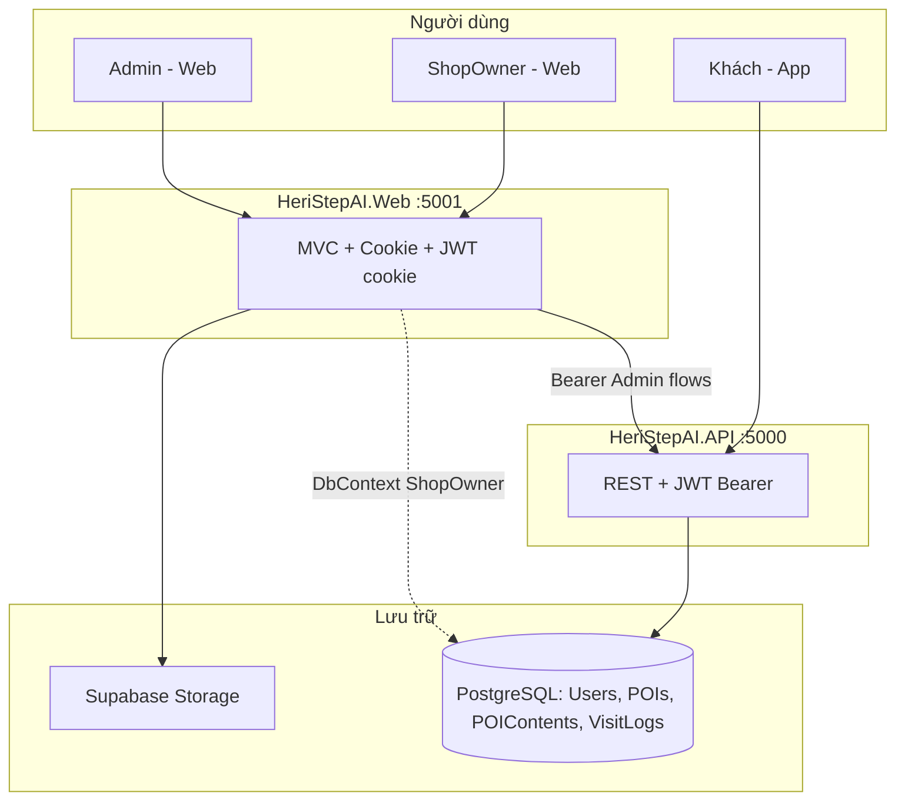
```mermaid
flowchart TB
    subgraph Users["Người dùng"]
        A[Admin - Web]
        S[ShopOwner - Web]
        U[Khách - App]
    end
    subgraph Web["HeriStepAI.Web :5001"]
        W[MVC + Cookie + JWT cookie]
    end
    subgraph API["HeriStepAI.API :5000"]
        AP[REST + JWT Bearer]
    end
    subgraph Storage["Lưu trữ"]
        DB[(PostgreSQL: Users, POIs, POIContents, VisitLogs)]
        SUP[Supabase Storage]
    end
    A --> W
    S --> W
    U --> AP
    W -->|Bearer Admin flows| AP
    W -.->|DbContext ShopOwner| DB
    W --> SUP
    AP --> DB
```

### A.2 Mobile: sync POI

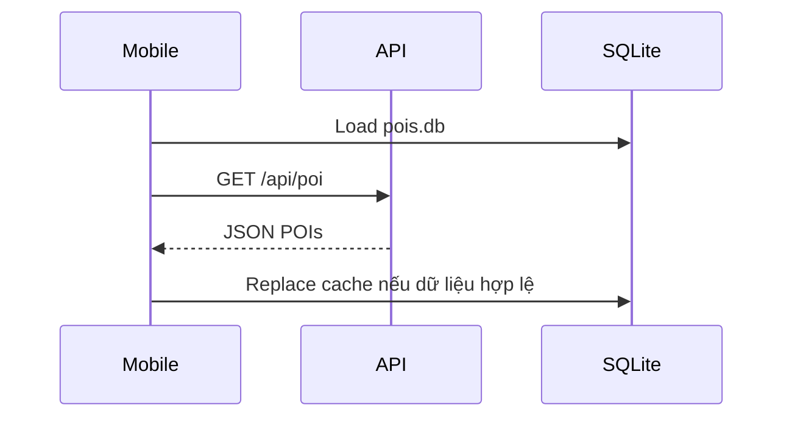
```mermaid
sequenceDiagram
    participant App as Mobile
    participant API as API
    participant SQL as SQLite
    App->>SQL: Load pois.db
    App->>API: GET /api/poi
    API-->>App: JSON POIs
    App->>SQL: Replace cache nếu dữ liệu hợp lệ
```

---

## Phụ lục B -  System Flow (Mermaid full)

# Sơ đồ flow hệ thống HeriStepAI (Mermaid)

---

## Sơ đồ B.1: Tổng quan thành phần và luồng dữ liệu

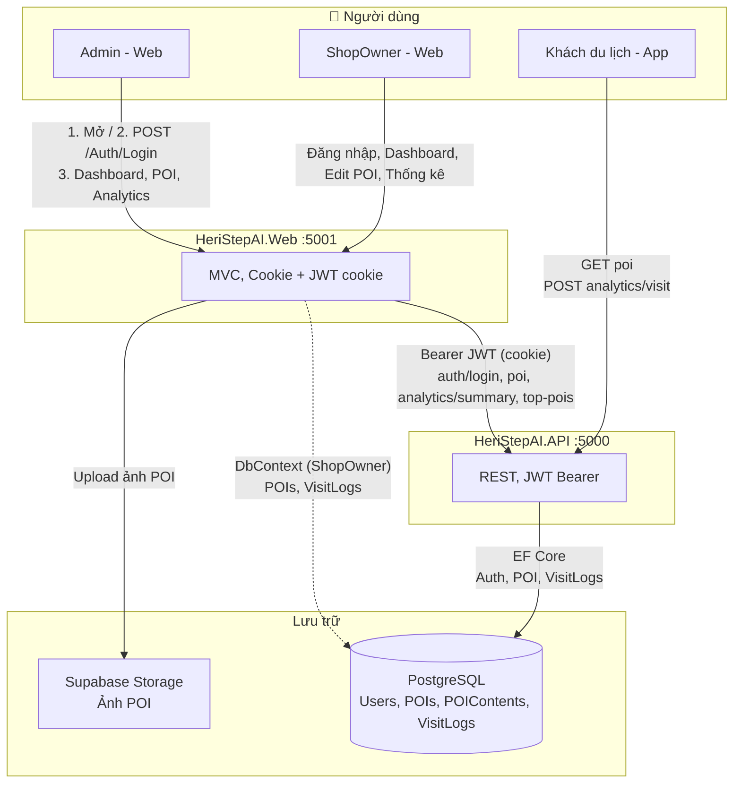
```mermaid
flowchart TB
    subgraph Users["👤 Người dùng"]
        A[Admin - Web]
        S[ShopOwner - Web]
        U[Khách du lịch - App]
    end

    subgraph Web["HeriStepAI.Web :5001"]
        W[MVC, Cookie + JWT cookie]
    end

    subgraph API["HeriStepAI.API :5000"]
        AP[REST, JWT Bearer]
    end

    subgraph Storage["Lưu trữ"]
        DB[(PostgreSQL<br/>Users, POIs, POIContents, VisitLogs)]
        SUP[Supabase Storage<br/>Ảnh POI]
    end

    A -->|"1. Mở / 2. POST /Auth/Login<br/>3. Dashboard, POI, Analytics"| W
    S -->|"Đăng nhập, Dashboard, Edit POI, Thống kê"| W
    U -->|"GET poi<br/>POST analytics/visit"| AP

    W -->|"Bearer JWT (cookie)<br/>auth/login, poi, analytics/summary, top-pois"| AP
    W -.->|"DbContext (ShopOwner)<br/>POIs, VisitLogs"| DB
    W -->|"Upload ảnh POI"| SUP
    AP -->|"EF Core<br/>Auth, POI, VisitLogs"| DB
```

### Giải thích chi tiết – Sơ đồ 1

| Thành phần | Ý nghĩa |
|------------|--------|
| **Users** | Ba loại người dùng: **Admin** (quản trị toàn hệ thống qua web), **ShopOwner** (chủ điểm POI, quản lý POI qua web), **Khách du lịch** (dùng app mobile để xem POI và ghi visit). |
| **HeriStepAI.Web :5001** | Ứng dụng web MVC chạy cổng 5001. Dùng **cookie** để lưu session và lưu **JWT trong cookie** (AuthToken) sau khi đăng nhập. Admin và ShopOwner đều truy cập qua đây. |
| **HeriStepAI.API :5000** | API REST chạy cổng 5000. Mọi request từ Web (Admin) và App đều xác thực bằng **JWT Bearer** trong header. |
| **PostgreSQL** | Cơ sở dữ liệu chính: bảng **Users** (đăng nhập, role), **POIs** (điểm tham quan), **POIContents** (nội dung đa ngôn ngữ), **VisitLogs** (lịch sử khách ghé thăm). Có thể dùng Supabase hoặc PostgreSQL local. |
| **Supabase Storage** | Lưu **ảnh POI**. Web upload ảnh khi Admin/ShopOwner tạo hoặc sửa POI; URL ảnh lưu trong DB. |

**Các mũi tên (luồng):**

- **Admin → Web:** (1) Mở trang chủ `/`, (2) POST `/Auth/Login` để đăng nhập, (3) Sau khi đăng nhập xem Dashboard, quản lý POI, xem Analytics.
- **ShopOwner → Web:** Đăng nhập tương tự, sau đó dùng Dashboard riêng, chỉnh sửa POI của mình, xem thống kê visit.
- **Khách du lịch → API (qua App):** App không qua Web; không cần đăng nhập. App GET danh sách POI và POST `analytics/visit` khi vào vùng POI. Trạng thái subscription lưu trong **SecureStorage**.
- **Web → API:** Khi Admin xem Dashboard/POI/Analytics, Web gửi request với **Bearer JWT** (lấy từ cookie) tới các endpoint: `auth/login`, `poi`, `analytics/summary`, `analytics/top-pois`, `poi/{id}/statistics`.
- **Web -.-→ DB (nét đứt):** **ShopOwner** đọc/ghi **trực tiếp** DB qua **DbContext** trong Web (cùng connection string với API), không đi qua API. Đây là luồng riêng so với Admin.
- **Web → Supabase Storage:** Khi tạo/sửa POI, Web upload ảnh lên bucket Supabase Storage.
- **API → DB:** API dùng **EF Core** để đọc/ghi Users, POI, VisitLogs (đăng nhập, danh sách POI, ghi visit từ App).

---

## Sơ đồ B.2: Flow đăng nhập Web (Admin / ShopOwner)

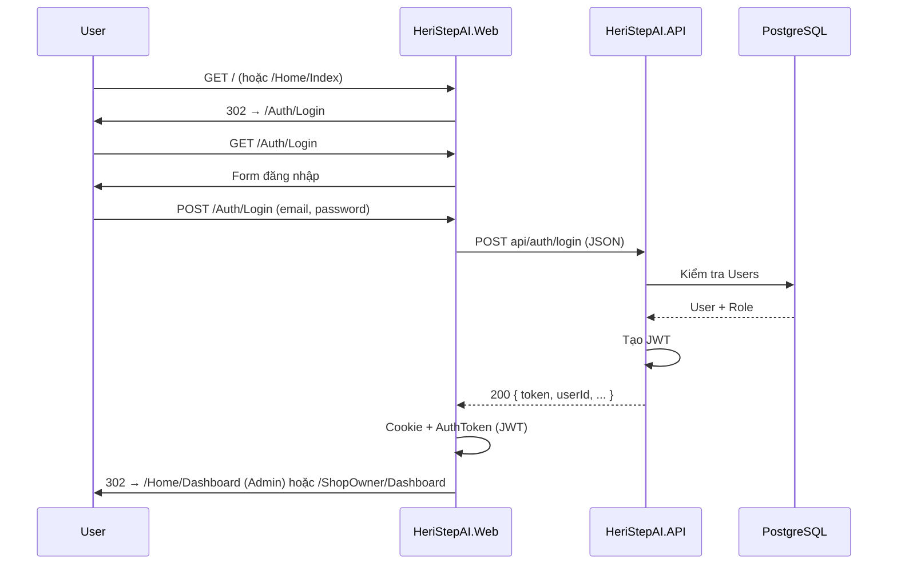
```mermaid
sequenceDiagram
    participant User
    participant Web as HeriStepAI.Web
    participant API as HeriStepAI.API
    participant DB as PostgreSQL

    User->>Web: GET / (hoặc /Home/Index)
    Web->>User: 302 → /Auth/Login
    User->>Web: GET /Auth/Login
    Web->>User: Form đăng nhập
    User->>Web: POST /Auth/Login (email, password)
    Web->>API: POST api/auth/login (JSON)
    API->>DB: Kiểm tra Users
    DB-->>API: User + Role
    API->>API: Tạo JWT
    API-->>Web: 200 { token, userId, ... }
    Web->>Web: Cookie + AuthToken (JWT)
    Web->>User: 302 → /Home/Dashboard (Admin) hoặc /ShopOwner/Dashboard
```

### Giải thích chi tiết – Sơ đồ 2

| Bước | Hành động | Giải thích |
|------|-----------|------------|
| 1 | User gửi **GET /** (hoặc `/Home/Index`) | Truy cập trang chủ. Nếu chưa đăng nhập, Web trả về redirect. |
| 2 | Web trả **302 → /Auth/Login** | Redirect trình duyệt tới trang đăng nhập. |
| 3 | User gửi **GET /Auth/Login** | Trình duyệt request trang form đăng nhập. |
| 4 | Web trả **form đăng nhập** | Hiển thị form email + password (Razor view). |
| 5 | User gửi **POST /Auth/Login** (email, password) | Submit form. Web nhận dữ liệu từ form. |
| 6 | Web gọi **POST api/auth/login** (JSON) | Web chuyển tiếp sang API (gửi email, password dạng JSON). API là nơi kiểm tra user. |
| 7 | API truy vấn **DB (Users)** | Kiểm tra email tồn tại, verify password (hash), lấy role (Admin/ShopOwner). |
| 8 | DB trả **User + Role** | API biết user hợp lệ và role để phân quyền. |
| 9 | API **tạo JWT** | Ký token chứa userId, role, expiry. |
| 10 | API trả **200 { token, userId, ... }** | Web nhận JWT và thông tin user. |
| 11 | Web ghi **Cookie + AuthToken (JWT)** | Lưu JWT vào cookie (httpOnly nếu có) để các request sau gửi kèm. |
| 12 | Web trả **302** tới Dashboard | **Admin** → `/Home/Dashboard`, **ShopOwner** → `/ShopOwner/Dashboard`. Trình duyệt chuyển sang trang tương ứng. |

---

## Sơ đồ B.3: Flow Dashboard Admin (Web → API)

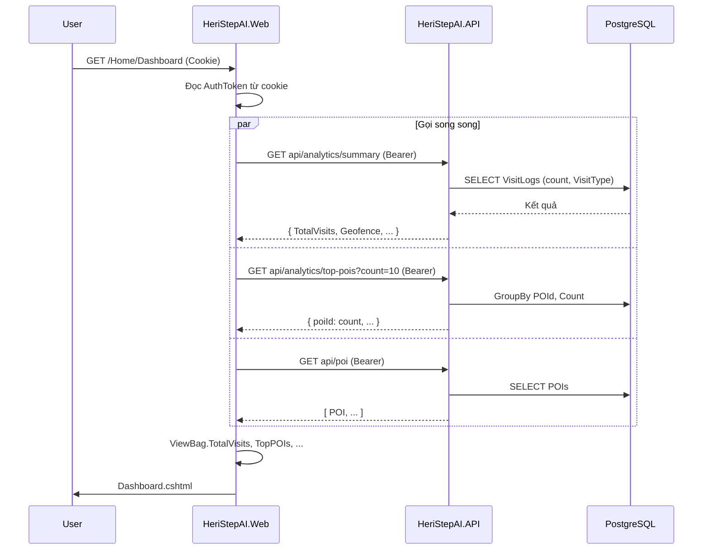
```mermaid
sequenceDiagram
    participant User
    participant Web as HeriStepAI.Web
    participant API as HeriStepAI.API
    participant DB as PostgreSQL

    User->>Web: GET /Home/Dashboard (Cookie)
    Web->>Web: Đọc AuthToken từ cookie
    par Gọi song song
        Web->>API: GET api/analytics/summary (Bearer)
        API->>DB: SELECT VisitLogs (count, VisitType)
        DB-->>API: Kết quả
        API-->>Web: { TotalVisits, Geofence, ... }
    and
        Web->>API: GET api/analytics/top-pois?count=10 (Bearer)
        API->>DB: GroupBy POId, Count
        API-->>Web: { poiId: count, ... }
    and
        Web->>API: GET api/poi (Bearer)
        API->>DB: SELECT POIs
        API-->>Web: [ POI, ... ]
    end
    Web->>Web: ViewBag.TotalVisits, TopPOIs, ...
    Web->>User: Dashboard.cshtml
```

### Giải thích chi tiết – Sơ đồ 3

| Bước | Hành động | Giải thích |
|------|-----------|------------|
| 1 | User gửi **GET /Home/Dashboard** (kèm Cookie) | Admin đã đăng nhập; trình duyệt gửi cookie chứa session/JWT. |
| 2 | Web **đọc AuthToken từ cookie** | Web lấy JWT từ cookie để gửi lên API dưới dạng header `Authorization: Bearer <token>`. |
| 3 | Web gọi **ba API song song** (par) | Để Dashboard load nhanh, Web gửi đồng thời 3 request thay vì gọi tuần tự. |
| 3a | **GET api/analytics/summary** (Bearer) | Lấy tổng quan: tổng lượt visit, phân loại theo VisitType (Geofence, Manual, …). API truy vấn VisitLogs (count, group by VisitType) rồi trả JSON. |
| 3b | **GET api/analytics/top-pois?count=10** (Bearer) | Lấy top 10 POI có nhiều visit nhất. API group by POId, count, sort, trả về danh sách. |
| 3c | **GET api/poi** (Bearer) | Lấy danh sách POI (để hiển thị bảng, dropdown, v.v.). API SELECT POIs từ DB. |
| 4 | API truy vấn **DB** (VisitLogs, POIs) | Mỗi endpoint dùng EF Core đọc bảng tương ứng. |
| 5 | Web nhận 3 response, gán **ViewBag** | ViewBag.TotalVisits, ViewBag.TopPOIs, danh sách POI để truyền sang view. |
| 6 | Web render **Dashboard.cshtml** | View Razor dùng dữ liệu trong ViewBag/Model để hiển thị số liệu, biểu đồ, bảng POI cho Admin. |

---

## Sơ đồ B.4: Flow App Mobile – Khởi động và ghi visit

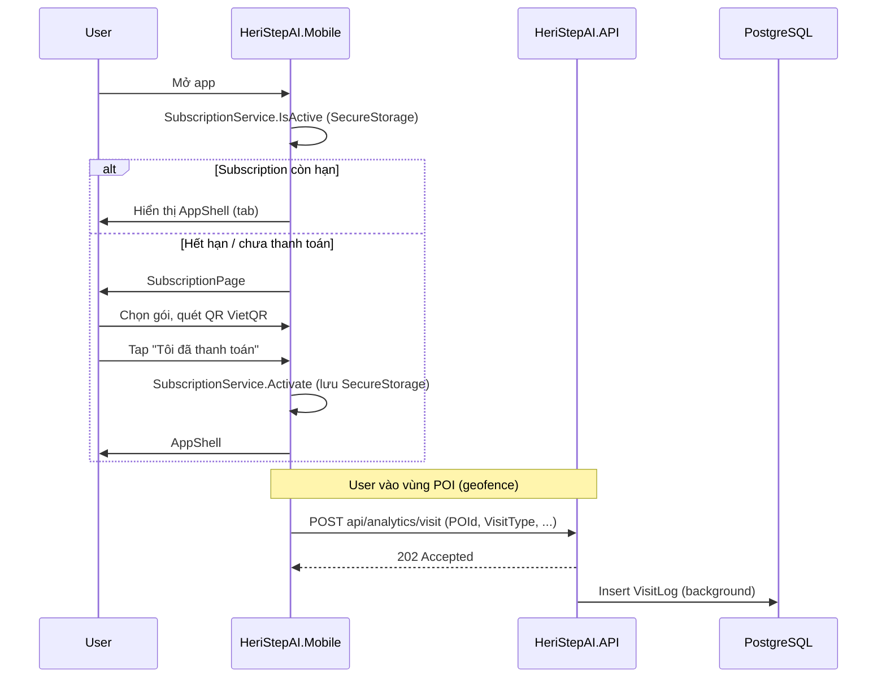
```mermaid
sequenceDiagram
    participant User
    participant App as HeriStepAI.Mobile
    participant API as HeriStepAI.API
    participant DB as PostgreSQL

    User->>App: Mở app
    App->>App: SubscriptionService.IsActive (SecureStorage)
    alt Subscription còn hạn
        App->>User: Hiển thị AppShell (tab)
    else Hết hạn / chưa thanh toán
        App->>User: SubscriptionPage
        User->>App: Chọn gói, quét QR VietQR
        User->>App: Tap "Tôi đã thanh toán"
        App->>App: SubscriptionService.Activate (lưu SecureStorage)
        App->>User: AppShell
    end

    Note over App,API: User vào vùng POI (geofence)
    App->>API: POST api/analytics/visit (POId, VisitType, ...)
    API-->>App: 202 Accepted
    API->>DB: Insert VisitLog (background)
```

### Giải thích chi tiết – Sơ đồ 4

| Bước | Hành động | Giải thích |
|------|-----------|------------|
| 1 | User **mở app** | Ứng dụng mobile (HeriStepAI.Mobile) khởi động. |
| 2 | App gọi **SubscriptionService.IsActive** | Đọc trạng thái subscription từ **SecureStorage**. Nếu còn hạn → vào AppShell ngay. |
| 3a | **Subscription còn hạn** | App chuyển thẳng tới **AppShell** (màn hình chính với tab). |
| 3b | **Hết hạn / chưa thanh toán** | Hiển thị **SubscriptionPage**. User chọn gói, quét QR VietQR, tap xác nhận. App kích hoạt subscription và lưu vào SecureStorage, rồi chuyển sang AppShell. |
| 4 | **User vào vùng POI (geofence)** | App dùng GPS/geofencing; khi user vào vùng bán kính quanh POI, app coi là “đã ghé thăm”. |
| 5 | App gửi **POST api/analytics/visit** (POId, VisitType, …) | Gửi POI id, loại visit (Geofence/Manual). API nhận payload và ghi nhận. |
| 6 | API trả **202 Accepted** | API chấp nhận request. |
| 7 | API **Insert VisitLog** (background) | Ghi một dòng vào bảng VisitLogs để Admin/ShopOwner xem thống kê. |

---

## Sơ đồ B.5: Phân tách nguồn dữ liệu (Web)

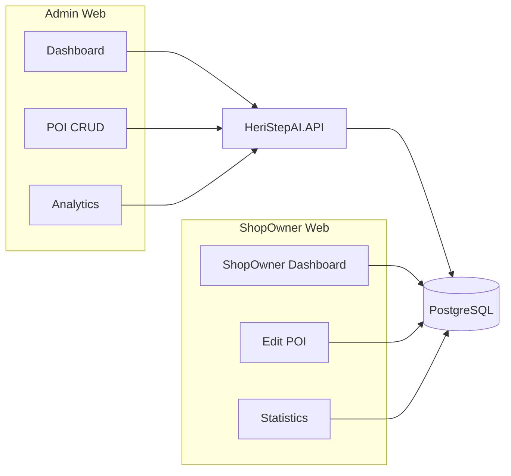
```mermaid
flowchart LR
    subgraph Admin["Admin Web"]
        D[Dashboard]
        P[POI CRUD]
        AN[Analytics]
    end

    subgraph ShopOwner["ShopOwner Web"]
        SD[ShopOwner Dashboard]
        SE[Edit POI]
        ST[Statistics]
    end

    API[HeriStepAI.API]
    DB[(PostgreSQL)]

    D --> API
    P --> API
    AN --> API
    API --> DB

    SD --> DB
    SE --> DB
    ST --> DB
```

### Giải thích chi tiết – Sơ đồ 5

Sơ đồ này nhấn mạnh **hai cách Web lấy dữ liệu** tùy vai trò:

| Nhánh | Thành phần | Nguồn dữ liệu | Giải thích |
|-------|------------|----------------|------------|
| **Admin Web** | Dashboard (D), POI CRUD (P), Analytics (AN) | **Luôn qua API** | Admin dùng các trang Web (Dashboard, quản lý POI, Analytics). Web **không** đọc DB trực tiếp; mỗi trang gọi **HeriStepAI.API** với Bearer JWT. API dùng EF Core đọc/ghi **PostgreSQL**. Cách này thống nhất logic nghiệp vụ ở API, dễ bảo trì và tái dùng cho App. |
| **ShopOwner Web** | ShopOwner Dashboard (SD), Edit POI (SE), Statistics (ST) | **Trực tiếp DB** | ShopOwner chỉ xem/sửa POI và thống kê **của mình**. Web dùng **DbContext** (cùng connection string với API) để truy vấn trực tiếp **PostgreSQL** (bảng POIs, VisitLogs, …), **không** gọi API. Giảm số request qua API và tận dụng filter theo ShopOwnerId trong Web. |

**Tóm tắt:** Admin → Web → **API** → DB; ShopOwner → Web → **DB** trực tiếp. App luôn dùng API → DB.

---

**Chú thích:**
- **Admin:** Cookie + JWT trong cookie; mọi request Dashboard/POI/Analytics đều gọi API với Bearer.
- **ShopOwner:** Đọc/ghi DB qua DbContext (cùng DB với API), không gọi API cho Dashboard/Edit/Statistics.
- **App:** Không đăng nhập; subscription lưu trong SecureStorage. Gọi API trực tiếp (poi, analytics/visit).

## Phụ lục B.2 — Use Case Diagrams

> Mô tả tất cả ca sử dụng theo từng tác nhân, phản ánh đúng codebase hiện tại.

---

### B.1 Use Case — Toàn hệ thống

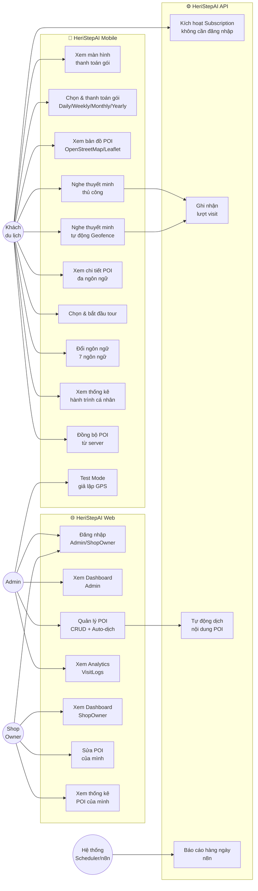
```mermaid
graph LR
    Tourist((Khách\ndu lịch))
    ShopOwner((Shop\nOwner))
    Admin((Admin))
    System((Hệ thống\nScheduler/n8n))

    subgraph Mobile["📱 HeriStepAI Mobile"]
        UC1[Xem màn hình\nthanh toán gói]
        UC2[Chọn & thanh toán gói\nDaily/Weekly/Monthly/Yearly]
        UC3[Xem bản đồ POI\nOpenStreetMap/Leaflet]
        UC4[Nghe thuyết minh\ntự động Geofence]
        UC5[Nghe thuyết minh\nthủ công]
        UC6[Xem chi tiết POI\nđa ngôn ngữ]
        UC7[Chọn & bắt đầu tour]
        UC8[Đổi ngôn ngữ\n7 ngôn ngữ]
        UC9[Xem thống kê\nhành trình cá nhân]
        UC10[Đồng bộ POI\ntừ server]
        UC11[Test Mode\ngiả lập GPS]
    end

    subgraph Web["🌐 HeriStepAI Web"]
        UC12[Đăng nhập\nAdmin/ShopOwner]
        UC13[Xem Dashboard\nAdmin]
        UC14[Quản lý POI\nCRUD + Auto-dịch]
        UC15[Xem Analytics\nVisitLogs]
        UC16[Xem Dashboard\nShopOwner]
        UC17[Sửa POI\ncủa mình]
        UC18[Xem thống kê\nPOI của mình]
    end

    subgraph API["⚙️ HeriStepAI API"]
        UC19[Kích hoạt Subscription\nkhông cần đăng nhập]
        UC20[Ghi nhận\nlượt visit]
        UC21[Tự động dịch\nnội dung POI]
        UC22[Báo cáo hàng ngày\nn8n]
    end

    Tourist --> UC1
    Tourist --> UC2
    Tourist --> UC3
    Tourist --> UC4
    Tourist --> UC5
    Tourist --> UC6
    Tourist --> UC7
    Tourist --> UC8
    Tourist --> UC9
    Tourist --> UC10
    Tourist --> UC19

    ShopOwner --> UC12
    ShopOwner --> UC16
    ShopOwner --> UC17
    ShopOwner --> UC18

    Admin --> UC12
    Admin --> UC13
    Admin --> UC14
    Admin --> UC15
    Admin --> UC11

    System --> UC22
    UC4 --> UC20
    UC5 --> UC20
    UC14 --> UC21
```

---

### B.2 Use Case — Mobile (chi tiết)

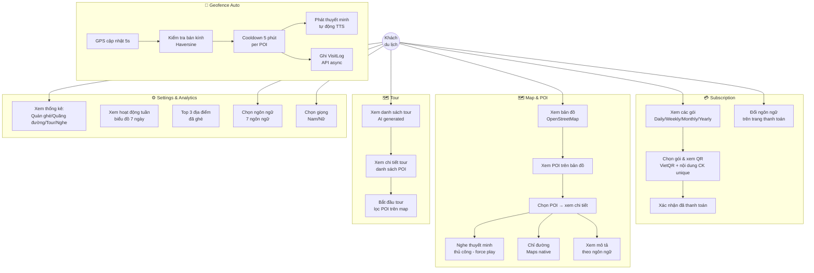
```mermaid
graph TB
    Tourist((Khách\ndu lịch))

    subgraph Subscription["💳 Subscription"]
        S1[Xem các gói\nDaily/Weekly/Monthly/Yearly]
        S2[Chọn gói & xem QR\nVietQR + nội dung CK unique]
        S3[Xác nhận đã thanh toán]
        S4[Đổi ngôn ngữ\ntrên trang thanh toán]
        S1 --> S2 --> S3
    end

    subgraph Map["🗺️ Map & POI"]
        M1[Xem bản đồ\nOpenStreetMap]
        M2[Xem POI trên bản đồ]
        M3[Chọn POI → xem chi tiết]
        M4[Nghe thuyết minh\nthủ công - force play]
        M5[Chỉ đường\nMaps native]
        M6[Xem mô tả\ntheo ngôn ngữ]
        M1 --> M2 --> M3 --> M4
        M3 --> M5
        M3 --> M6
    end

    subgraph Geofence["📡 Geofence Auto"]
        G1[GPS cập nhật 5s]
        G2[Kiểm tra bán kính\nHaversine]
        G3[Cooldown 5 phút\nper POI]
        G4[Phát thuyết minh\ntự động TTS]
        G5[Ghi VisitLog\nAPI async]
        G1 --> G2 --> G3 --> G4
        G3 --> G5
    end

    subgraph Tour["🗺️ Tour"]
        T1[Xem danh sách tour\nAI generated]
        T2[Xem chi tiết tour\ndanh sách POI]
        T3[Bắt đầu tour\nlọc POI trên map]
        T1 --> T2 --> T3
    end

    subgraph Settings["⚙️ Settings & Analytics"]
        A1[Xem thống kê:\nQuán ghé/Quãng đường/Tour/Nghe]
        A2[Xem hoạt động tuần\nbiểu đồ 7 ngày]
        A3[Top 3 địa điểm\nđã ghé]
        A4[Chọn ngôn ngữ\n7 ngôn ngữ]
        A5[Chọn giọng\nNam/Nữ]
    end

    Tourist --> S1
    Tourist --> S4
    Tourist --> M1
    Tourist --> T1
    Tourist --> A1
    Tourist --> A4
    Tourist --> A5
```

---

## Phụ lục C — Sequence Diagrams

> Mô tả chi tiết luồng tương tác giữa các thành phần theo thứ tự thời gian, phản ánh đúng code hiện tại.

---

### C.1 App Startup — Kiểm tra Subscription

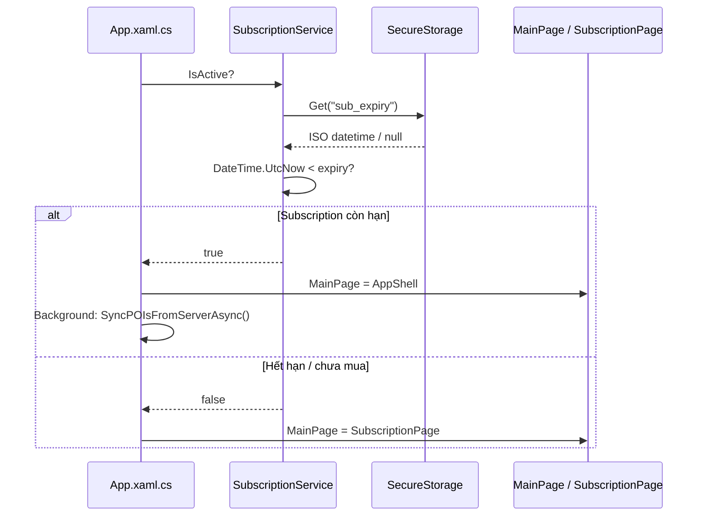
```mermaid
sequenceDiagram
    participant App as App.xaml.cs
    participant Sub as SubscriptionService
    participant Sec as SecureStorage
    participant UI as MainPage / SubscriptionPage

    App->>Sub: IsActive?
    Sub->>Sec: Get("sub_expiry")
    Sec-->>Sub: ISO datetime / null
    Sub->>Sub: DateTime.UtcNow < expiry?
    alt Subscription còn hạn
        Sub-->>App: true
        App->>UI: MainPage = AppShell
        App->>App: Background: SyncPOIsFromServerAsync()
    else Hết hạn / chưa mua
        Sub-->>App: false
        App->>UI: MainPage = SubscriptionPage
    end
```

---

### C.2 Thanh toán Subscription

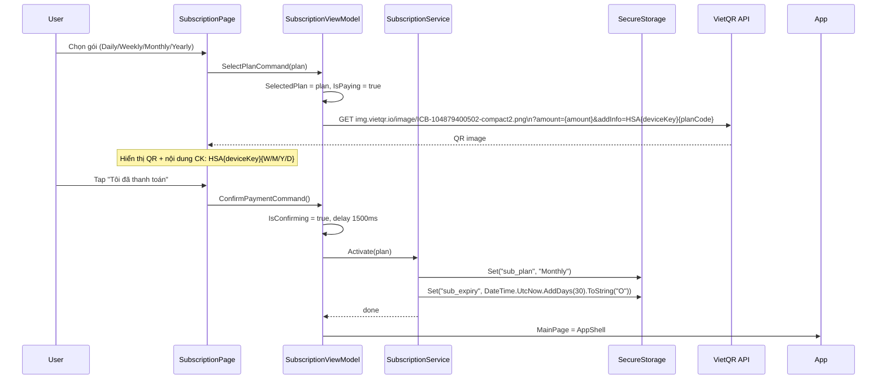
```mermaid
sequenceDiagram
    participant User
    participant SubPage as SubscriptionPage
    participant VM as SubscriptionViewModel
    participant Sub as SubscriptionService
    participant Sec as SecureStorage
    participant VietQR as VietQR API
    participant App as App

    User->>SubPage: Chọn gói (Daily/Weekly/Monthly/Yearly)
    SubPage->>VM: SelectPlanCommand(plan)
    VM->>VM: SelectedPlan = plan, IsPaying = true
    VM->>VietQR: GET img.vietqr.io/image/ICB-104879400502-compact2.png\n?amount={amount}&addInfo=HSA{deviceKey}{planCode}
    VietQR-->>SubPage: QR image
    Note over SubPage: Hiển thị QR + nội dung CK: HSA{deviceKey}{W/M/Y/D}
    User->>SubPage: Tap "Tôi đã thanh toán"
    SubPage->>VM: ConfirmPaymentCommand()
    VM->>VM: IsConfirming = true, delay 1500ms
    VM->>Sub: Activate(plan)
    Sub->>Sec: Set("sub_plan", "Monthly")
    Sub->>Sec: Set("sub_expiry", DateTime.UtcNow.AddDays(30).ToString("O"))
    Sub-->>VM: done
    VM->>App: MainPage = AppShell
```

---

### C.3 Đăng nhập Web (Admin / ShopOwner)

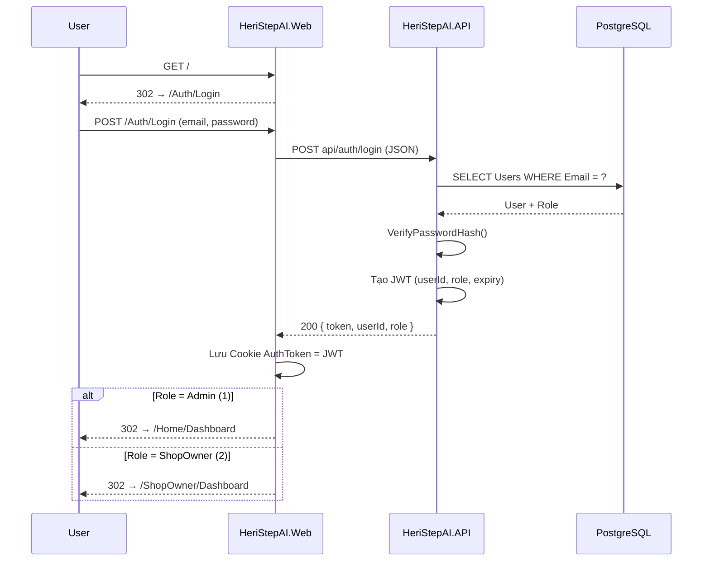
```mermaid
sequenceDiagram
    participant User
    participant Web as HeriStepAI.Web
    participant API as HeriStepAI.API
    participant DB as PostgreSQL

    User->>Web: GET / 
    Web-->>User: 302 → /Auth/Login
    User->>Web: POST /Auth/Login (email, password)
    Web->>API: POST api/auth/login (JSON)
    API->>DB: SELECT Users WHERE Email = ?
    DB-->>API: User + Role
    API->>API: VerifyPasswordHash()
    API->>API: Tạo JWT (userId, role, expiry)
    API-->>Web: 200 { token, userId, role }
    Web->>Web: Lưu Cookie AuthToken = JWT
    alt Role = Admin (1)
        Web-->>User: 302 → /Home/Dashboard
    else Role = ShopOwner (2)
        Web-->>User: 302 → /ShopOwner/Dashboard
    end
```

---

### C.4 Admin tạo POI mới + Auto-translate

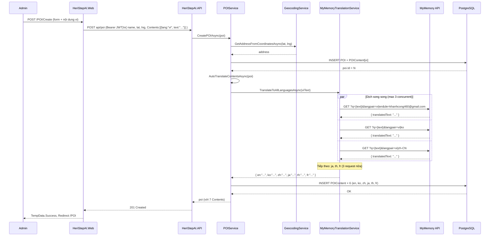
```mermaid
sequenceDiagram
    participant Admin
    participant Web as HeriStepAI.Web
    participant API as HeriStepAI.API
    participant POISvc as POIService
    participant GeoSvc as GeocodingService
    participant TransSvc as MyMemoryTranslationService
    participant MyMemory as MyMemory API
    participant DB as PostgreSQL

    Admin->>Web: POST /POI/Create (form + nội dung vi)
    Web->>API: POST api/poi (Bearer JWT)\n{ name, lat, lng, Contents:[{lang:"vi", text:"..."}] }
    API->>POISvc: CreatePOIAsync(poi)
    POISvc->>GeoSvc: GetAddressFromCoordinatesAsync(lat, lng)
    GeoSvc-->>POISvc: address
    POISvc->>DB: INSERT POI + POIContent[vi]
    DB-->>POISvc: poi.Id = N
    POISvc->>POISvc: AutoTranslateContentsAsync(poi)
    POISvc->>TransSvc: TranslateToAllLanguagesAsync(viText)
    par Dịch song song (max 3 concurrent)
        TransSvc->>MyMemory: GET ?q={text}&langpair=vi|en&de=khanhcong460@gmail.com
        MyMemory-->>TransSvc: { translatedText: "..." }
    and
        TransSvc->>MyMemory: GET ?q={text}&langpair=vi|ko
        MyMemory-->>TransSvc: { translatedText: "..." }
    and
        TransSvc->>MyMemory: GET ?q={text}&langpair=vi|zh-CN
        MyMemory-->>TransSvc: { translatedText: "..." }
    end
    Note over TransSvc: Tiếp theo: ja, th, fr (3 request nữa)
    TransSvc-->>POISvc: { en:"...", ko:"...", zh:"...", ja:"...", th:"...", fr:"..." }
    POISvc->>DB: INSERT POIContent × 6 (en, ko, zh, ja, th, fr)
    DB-->>POISvc: OK
    POISvc-->>API: poi (với 7 Contents)
    API-->>Web: 201 Created
    Web-->>Admin: TempData.Success, Redirect /POI
```

---

### C.5 Admin cập nhật POI

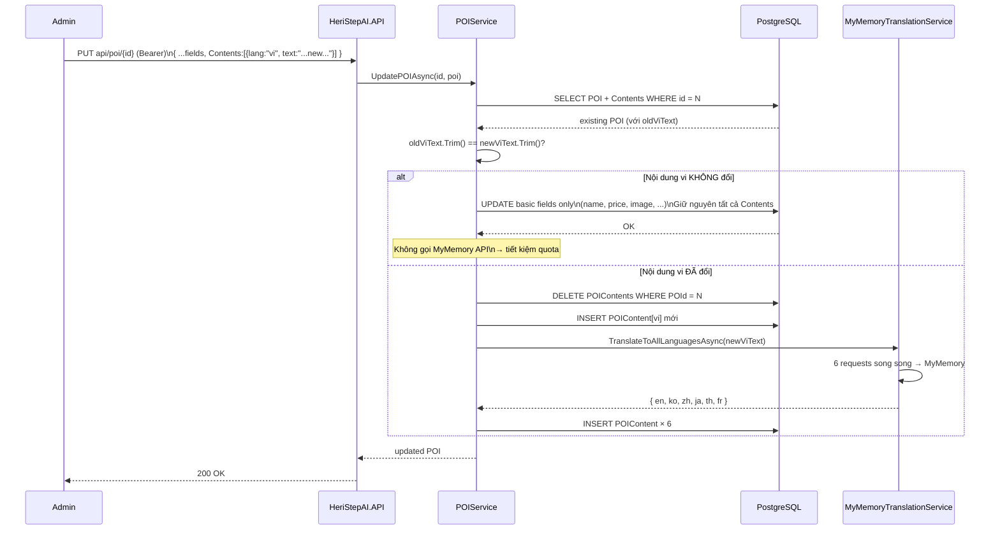
```mermaid
sequenceDiagram
    participant Admin
    participant API as HeriStepAI.API
    participant POISvc as POIService
    participant DB as PostgreSQL
    participant TransSvc as MyMemoryTranslationService

    Admin->>API: PUT api/poi/{id} (Bearer)\n{ ...fields, Contents:[{lang:"vi", text:"...new..."}] }
    API->>POISvc: UpdatePOIAsync(id, poi)
    POISvc->>DB: SELECT POI + Contents WHERE id = N
    DB-->>POISvc: existing POI (với oldViText)
    POISvc->>POISvc: oldViText.Trim() == newViText.Trim()?
    alt Nội dung vi KHÔNG đổi
        POISvc->>DB: UPDATE basic fields only\n(name, price, image, ...)\nGiữ nguyên tất cả Contents
        DB-->>POISvc: OK
        Note over POISvc: Không gọi MyMemory API\n→ tiết kiệm quota
    else Nội dung vi ĐÃ đổi
        POISvc->>DB: DELETE POIContents WHERE POId = N
        POISvc->>DB: INSERT POIContent[vi] mới
        POISvc->>TransSvc: TranslateToAllLanguagesAsync(newViText)
        TransSvc->>TransSvc: 6 requests song song → MyMemory
        TransSvc-->>POISvc: { en, ko, zh, ja, th, fr }
        POISvc->>DB: INSERT POIContent × 6
    end
    POISvc-->>API: updated POI
    API-->>Admin: 200 OK
```

---

### C.6 Mobile — Khởi động & đồng bộ POI

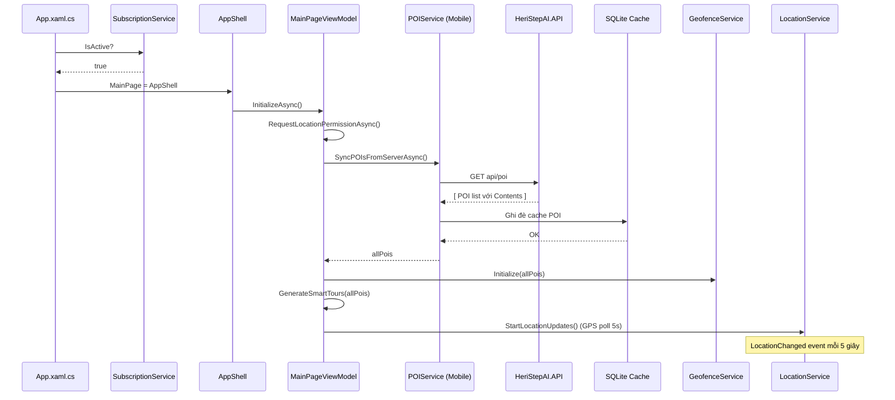
```mermaid
sequenceDiagram
    participant App as App.xaml.cs
    participant Sub as SubscriptionService
    participant Shell as AppShell
    participant Main as MainPageViewModel
    participant POISvc as POIService (Mobile)
    participant API as HeriStepAI.API
    participant SQLite as SQLite Cache
    participant Geo as GeofenceService
    participant Loc as LocationService

    App->>Sub: IsActive?
    Sub-->>App: true
    App->>Shell: MainPage = AppShell
    Shell->>Main: InitializeAsync()
    Main->>Main: RequestLocationPermissionAsync()
    Main->>POISvc: SyncPOIsFromServerAsync()
    POISvc->>API: GET api/poi
    API-->>POISvc: [ POI list với Contents ]
    POISvc->>SQLite: Ghi đè cache POI
    SQLite-->>POISvc: OK
    POISvc-->>Main: allPois
    Main->>Geo: Initialize(allPois)
    Main->>Main: GenerateSmartTours(allPois)
    Main->>Loc: StartLocationUpdates() (GPS poll 5s)
    Note over Loc: LocationChanged event mỗi 5 giây
```

---

### C.7 Geofence — Tự động phát thuyết minh (3 lớp anti-spam)

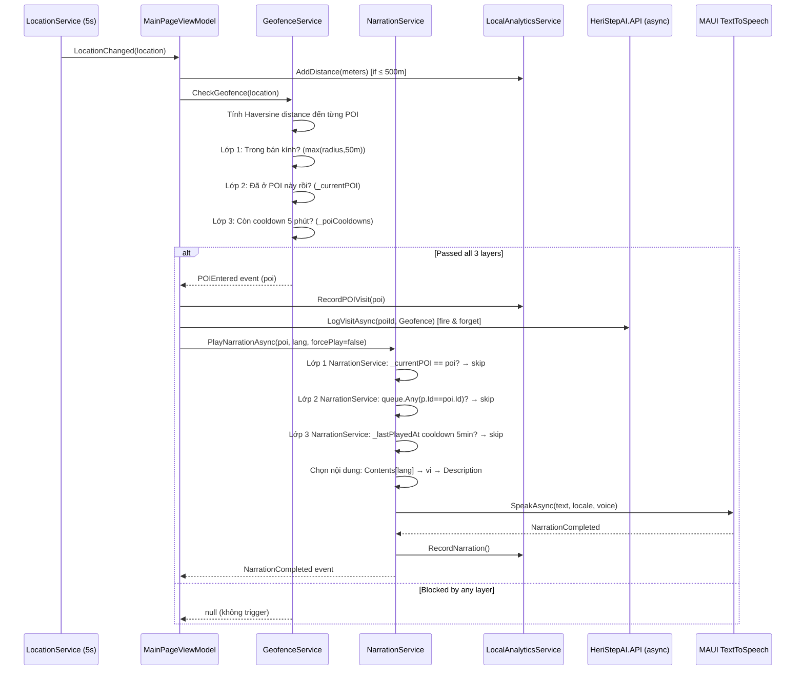
```mermaid
sequenceDiagram
    participant GPS as LocationService (5s)
    participant Main as MainPageViewModel
    participant Geo as GeofenceService
    participant Narr as NarrationService
    participant Analytics as LocalAnalyticsService
    participant API as HeriStepAI.API (async)
    participant TTS as MAUI TextToSpeech

    GPS->>Main: LocationChanged(location)
    Main->>Analytics: AddDistance(meters) [if ≤ 500m]
    Main->>Geo: CheckGeofence(location)
    Geo->>Geo: Tính Haversine distance đến từng POI
    Geo->>Geo: Lớp 1: Trong bán kính? (max(radius,50m))
    Geo->>Geo: Lớp 2: Đã ở POI này rồi? (_currentPOI)
    Geo->>Geo: Lớp 3: Còn cooldown 5 phút? (_poiCooldowns)
    alt Passed all 3 layers
        Geo-->>Main: POIEntered event (poi)
        Main->>Analytics: RecordPOIVisit(poi)
        Main->>API: LogVisitAsync(poiId, Geofence) [fire & forget]
        Main->>Narr: PlayNarrationAsync(poi, lang, forcePlay=false)
        Narr->>Narr: Lớp 1 NarrationService: _currentPOI == poi? → skip
        Narr->>Narr: Lớp 2 NarrationService: queue.Any(p.Id==poi.Id)? → skip
        Narr->>Narr: Lớp 3 NarrationService: _lastPlayedAt cooldown 5min? → skip
        Narr->>Narr: Chọn nội dung: Contents[lang] → vi → Description
        Narr->>TTS: SpeakAsync(text, locale, voice)
        TTS-->>Narr: NarrationCompleted
        Narr->>Analytics: RecordNarration()
        Narr-->>Main: NarrationCompleted event
    else Blocked by any layer
        Geo-->>Main: null (không trigger)
    end
```

---

### C.8 Người dùng nghe thuyết minh thủ công (POI Detail)

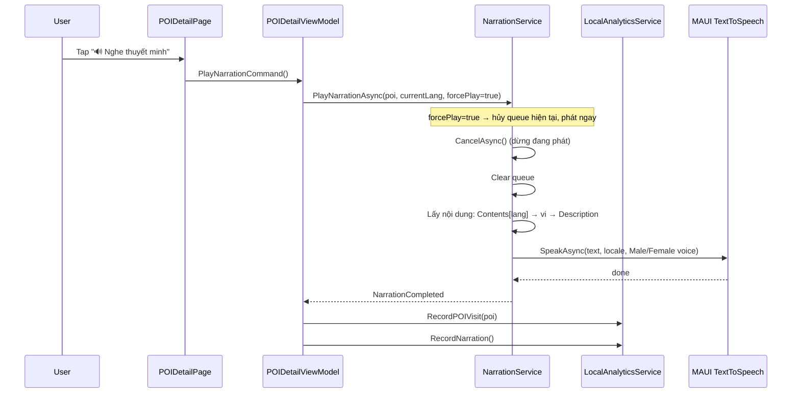
```mermaid
sequenceDiagram
    participant User
    participant Page as POIDetailPage
    participant VM as POIDetailViewModel
    participant Narr as NarrationService
    participant Analytics as LocalAnalyticsService
    participant TTS as MAUI TextToSpeech

    User->>Page: Tap "🔊 Nghe thuyết minh"
    Page->>VM: PlayNarrationCommand()
    VM->>Narr: PlayNarrationAsync(poi, currentLang, forcePlay=true)
    Note over Narr: forcePlay=true → hủy queue hiện tại, phát ngay
    Narr->>Narr: CancelAsync() (dừng đang phát)
    Narr->>Narr: Clear queue
    Narr->>Narr: Lấy nội dung: Contents[lang] → vi → Description
    Narr->>TTS: SpeakAsync(text, locale, Male/Female voice)
    TTS-->>Narr: done
    Narr-->>VM: NarrationCompleted
    VM->>Analytics: RecordPOIVisit(poi)
    VM->>Analytics: RecordNarration()
```

---

### C.9 Chọn Tour & lọc POI trên Map

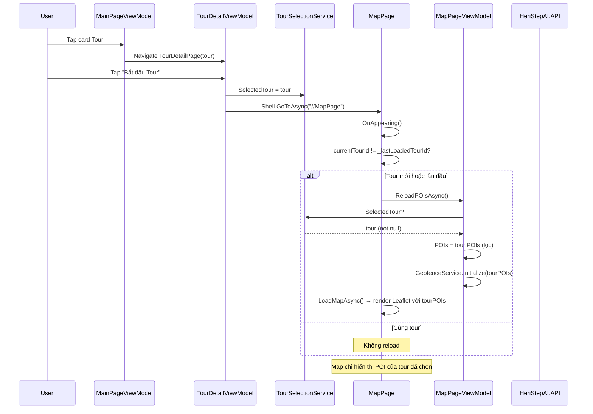
```mermaid
sequenceDiagram
    participant User
    participant MainVM as MainPageViewModel
    participant TourVM as TourDetailViewModel
    participant TourSvc as TourSelectionService
    participant MapPage as MapPage
    participant MapVM as MapPageViewModel
    participant API as HeriStepAI.API

    User->>MainVM: Tap card Tour
    MainVM->>TourVM: Navigate TourDetailPage(tour)
    User->>TourVM: Tap "Bắt đầu Tour"
    TourVM->>TourSvc: SelectedTour = tour
    TourVM->>MapPage: Shell.GoToAsync("//MapPage")
    MapPage->>MapPage: OnAppearing()
    MapPage->>MapPage: currentTourId != _lastLoadedTourId?
    alt Tour mới hoặc lần đầu
        MapPage->>MapVM: ReloadPOIsAsync()
        MapVM->>TourSvc: SelectedTour?
        TourSvc-->>MapVM: tour (not null)
        MapVM->>MapVM: POIs = tour.POIs (lọc)
        MapVM->>MapVM: GeofenceService.Initialize(tourPOIs)
        MapPage->>MapPage: LoadMapAsync() → render Leaflet với tourPOIs
    else Cùng tour
        Note over MapPage: Không reload
    end
    Note over MapPage: Map chỉ hiển thị POI của tour đã chọn
```

---

### C.10 Analytics — Ghi & hiển thị thống kê

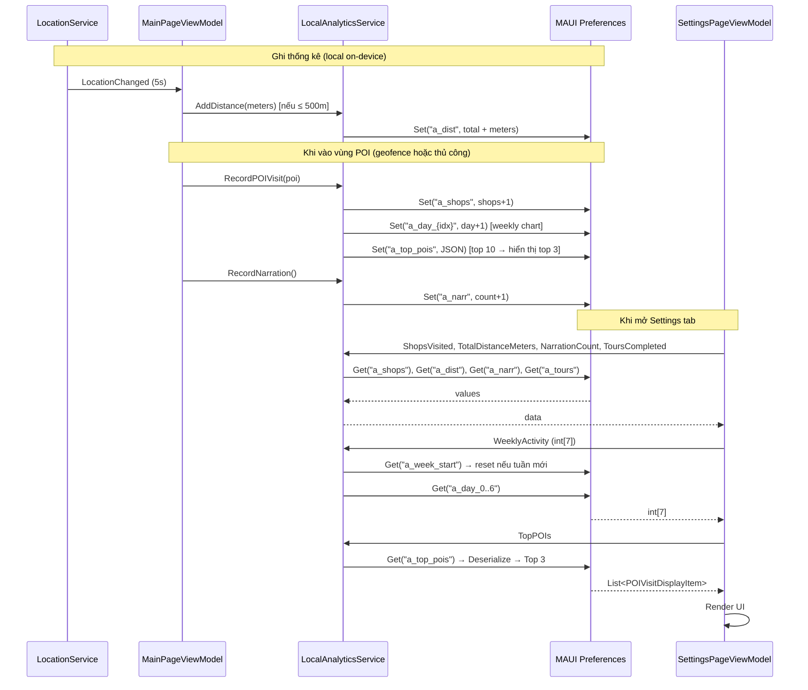
```mermaid
sequenceDiagram
    participant GPS as LocationService
    participant Main as MainPageViewModel
    participant Analytics as LocalAnalyticsService
    participant Prefs as MAUI Preferences
    participant Settings as SettingsPageViewModel

    Note over GPS,Prefs: Ghi thống kê (local on-device)

    GPS->>Main: LocationChanged (5s)
    Main->>Analytics: AddDistance(meters) [nếu ≤ 500m]
    Analytics->>Prefs: Set("a_dist", total + meters)

    Note over Main,Prefs: Khi vào vùng POI (geofence hoặc thủ công)
    Main->>Analytics: RecordPOIVisit(poi)
    Analytics->>Prefs: Set("a_shops", shops+1)
    Analytics->>Prefs: Set("a_day_{idx}", day+1) [weekly chart]
    Analytics->>Prefs: Set("a_top_pois", JSON) [top 10 → hiển thị top 3]

    Main->>Analytics: RecordNarration()
    Analytics->>Prefs: Set("a_narr", count+1)

    Note over Settings,Prefs: Khi mở Settings tab
    Settings->>Analytics: ShopsVisited, TotalDistanceMeters, NarrationCount, ToursCompleted
    Analytics->>Prefs: Get("a_shops"), Get("a_dist"), Get("a_narr"), Get("a_tours")
    Prefs-->>Analytics: values
    Analytics-->>Settings: data
    Settings->>Analytics: WeeklyActivity (int[7])
    Analytics->>Prefs: Get("a_week_start") → reset nếu tuần mới
    Analytics->>Prefs: Get("a_day_0..6")
    Prefs-->>Settings: int[7]
    Settings->>Analytics: TopPOIs
    Analytics->>Prefs: Get("a_top_pois") → Deserialize → Top 3
    Prefs-->>Settings: List<POIVisitDisplayItem>
    Settings->>Settings: Render UI
```

---

### C.11 Test Mode — Giả lập GPS tuần tự qua các POI

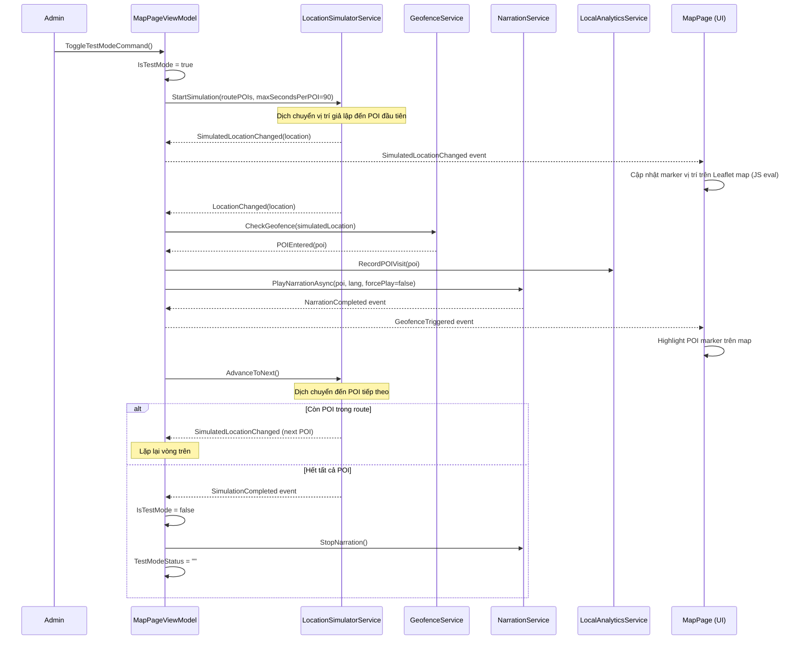
```mermaid
sequenceDiagram
    participant Admin
    participant MapVM as MapPageViewModel
    participant Sim as LocationSimulatorService
    participant Geo as GeofenceService
    participant Narr as NarrationService
    participant Analytics as LocalAnalyticsService
    participant MapPage as MapPage (UI)

    Admin->>MapVM: ToggleTestModeCommand()
    MapVM->>MapVM: IsTestMode = true
    MapVM->>Sim: StartSimulation(routePOIs, maxSecondsPerPOI=90)
    Note over Sim: Dịch chuyển vị trí giả lập đến POI đầu tiên
    Sim-->>MapVM: SimulatedLocationChanged(location)
    MapVM-->>MapPage: SimulatedLocationChanged event
    MapPage->>MapPage: Cập nhật marker vị trí trên Leaflet map (JS eval)

    Sim-->>MapVM: LocationChanged(location)
    MapVM->>Geo: CheckGeofence(simulatedLocation)
    Geo-->>MapVM: POIEntered(poi)
    MapVM->>Analytics: RecordPOIVisit(poi)
    MapVM->>Narr: PlayNarrationAsync(poi, lang, forcePlay=false)
    Narr-->>MapVM: NarrationCompleted event
    MapVM-->>MapPage: GeofenceTriggered event
    MapPage->>MapPage: Highlight POI marker trên map

    MapVM->>Sim: AdvanceToNext()
    Note over Sim: Dịch chuyển đến POI tiếp theo

    alt Còn POI trong route
        Sim-->>MapVM: SimulatedLocationChanged (next POI)
        Note over MapVM: Lặp lại vòng trên
    else Hết tất cả POI
        Sim-->>MapVM: SimulationCompleted event
        MapVM->>MapVM: IsTestMode = false
        MapVM->>Narr: StopNarration()
        MapVM->>MapVM: TestModeStatus = ""
    end
```

---

### C.12 Admin Dashboard (Web → API song song)

```mermaid
sequenceDiagram
    participant Admin
    participant Web as HeriStepAI.Web
    participant API as HeriStepAI.API
    participant DB as PostgreSQL

    Admin->>Web: GET /Home/Dashboard (Cookie AuthToken)
    Web->>Web: Đọc JWT từ Cookie "AuthToken"

    par Gọi 3 API song song
        Web->>API: GET api/analytics/summary (Bearer)
        API->>DB: SELECT COUNT(*) FROM VisitLogs\nGROUP BY VisitType
        DB-->>API: { Total, Geofence, MapClick, QRCode }
        API-->>Web: summary JSON
    and
        Web->>API: GET api/analytics/top-pois?count=10 (Bearer)
        API->>DB: SELECT POId, COUNT(*) FROM VisitLogs\nGROUP BY POId ORDER BY count DESC
        DB-->>API: [ { poiId, count } × 10 ]
        API-->>Web: topPOIs JSON
    and
        Web->>API: GET api/poi (Bearer)
        API->>DB: SELECT * FROM POIs WHERE IsActive=true
        DB-->>API: [ POI list ]
        API-->>Web: pois JSON
    end

    Web->>Web: ViewBag.TotalVisits = summary.Total\nViewBag.TopPOIs = topPOIs\nViewBag.POIs = pois
    Web-->>Admin: Dashboard.cshtml\n(biểu đồ, bảng top POI, tổng visits)
```

---

### C.13 ShopOwner — Dashboard & Edit POI (trực tiếp DB)

```mermaid
sequenceDiagram
    participant SO as ShopOwner
    participant Web as HeriStepAI.Web
    participant DB as PostgreSQL

    SO->>Web: GET /ShopOwner/Dashboard (Cookie)
    Web->>Web: Đọc userId từ Cookie session
    Web->>DB: SELECT POIs WHERE OwnerId = userId (DbContext)
    DB-->>Web: [ POI của ShopOwner ]
    Web->>DB: SELECT VisitLogs JOIN POIs\nWHERE POIs.OwnerId = userId (DbContext)
    DB-->>Web: VisitLogs của POI mình
    Web-->>SO: ShopOwnerDashboard.cshtml

    SO->>Web: GET /ShopOwner/Edit/{poiId}
    Web->>DB: SELECT POI WHERE Id=poiId AND OwnerId=userId
    DB-->>Web: POI data
    Web-->>SO: Edit form (pre-filled)

    SO->>Web: POST /ShopOwner/Edit/{poiId} (form data)
    Web->>DB: SELECT POI (kiểm tra OwnerId == userId)
    DB-->>Web: existing POI
    Web->>DB: UPDATE POI SET Name=..., Description=...\n(chỉ các field được phép sửa)
    DB-->>Web: OK
    Web-->>SO: Redirect /ShopOwner/Dashboard

    SO->>Web: GET /ShopOwner/Statistics/{poiId}
    Web->>DB: SELECT VisitLogs WHERE POId=poiId\nGROUP BY DATE(VisitTime)
    DB-->>Web: daily visit counts
    Web-->>SO: Statistics.cshtml (biểu đồ theo ngày)
```

---

### C.14 n8n Daily Report

```mermaid
sequenceDiagram
    participant n8n as n8n Scheduler
    participant API as HeriStepAI.API
    participant DB as PostgreSQL

    Note over n8n: Chạy mỗi ngày lúc 00:00
    n8n->>API: GET api/analytics/daily-report?token={secret}
    API->>API: Kiểm tra token hợp lệ
    API->>DB: SELECT COUNT(*) FROM VisitLogs\nWHERE DATE(VisitTime) = today
    DB-->>API: todayCount
    API->>DB: SELECT COUNT(*) FROM VisitLogs\nWHERE DATE(VisitTime) = yesterday
    DB-->>API: yesterdayCount
    API->>DB: SELECT POId, COUNT(*) FROM VisitLogs\nWHERE DATE=today GROUP BY POId\nORDER BY count DESC LIMIT 5
    DB-->>API: top5POIs
    API->>DB: SELECT POIs WHERE Id NOT IN\n(SELECT POId FROM VisitLogs WHERE DATE=today)
    DB-->>API: zeroVisitPOIs
    API->>DB: SELECT HOUR(VisitTime), COUNT(*) FROM VisitLogs\nWHERE DATE=today GROUP BY HOUR
    DB-->>API: hourlyPeak
    API-->>n8n: { todayCount, yesterdayCount,\ngrowthPct, top5POIs, zeroVisitPOIs,\nhourlyPeak, visitsByType }

    Note over n8n: Tiếp theo: gửi báo cáo qua email/Slack

    n8n->>API: GET api/analytics/user-daily-visits?token={secret}&date=today
    API->>DB: SELECT Users JOIN VisitLogs JOIN POIs\nWHERE DATE(VisitTime)=today\nGROUP BY UserId
    DB-->>API: [ { userId, userName, visits:[{poi, time}] } ]
    API-->>n8n: user visit list
    Note over n8n: Dùng để tạo certificate/badge cho tourists
```

---

### C.15 Đổi ngôn ngữ & cập nhật nội dung POI

```mermaid
sequenceDiagram
    participant User
    participant VM as ViewModel (any page)
    participant LangSvc as LocalizationService
    participant Prefs as MAUI Preferences
    participant POIDetailVM as POIDetailViewModel

    User->>VM: SwitchLanguageCommand() hoặc SettingsPage picker
    VM->>LangSvc: SetLanguage("en")
    LangSvc->>Prefs: Set("AppLanguage", "en")
    LangSvc->>LangSvc: _currentLanguage = "en"
    LangSvc-->>VM: LanguageChanged event (broadcast toàn app)

    Note over VM: Tất cả ViewModels subscribe LanguageChanged
    VM->>VM: RefreshTranslations()
    VM->>LangSvc: GetString("StartTour") → "Start Tour"
    VM->>VM: OnPropertyChanged(nameof(LblStartTour))

    Note over POIDetailVM: POIDetailViewModel cập nhật mô tả POI
    POIDetailVM->>POIDetailVM: OnPropertyChanged(nameof(LocalizedDescription))
    POIDetailVM->>POIDetailVM: LocalizedDescription getter
    POIDetailVM->>POIDetailVM: SelectedPoi.Contents.FirstOrDefault\n(c => c.Language == "en")
    alt Có content tiếng Anh
        POIDetailVM-->>User: Hiển thị mô tả tiếng Anh
    else Không có en, fallback vi
        POIDetailVM->>POIDetailVM: Contents.FirstOrDefault(c => c.Language == "vi")
        POIDetailVM-->>User: Hiển thị mô tả tiếng Việt
    else Không có gì
        POIDetailVM->>POIDetailVM: Dùng POI.Description (field gốc)
        POIDetailVM-->>User: Hiển thị Description gốc
    end
```

---

### C.16 Subscription — Kích hoạt gói (Mobile)

```mermaid
sequenceDiagram
    participant User
    participant SubPage as SubscriptionPage
    participant SubVM as SubscriptionViewModel
    participant Sec as SecureStorage

    User->>SubPage: Mở app (subscription hết hạn)
    SubPage->>SubVM: LoadPlans()
    SubVM-->>SubPage: Hiển thị gói Daily/Weekly/Monthly/Yearly + QR VietQR

    User->>SubPage: Chọn gói
    SubVM->>SubVM: GenerateQRContent (unique transfer content)
    SubVM-->>SubPage: Hiển thị QR code + nội dung chuyển khoản

    User->>SubPage: Quét QR & chuyển khoản
    User->>SubPage: Tap "Tôi đã thanh toán"
    SubPage->>SubVM: ConfirmPaymentCommand()
    SubVM->>Sec: Set SubscriptionExpiry (now + duration)
    SubVM-->>SubPage: Navigate → AppShell
```

---

### C.17 Narration Queue — Xử lý tuần tự

```mermaid
sequenceDiagram
    participant Geo as GeofenceService
    participant Main as MainPageViewModel
    participant Narr as NarrationService
    participant Queue as Internal Queue
    participant TTS as MAUI TextToSpeech

    Note over Geo,TTS: Scenario: 3 POI được trigger gần nhau

    Geo-->>Main: POIEntered(POI_A)
    Main->>Narr: PlayNarrationAsync(POI_A, forcePlay=false)
    Narr->>Queue: Enqueue(POI_A)
    Narr->>Narr: ProcessLoop bắt đầu (nếu chưa chạy)
    Narr->>TTS: SpeakAsync(POI_A content)

    Geo-->>Main: POIEntered(POI_B)
    Main->>Narr: PlayNarrationAsync(POI_B, forcePlay=false)
    Narr->>Narr: queue.Any(p.Id == POI_B.Id)? → false
    Narr->>Queue: Enqueue(POI_B)
    Note over TTS: POI_A đang phát, POI_B chờ trong queue

    Geo-->>Main: POIEntered(POI_B) lại (duplicate)
    Main->>Narr: PlayNarrationAsync(POI_B, forcePlay=false)
    Narr->>Narr: queue.Any(p.Id == POI_B.Id)? → TRUE → skip
    Note over Narr: POI_B đã trong queue, không thêm lại

    TTS-->>Narr: POI_A done
    Narr-->>Main: NarrationCompleted(POI_A)
    Narr->>Queue: Dequeue → POI_B
    Narr->>Narr: _lastPlayedAt[POI_B] cooldown còn? → check
    Narr->>TTS: SpeakAsync(POI_B content)

    Note over Main: User tap "Nghe thuyết minh" POI_C (force)
    Main->>Narr: PlayNarrationAsync(POI_C, forcePlay=TRUE)
    Narr->>TTS: CancelAsync() (dừng POI_B giữa chừng)
    Narr->>Queue: Clear() (xóa toàn bộ queue)
    Narr->>TTS: SpeakAsync(POI_C content)
    TTS-->>Narr: POI_C done
    Narr-->>Main: NarrationCompleted(POI_C)
```

---

### C.18 Map — Click POI trên bản đồ

```mermaid
sequenceDiagram
    participant User
    participant MapPage as MapPage (WebView Leaflet)
    participant MapVM as MapPageViewModel
    participant API as HeriStepAI.API
    participant Narr as NarrationService
    participant Analytics as LocalAnalyticsService

    User->>MapPage: Tap marker POI trên Leaflet map
    MapPage->>MapPage: WebView Navigating event\nURL: poi://select?id={poiId}
    MapPage->>MapVM: POI tapped → POISelected(poi)
    MapVM->>MapVM: SelectedPOI = poi, HasSelectedPOI = true
    MapVM->>MapVM: Tính distance: Haversine(currentLoc, poi)

    MapVM->>API: LogVisitAsync(poiId, lat, lon, VisitType.MapClick)
    Note over API: Fire & forget — không await

    MapVM->>Narr: PlayNarrationAsync(poi, lang, forcePlay=true)
    Note over Narr: forcePlay=true → hủy queue, phát ngay

    Note over MapPage: Bottom sheet auto-expand (PropertyChanged)
    MapPage->>MapPage: Hiển thị POI detail card\n(tên, rating, distance, nút nghe/chỉ đường)

    User->>MapPage: Tap "🗺️ Chỉ đường"
    MapPage->>MapVM: NavigateCommand()
    MapVM->>MapVM: Map.Default.OpenAsync(poi.Location)
    Note over MapVM: Mở Google Maps / Apple Maps native

    User->>MapPage: Tap "Xem chi tiết"
    MapPage->>MapVM: Navigate → POIDetailPage(poi)
```

---

### C.19 Admin xóa POI (Soft Delete)

```mermaid
sequenceDiagram
    participant Admin
    participant Web as HeriStepAI.Web
    participant API as HeriStepAI.API
    participant POISvc as POIService
    participant DB as PostgreSQL

    Admin->>Web: POST /POI/Delete/{poiId} (Bearer Cookie)
    Web->>API: DELETE api/poi/{poiId} (Bearer JWT)
    API->>API: Authorize(Roles="Admin,ShopOwner")
    alt ShopOwner
        API->>POISvc: GetPOIByIdAsync(poiId)
        POISvc->>DB: SELECT POI WHERE Id=poiId
        DB-->>POISvc: poi
        API->>API: poi.OwnerId != userId? → 403 Forbid
    end
    API->>POISvc: DeletePOIAsync(poiId)
    POISvc->>DB: SELECT POI WHERE Id=poiId
    DB-->>POISvc: poi
    POISvc->>DB: UPDATE POIs SET IsActive=false\nWHERE Id=poiId
    Note over DB: Soft delete — dữ liệu vẫn còn trong DB\nkhông xóa POIContents, VisitLogs
    DB-->>POISvc: OK
    POISvc-->>API: true
    API-->>Web: 204 No Content
    Web-->>Admin: Redirect /POI (danh sách)\nTempData.Success
```

---

### C.20 Chọn giọng đọc (Voice Preference)

```mermaid
sequenceDiagram
    participant User
    participant SettingsPage as SettingsPage
    participant SettingsVM as SettingsPageViewModel
    participant VoiceSvc as VoicePreferenceService
    participant Prefs as MAUI Preferences
    participant Narr as NarrationService
    participant TTS as MAUI TextToSpeech

    User->>SettingsPage: Chọn "Giọng Nam" hoặc "Giọng Nữ"
    SettingsPage->>SettingsVM: SelectedVoiceGender changed
    SettingsVM->>VoiceSvc: SaveVoiceGender(VoiceGender.Male / Female)
    VoiceSvc->>Prefs: Set("VoiceGender", "Male")

    Note over Narr,TTS: Lần tiếp theo phát TTS
    Narr->>VoiceSvc: VoiceGender (get)
    VoiceSvc->>Prefs: Get("VoiceGender")
    Prefs-->>VoiceSvc: "Male"
    VoiceSvc-->>Narr: VoiceGender.Male
    Narr->>TTS: GetVoicesAsync()
    TTS-->>Narr: [ available voices ]
    Narr->>Narr: Filter: locale starts with lang code\n+ Name contains "male" / không chứa "female"
    alt Tìm được giọng phù hợp
        Narr->>TTS: SpeakAsync(text, SpeechOptions { Voice = matchedVoice })
    else Không tìm được
        Narr->>TTS: SpeakAsync(text, SpeechOptions { Pitch=1.0, Volume=1.0 })
    end
```

---

## Phụ lục D — Activity Diagrams

> Sơ đồ hoạt động mô tả luồng xử lý nghiệp vụ của từng use case.

---

### D.1 App Startup — Subscription Gate

```mermaid
flowchart TD
    Start([Mở app]) --> CheckSub[SubscriptionService.IsActive?]
    CheckSub --> SubActive{Còn hạn?}
    SubActive -->|Có| LoadShell[Hiển thị AppShell]
    LoadShell --> SyncBG[Background: SyncPOIsFromServerAsync]
    SyncBG --> InitMain[MainPageViewModel.InitializeAsync]
    InitMain --> ReqPerm[Xin quyền GPS]
    ReqPerm --> PermOK{Cấp quyền?}
    PermOK -->|Có| StartGPS[LocationService.StartLocationUpdates\nGPS poll 5 giây]
    PermOK -->|Không| ShowWarn[Hiển thị cảnh báo\nkhông có vị trí]
    StartGPS --> LoadPOI[Load POI từ SQLite cache\nSync từ API]
    SubActive -->|Không| ShowSubPage[Hiển thị SubscriptionPage]
    ShowSubPage --> UserPay[User chọn gói & quét QR]
    UserPay --> Confirm[Tap Tôi đã thanh toán]
    Confirm --> Activate[SubscriptionService.Activate\nLưu vào SecureStorage]
    Activate --> LoadShell
```

---

### D.2 Geofence — Kích hoạt thuyết minh (3 lớp chống spam)

```mermaid
flowchart TD
    Start([GPS cập nhật 5s]) --> GetLoc[Lấy vị trí GPS thật\nhoặc giả lập Test Mode]
    GetLoc --> AddDist[AddDistance nếu ≤ 500m]
    AddDist --> FindPOI[Haversine: tìm POI gần nhất\ntrong bán kính max\nradius, 50m]
    FindPOI --> InRadius{Trong bán kính\nPOI nào?}
    InRadius -->|Không| ResetCurrent[currentPOI = null]
    ResetCurrent --> Wait[Chờ 5s]
    Wait --> Start
    InRadius -->|Có POI X| Layer1{Lớp 1 GeofenceService:\ncurrentPOI == X?}
    Layer1 -->|Đang ở đây rồi| Wait
    Layer1 -->|POI mới| Layer2{Lớp 2 GeofenceService:\ncooldown 5 phút còn?}
    Layer2 -->|Còn cooldown| Wait
    Layer2 -->|Hết cooldown| FireEvent[POIEntered event\nghi cooldown timestamp]
    FireEvent --> RecordVisit[RecordPOIVisit\nRecordDistance]
    RecordVisit --> LogAPI[POST api/analytics/visit\nfire & forget]
    LogAPI --> Layer3{Lớp NarrationService:\nqueue / cooldown?}
    Layer3 -->|Trùng queue hoặc cooldown| Wait
    Layer3 -->|OK| GetContent[Lấy nội dung:\nContents\nlang → vi → Description]
    GetContent --> HasAudio{Có AudioUrl?}
    HasAudio -->|Có| PlayAudio[Phát file audio]
    HasAudio -->|Không| TTS[TTS SpeakAsync\ngiọng Nam/Nữ]
    PlayAudio --> RecordNarr[RecordNarration\nanalytics]
    TTS --> RecordNarr
    RecordNarr --> Wait
```

---

### D.3 Admin tạo POI + Auto-translate

```mermaid
flowchart TD
    Start([Admin mở /POI/Create]) --> FillForm[Điền thông tin POI\nTên, tọa độ, mô tả Tiếng Việt, giá...]
    FillForm --> HasImg{Upload ảnh?}
    HasImg -->|Có| UploadImg[Upload lên Supabase Storage]
    UploadImg --> ImgOK{Thành công?}
    ImgOK -->|Lỗi| ShowImgErr[Hiển thị lỗi]
    ShowImgErr --> FillForm
    ImgOK -->|OK| SetUrl[Gán ImageUrl]
    SetUrl --> Submit
    HasImg -->|Không| Submit[Submit tạo POI]
    Submit --> ValidSrv{Validate\nserver-side}
    ValidSrv -->|Thiếu field| ShowErr[Hiển thị lỗi form]
    ShowErr --> FillForm
    ValidSrv -->|Hợp lệ| CallAPI[POST api/poi\nContents: vi only]
    CallAPI --> SaveDB[Lưu POI + POIContent vi\nvào PostgreSQL]
    SaveDB --> GeoCode[GeocodingService\nreverse-geocode nếu không có address]
    GeoCode --> AutoTrans[AutoTranslateContentsAsync]
    AutoTrans --> TransParallel[Dịch song song\nmax 3 concurrent\nen, ko, zh, ja, th, fr]
    TransParallel --> TransOK{Từng ngôn ngữ\ndịch thành công?}
    TransOK -->|OK| SaveContent[INSERT POIContent\ncho ngôn ngữ đó]
    TransOK -->|Lỗi| SkipLang[Bỏ qua ngôn ngữ đó\nkhông crash]
    SaveContent --> MoreLang{Còn ngôn ngữ\nchưa dịch?}
    SkipLang --> MoreLang
    MoreLang -->|Còn| TransParallel
    MoreLang -->|Xong| Return201[API trả 201 Created]
    Return201 --> ShowSuccess[TempData.Success\nRedirect /POI list]
    ShowSuccess --> End([Kết thúc])
```

---

### D.4 Mobile — Chọn Tour & bắt đầu khám phá

```mermaid
flowchart TD
    Start([Mở MainPage]) --> LoadTours[TourGeneratorService\ntạo smart tours từ POI cache]
    LoadTours --> HasTours{Có tour?}
    HasTours -->|Không| ShowEmpty[Hiển thị trống]
    ShowEmpty --> End([Kết thúc])
    HasTours -->|Có| ShowCards[Hiển thị tour cards]
    ShowCards --> SelectTour[Chọn 1 tour]
    SelectTour --> OpenDetail[TourDetailPage\nDanh sách POI, tổng giá]
    OpenDetail --> Decision{Quyết định?}
    Decision -->|Quay lại| ShowCards
    Decision -->|Bắt đầu Tour| SetSelection[TourSelectionService\nSelectedTour = tour]
    SetSelection --> NavMap[GoToAsync //MapPage]
    NavMap --> OnAppearing[MapPage.OnAppearing\ncurrentTourId != lastLoadedTourId?]
    OnAppearing -->|Tour mới| ReloadPOI[ReloadPOIsAsync\nPOIs = tour.POIs]
    OnAppearing -->|Cùng tour| KeepMap[Giữ nguyên map]
    ReloadPOI --> InitGeo[GeofenceService.Initialize\nPOI của tour]
    InitGeo --> RenderMap[Render Leaflet\nchỉ POI tour]
    RenderMap --> StartTrack[LocationService tracking\nGeofence theo POI tour]
    StartTrack --> End2([Đang tour])
```

---

### D.5 Đăng nhập Web (Admin / ShopOwner)

```mermaid
flowchart TD
    Start([Truy cập /]) --> Redirect[302 → /Auth/Login]
    Redirect --> EnterCreds[Nhập email & mật khẩu]
    EnterCreds --> Submit[POST /Auth/Login]
    Submit --> Validate{Validate\nclient-side}
    Validate -->|Thiếu field| ShowValErr[Hiển thị lỗi]
    ShowValErr --> EnterCreds
    Validate -->|Hợp lệ| CallAPI[POST api/auth/login]
    CallAPI --> APIResult{Kết quả API?}
    APIResult -->|401 sai credentials| ShowLoginErr[ViewBag.Error]
    ShowLoginErr --> EnterCreds
    APIResult -->|500 / network| ShowSrvErr[Lỗi hệ thống]
    ShowSrvErr --> End2([Thử lại sau])
    APIResult -->|200 OK + JWT| SaveCookie[Lưu Cookie AuthToken = JWT]
    SaveCookie --> CheckRole{Role?}
    CheckRole -->|Admin = 1| GoAdmin[Redirect /Home/Dashboard]
    CheckRole -->|ShopOwner = 2| GoShop[Redirect /ShopOwner/Dashboard]
    GoAdmin --> End([Kết thúc])
    GoShop --> End
```

---

### D.6 Thanh toán Subscription (Mobile)

```mermaid
flowchart TD
    Start([Mở app — hết hạn]) --> ShowPlans[Hiển thị 4 gói:\nDaily 29k / Weekly 99k\nMonthly 199k / Yearly 999k]
    ShowPlans --> SwitchLang{Muốn đổi\nngôn ngữ?}
    SwitchLang -->|Có| CycleLang[SwitchLanguageCommand\nvi→en→ko→zh→ja→th→fr]
    CycleLang --> ShowPlans
    SwitchLang -->|Không| SelectPlan[Chọn gói]
    SelectPlan --> ShowQR[Hiển thị QR VietQR\nICB-104879400502\namount + nội dung: HSA+DeviceKey+PlanCode]
    ShowQR --> UserTransfer[User chuyển khoản\nngân hàng]
    UserTransfer --> TapConfirm[Tap Tôi đã thanh toán]
    TapConfirm --> Processing[IsConfirming = true\nDelay 1500ms]
    Processing --> Activate[SubscriptionService.Activate\nsub_plan + sub_expiry → SecureStorage]
    Activate --> LoadApp[MainPage = AppShell\nvào app bình thường]
    LoadApp --> End([Kết thúc])
```

---

## Phụ lục E — System Flow (bản tóm tắt)

## Sơ đồ E.1: Tổng quan thành phần và luồng dữ liệu

```mermaid
flowchart TB
    subgraph Users["👤 Người dùng"]
        A[Admin - Web]
        S[ShopOwner - Web]
        U[Khách du lịch - App]
    end

    subgraph Web["HeriStepAI.Web :5001"]
        W[MVC, Cookie + JWT cookie]
    end

    subgraph API["HeriStepAI.API :5000"]
        AP[REST, JWT Bearer]
    end

    subgraph Storage["Lưu trữ"]
        DB[(PostgreSQL<br/>Users, POIs, POIContents, VisitLogs)]
        SUP[Supabase Storage<br/>Ảnh POI]
    end

    A -->|"1. Mở / 2. POST /Auth/Login<br/>3. Dashboard, POI, Analytics"| W
    S -->|"Đăng nhập, Dashboard, Edit POI, Thống kê"| W
    U -->|"GET poi<br/>POST analytics/visit"| AP

    W -->|"Bearer JWT (cookie)<br/>auth/login, poi, analytics/summary, top-pois"| AP
    W -.->|"DbContext (ShopOwner)<br/>POIs, VisitLogs"| DB
    W -->|"Upload ảnh POI"| SUP
    AP -->|"EF Core<br/>Auth, POI, VisitLogs"| DB
```

### Giải thích chi tiết – Sơ đồ 1

| Thành phần | Ý nghĩa |
|------------|--------|
| **Users** | Ba loại người dùng: **Admin** (quản trị toàn hệ thống qua web), **ShopOwner** (chủ điểm POI, quản lý POI qua web), **Khách du lịch** (dùng app mobile để xem POI và ghi visit). |
| **HeriStepAI.Web :5001** | Ứng dụng web MVC chạy cổng 5001. Dùng **cookie** để lưu session và lưu **JWT trong cookie** (AuthToken) sau khi đăng nhập. Admin và ShopOwner đều truy cập qua đây. |
| **HeriStepAI.API :5000** | API REST chạy cổng 5000. Mọi request từ Web (Admin) và App đều xác thực bằng **JWT Bearer** trong header. |
| **PostgreSQL** | Cơ sở dữ liệu chính: bảng **Users** (đăng nhập, role), **POIs** (điểm tham quan), **POIContents** (nội dung đa ngôn ngữ), **VisitLogs** (lịch sử khách ghé thăm). Có thể dùng Supabase hoặc PostgreSQL local. |
| **Supabase Storage** | Lưu **ảnh POI**. Web upload ảnh khi Admin/ShopOwner tạo hoặc sửa POI; URL ảnh lưu trong DB. |

**Các mũi tên (luồng):**

- **Admin → Web:** (1) Mở trang chủ `/`, (2) POST `/Auth/Login` để đăng nhập, (3) Sau khi đăng nhập xem Dashboard, quản lý POI, xem Analytics.
- **ShopOwner → Web:** Đăng nhập tương tự, sau đó dùng Dashboard riêng, chỉnh sửa POI của mình, xem thống kê visit.
- **Khách du lịch → API (qua App):** App không qua Web; không cần đăng nhập. App GET danh sách POI và POST `analytics/visit` khi vào vùng POI. Trạng thái subscription lưu trong **SecureStorage**.
- **Web → API:** Khi Admin xem Dashboard/POI/Analytics, Web gửi request với **Bearer JWT** (lấy từ cookie) tới các endpoint: `auth/login`, `poi`, `analytics/summary`, `analytics/top-pois`, `poi/{id}/statistics`.
- **Web -.-→ DB (nét đứt):** **ShopOwner** đọc/ghi **trực tiếp** DB qua **DbContext** trong Web (cùng connection string với API), không đi qua API. Đây là luồng riêng so với Admin.
- **Web → Supabase Storage:** Khi tạo/sửa POI, Web upload ảnh lên bucket Supabase Storage.
- **API → DB:** API dùng **EF Core** để đọc/ghi Users, POI, VisitLogs (đăng nhập, danh sách POI, ghi visit từ App).

---

## Sơ đồ E.2: Flow đăng nhập Web (Admin / ShopOwner)

```mermaid
sequenceDiagram
    participant User
    participant Web as HeriStepAI.Web
    participant API as HeriStepAI.API
    participant DB as PostgreSQL

    User->>Web: GET / (hoặc /Home/Index)
    Web->>User: 302 → /Auth/Login
    User->>Web: GET /Auth/Login
    Web->>User: Form đăng nhập
    User->>Web: POST /Auth/Login (email, password)
    Web->>API: POST api/auth/login (JSON)
    API->>DB: Kiểm tra Users
    DB-->>API: User + Role
    API->>API: Tạo JWT
    API-->>Web: 200 { token, userId, ... }
    Web->>Web: Cookie + AuthToken (JWT)
    Web->>User: 302 → /Home/Dashboard (Admin) hoặc /ShopOwner/Dashboard
```

### Giải thích chi tiết – Sơ đồ 2

| Bước | Hành động | Giải thích |
|------|-----------|------------|
| 1 | User gửi **GET /** (hoặc `/Home/Index`) | Truy cập trang chủ. Nếu chưa đăng nhập, Web trả về redirect. |
| 2 | Web trả **302 → /Auth/Login** | Redirect trình duyệt tới trang đăng nhập. |
| 3 | User gửi **GET /Auth/Login** | Trình duyệt request trang form đăng nhập. |
| 4 | Web trả **form đăng nhập** | Hiển thị form email + password (Razor view). |
| 5 | User gửi **POST /Auth/Login** (email, password) | Submit form. Web nhận dữ liệu từ form. |
| 6 | Web gọi **POST api/auth/login** (JSON) | Web chuyển tiếp sang API (gửi email, password dạng JSON). API là nơi kiểm tra user. |
| 7 | API truy vấn **DB (Users)** | Kiểm tra email tồn tại, verify password (hash), lấy role (Admin/ShopOwner). |
| 8 | DB trả **User + Role** | API biết user hợp lệ và role để phân quyền. |
| 9 | API **tạo JWT** | Ký token chứa userId, role, expiry. |
| 10 | API trả **200 { token, userId, ... }** | Web nhận JWT và thông tin user. |
| 11 | Web ghi **Cookie + AuthToken (JWT)** | Lưu JWT vào cookie (httpOnly nếu có) để các request sau gửi kèm. |
| 12 | Web trả **302** tới Dashboard | **Admin** → `/Home/Dashboard`, **ShopOwner** → `/ShopOwner/Dashboard`. Trình duyệt chuyển sang trang tương ứng. |

---

## Sơ đồ E.3: Flow Dashboard Admin (Web → API)

```mermaid
sequenceDiagram
    participant User
    participant Web as HeriStepAI.Web
    participant API as HeriStepAI.API
    participant DB as PostgreSQL

    User->>Web: GET /Home/Dashboard (Cookie)
    Web->>Web: Đọc AuthToken từ cookie
    par Gọi song song
        Web->>API: GET api/analytics/summary (Bearer)
        API->>DB: SELECT VisitLogs (count, VisitType)
        DB-->>API: Kết quả
        API-->>Web: { TotalVisits, Geofence, ... }
    and
        Web->>API: GET api/analytics/top-pois?count=10 (Bearer)
        API->>DB: GroupBy POId, Count
        API-->>Web: { poiId: count, ... }
    and
        Web->>API: GET api/poi (Bearer)
        API->>DB: SELECT POIs
        API-->>Web: [ POI, ... ]
    end
    Web->>Web: ViewBag.TotalVisits, TopPOIs, ...
    Web->>User: Dashboard.cshtml
```

### Giải thích chi tiết – Sơ đồ 3

| Bước | Hành động | Giải thích |
|------|-----------|------------|
| 1 | User gửi **GET /Home/Dashboard** (kèm Cookie) | Admin đã đăng nhập; trình duyệt gửi cookie chứa session/JWT. |
| 2 | Web **đọc AuthToken từ cookie** | Web lấy JWT từ cookie để gửi lên API dưới dạng header `Authorization: Bearer <token>`. |
| 3 | Web gọi **ba API song song** (par) | Để Dashboard load nhanh, Web gửi đồng thời 3 request thay vì gọi tuần tự. |
| 3a | **GET api/analytics/summary** (Bearer) | Lấy tổng quan: tổng lượt visit, phân loại theo VisitType (Geofence, Manual, …). API truy vấn VisitLogs (count, group by VisitType) rồi trả JSON. |
| 3b | **GET api/analytics/top-pois?count=10** (Bearer) | Lấy top 10 POI có nhiều visit nhất. API group by POId, count, sort, trả về danh sách. |
| 3c | **GET api/poi** (Bearer) | Lấy danh sách POI (để hiển thị bảng, dropdown, v.v.). API SELECT POIs từ DB. |
| 4 | API truy vấn **DB** (VisitLogs, POIs) | Mỗi endpoint dùng EF Core đọc bảng tương ứng. |
| 5 | Web nhận 3 response, gán **ViewBag** | ViewBag.TotalVisits, ViewBag.TopPOIs, danh sách POI để truyền sang view. |
| 6 | Web render **Dashboard.cshtml** | View Razor dùng dữ liệu trong ViewBag/Model để hiển thị số liệu, biểu đồ, bảng POI cho Admin. |

---

## Sơ đồ E.4: Flow App Mobile – Khởi động và ghi visit

```mermaid
sequenceDiagram
    participant User
    participant App as HeriStepAI.Mobile
    participant API as HeriStepAI.API
    participant DB as PostgreSQL

    User->>App: Mở app
    App->>App: SubscriptionService.IsActive (SecureStorage)
    alt Subscription còn hạn
        App->>User: Hiển thị AppShell (tab)
    else Hết hạn / chưa thanh toán
        App->>User: SubscriptionPage
        User->>App: Chọn gói, quét QR VietQR
        User->>App: Tap "Tôi đã thanh toán"
        App->>App: SubscriptionService.Activate (lưu SecureStorage)
        App->>User: AppShell
    end

    Note over App,API: User vào vùng POI (geofence)
    App->>API: POST api/analytics/visit (POId, VisitType, ...)
    API-->>App: 202 Accepted
    API->>DB: Insert VisitLog (background)
```

### Giải thích chi tiết – Sơ đồ 4

| Bước | Hành động | Giải thích |
|------|-----------|------------|
| 1 | User **mở app** | Ứng dụng mobile (HeriStepAI.Mobile) khởi động. |
| 2 | App gọi **SubscriptionService.IsActive** | Đọc trạng thái subscription từ **SecureStorage**. Nếu còn hạn → vào AppShell ngay. |
| 3a | **Subscription còn hạn** | App chuyển thẳng tới **AppShell** (màn hình chính với tab). |
| 3b | **Hết hạn / chưa thanh toán** | Hiển thị **SubscriptionPage**. User chọn gói, quét QR VietQR, tap xác nhận. App kích hoạt subscription và lưu vào SecureStorage, rồi chuyển sang AppShell. |
| 4 | **User vào vùng POI (geofence)** | App dùng GPS/geofencing; khi user vào vùng bán kính quanh POI, app coi là “đã ghé thăm”. |
| 5 | App gửi **POST api/analytics/visit** (POId, VisitType, …) | Gửi POI id, loại visit (Geofence/Manual). API nhận payload và ghi nhận. |
| 6 | API trả **202 Accepted** | API chấp nhận request. |
| 7 | API **Insert VisitLog** (background) | Ghi một dòng vào bảng VisitLogs để Admin/ShopOwner xem thống kê. |

---

## Sơ đồ E.5: Phân tách nguồn dữ liệu (Web)

```mermaid
flowchart LR
    subgraph Admin["Admin Web"]
        D[Dashboard]
        P[POI CRUD]
        AN[Analytics]
    end

    subgraph ShopOwner["ShopOwner Web"]
        SD[ShopOwner Dashboard]
        SE[Edit POI]
        ST[Statistics]
    end

    API[HeriStepAI.API]
    DB[(PostgreSQL)]

    D --> API
    P --> API
    AN --> API
    API --> DB

    SD --> DB
    SE --> DB
    ST --> DB
```

### Giải thích chi tiết – Sơ đồ 5

Sơ đồ này nhấn mạnh **hai cách Web lấy dữ liệu** tùy vai trò:

| Nhánh | Thành phần | Nguồn dữ liệu | Giải thích |
|-------|------------|----------------|------------|
| **Admin Web** | Dashboard (D), POI CRUD (P), Analytics (AN) | **Luôn qua API** | Admin dùng các trang Web (Dashboard, quản lý POI, Analytics). Web **không** đọc DB trực tiếp; mỗi trang gọi **HeriStepAI.API** với Bearer JWT. API dùng EF Core đọc/ghi **PostgreSQL**. Cách này thống nhất logic nghiệp vụ ở API, dễ bảo trì và tái dùng cho App. |
| **ShopOwner Web** | ShopOwner Dashboard (SD), Edit POI (SE), Statistics (ST) | **Trực tiếp DB** | ShopOwner chỉ xem/sửa POI và thống kê **của mình**. Web dùng **DbContext** (cùng connection string với API) để truy vấn trực tiếp **PostgreSQL** (bảng POIs, VisitLogs, …), **không** gọi API. Giảm số request qua API và tận dụng filter theo ShopOwnerId trong Web. |

**Tóm tắt:** Admin → Web → **API** → DB; ShopOwner → Web → **DB** trực tiếp. App luôn dùng API → DB.

---

**Chú thích:**
- **Admin:** Cookie + JWT trong cookie; mọi request Dashboard/POI/Analytics đều gọi API với Bearer.
- **ShopOwner:** Đọc/ghi DB qua DbContext (cùng DB với API), không gọi API cho Dashboard/Edit/Statistics.
- **App:** Không đăng nhập; subscription lưu trong SecureStorage. Gọi API trực tiếp (poi, analytics/visit).

---

## Phụ lục F — Sơ đồ hoạt động (Activity Diagrams, bản tóm tắt)

> Sơ đồ hoạt động mô tả **luồng xử lý nghiệp vụ** của từng use case: các bước, điểm quyết định, rẽ nhánh và điều kiện kết thúc.

---

### F.1 Đăng nhập Web (Admin / ShopOwner)

```mermaid
flowchart TD
    Start([Bắt đầu]) --> OpenLogin[Mở /Auth/Login]
    OpenLogin --> EnterCreds[Nhập email & mật khẩu]
    EnterCreds --> Submit[Submit form]
    Submit --> ValidateLocal{Validate\nclient-side}
    ValidateLocal -->|Thiếu field| ShowValidationErr[Hiển thị lỗi validation]
    ShowValidationErr --> EnterCreds
    ValidateLocal -->|Hợp lệ| CallAPI[POST api/auth/login]
    CallAPI --> APICheck{API trả kết quả?}
    APICheck -->|401 / sai credentials| ShowLoginErr[ViewBag.Error: sai email/mật khẩu]
    ShowLoginErr --> EnterCreds
    APICheck -->|500 / network| ShowServerErr[ViewBag.Error: lỗi hệ thống]
    ShowServerErr --> End2([Kết thúc — thử lại sau])
    APICheck -->|200 OK + JWT| SaveCookie[Lưu cookie session\n+ AuthToken JWT]
    SaveCookie --> CheckRole{Role?}
    CheckRole -->|Admin - Role=1| GoAdmin[Redirect /Home/Dashboard]
    CheckRole -->|ShopOwner - Role=2| GoShop[Redirect /ShopOwner/Dashboard]
    GoAdmin --> End([Kết thúc])
    GoShop --> End
```

---

### F.2 Admin tạo POI mới (Web)

```mermaid
flowchart TD
    Start([Bắt đầu]) --> OpenCreate[Mở /POI/Create]
    OpenCreate --> FillForm[Điền thông tin POI\nTên, mô tả, tọa độ, category, radius...]
    FillForm --> HasImage{Có ảnh\nmuốn upload?}
    HasImage -->|Có| UploadImg[Upload ảnh lên Supabase Storage]
    UploadImg --> ImgOK{Upload\nthành công?}
    ImgOK -->|Lỗi| ShowImgErr[Hiển thị lỗi upload]
    ShowImgErr --> FillForm
    ImgOK -->|OK| SetImageUrl[Gán ImageUrl vào form]
    SetImageUrl --> HasOwner
    HasImage -->|Không| HasOwner{Chọn ShopOwner\nhiện có hay tạo mới?}
    HasOwner -->|Tạo mới| FillOwner[Điền thông tin owner mới\nemail, mật khẩu]
    HasOwner -->|Chọn hiện có| SubmitPOI[Submit tạo POI]
    FillOwner --> SubmitPOI
    SubmitPOI --> ValidateForm{Validate\nserver-side}
    ValidateForm -->|Thiếu field bắt buộc| ShowFormErr[TempData lỗi; hiện lại form]
    ShowFormErr --> FillForm
    ValidateForm -->|Hợp lệ| CallCreateAPI[POST /api/poi\n+ tạo owner nếu cần]
    CallCreateAPI --> APIResult{API trả\nkết quả?}
    APIResult -->|Lỗi 4xx/5xx| ShowAPIErr[TempData.Error; quay lại form]
    ShowAPIErr --> FillForm
    APIResult -->|201 Created| ShowSuccess[TempData.Success\nRedirect /POI danh sách]
    ShowSuccess --> End([Kết thúc])
```

---

### F.3 Mobile — Khởi động app & đồng bộ POI

```mermaid
flowchart TD
    Start([Mở app]) --> CheckSub[SubscriptionService.IsActive\nđọc SecureStorage]
    CheckSub --> HasSub{Subscription\ncòn hạn?}
    HasSub -->|Không| ShowSubPage[Hiển thị SubscriptionPage]
    ShowSubPage --> ChoosePlan[Chọn gói Daily/Weekly/Monthly/Yearly]
    ChoosePlan --> ScanQR[Quét QR VietQR & chuyển khoản]
    ScanQR --> TapConfirm[Tap Tôi đã thanh toán]
    TapConfirm --> Activate[SubscriptionService.Activate\nLưu expiry vào SecureStorage]
    Activate --> LoadShell
    HasSub -->|Có| LoadShell[Hiển thị AppShell\nMainPage]
    LoadShell --> LoadSQLite[Đọc POI từ SQLite cache\nhiển thị ngay]
    LoadSQLite --> FetchAPI[GET api/poi]
    FetchAPI --> APIAvail{API khả\ndụng?}
    APIAvail -->|Lỗi / timeout| KeepCache[Giữ nguyên SQLite cache\nHiển thị POI cũ]
    KeepCache --> End([Kết thúc sync])
    APIAvail -->|OK + dữ liệu hợp lệ| ReplaceCache[Ghi đè SQLite\nvới dữ liệu mới]
    ReplaceCache --> UpdateUI[Cập nhật UI\nPOI mới nhất]
    UpdateUI --> End
```

---

### F.4 Mobile — Geofence kích hoạt thuyết minh

```mermaid
flowchart TD
    Start([Khách đang đi\nGPS cập nhật mỗi 5s]) --> GetLocation[LocationService\nlấy vị trí GPS]
    GetLocation --> SimMode{Đang\nSimulate?}
    SimMode -->|Có| UseSimLoc[Dùng vị trí giả lập]
    SimMode -->|Không| UseRealLoc[Dùng vị trí GPS thật]
    UseSimLoc --> CheckGeofence
    UseRealLoc --> CheckGeofence[GeofenceService\nCheckGeofence]
    CheckGeofence --> InsidePOI{Trong vùng\nbán kính POI?}
    InsidePOI -->|Không POI nào| ResetCurrent[Reset currentPOI = null]
    ResetCurrent --> Wait[Chờ 5 giây]
    Wait --> GetLocation
    InsidePOI -->|Có POI| SamePOI{Cùng POI\nđang ở?}
    SamePOI -->|Có — đứng yên| Wait
    SamePOI -->|POI mới| CheckCooldown{Còn\ncooldown 5 phút?}
    CheckCooldown -->|Còn cooldown| Wait
    CheckCooldown -->|Hết cooldown| TriggerPOI[Cập nhật currentPOI\nGhi cooldown timestamp]
    TriggerPOI --> LogVisit[POST api/analytics/visit\nVisitType=Geofence — best effort]
    LogVisit --> HasAudio{POIContent có\nAudioUrl?}
    HasAudio -->|Có| PlayAudio[Phát file audio]
    HasAudio -->|Không| HasText{Có\nTextContent?}
    HasText -->|Có| TTS[NarrationService\nTTS TextContent]
    HasText -->|Không| ShowNotif[Hiển thị tên POI\nkhông có audio]
    PlayAudio --> Wait
    TTS --> Wait
    ShowNotif --> Wait
```

---

### F.5 Mobile — Chọn Tour và bắt đầu khám phá

```mermaid
flowchart TD
    Start([Khách mở MainPage]) --> LoadTours[TourGeneratorService\ntạo danh sách Tour từ POI SQLite]
    LoadTours --> HasTours{Có tour\nđược tạo?}
    HasTours -->|Không| ShowEmpty[Hiển thị trống\nhoặc thông báo không có tour]
    ShowEmpty --> End([Kết thúc])
    HasTours -->|Có| ShowTourCards[Hiển thị danh sách Tour cards\nMainPage]
    ShowTourCards --> SelectTour[Khách chọn một Tour]
    SelectTour --> OpenDetail[Mở TourDetailPage\nDanh sách POI trong tour]
    OpenDetail --> ReadDetail[Xem thông tin POI:\ntên, ảnh, thời gian, giá ước tính]
    ReadDetail --> UserDecide{Quyết định?}
    UserDecide -->|Quay lại| ShowTourCards
    UserDecide -->|Bắt đầu Tour| SetTourSelection[TourSelectionService\nSelectedTour = tour này]
    SetTourSelection --> NavigateMap[Điều hướng //MapPage]
    NavigateMap --> MapLoadPOI[MapPage: LoadPOIsAsync\nưu tiên POI của SelectedTour]
    MapLoadPOI --> HasSelectedTour{SelectedTour\nđã set?}
    HasSelectedTour -->|Có| FilterPOI[Chỉ hiển thị POI\ntrong tour trên bản đồ]
    HasSelectedTour -->|Không — race condition| ShowAllPOI[Hiển thị toàn bộ POI\nSQLite cache]
    FilterPOI --> StartTracking[Bắt đầu LocationService\nGeofence theo POI tour]
    ShowAllPOI --> StartTracking
    StartTracking --> End2([Kết thúc — đang tour])
```

---

## Phụ lục G — Class Diagram (Mermaid)

> Mục tiêu: mô tả các lớp cốt lõi cần thiết cho kiến trúc hiện tại (API + Mobile), đồng nhất với mục `9. Data Requirements` và `6. Functional Requirements`.

### G.1 Domain & Data Model (Core Entities)

```mermaid
classDiagram
    class User {
        +int Id
        +string Username
        +string Email
        +string PasswordHash
        +UserRole Role
        +string? FullName
        +string? Phone
        +DateTime CreatedAt
        +bool IsActive
    }

    class POI {
        +int Id
        +string Name
        +string Description
        +double Latitude
        +double Longitude
        +string Address
        +double Radius
        +int Priority
        +int? OwnerId
        +string ImageUrl
        +string MapLink
        +bool IsActive
        +double? Rating
        +int ReviewCount
        +int Category
        +int? TourId
        +int EstimatedMinutes
        +int FoodType
        +long PriceMin
        +long PriceMax
    }

    class POIContent {
        +int Id
        +int POId
        +string Language
        +string TextContent
        +string? AudioUrl
    }

    class VisitLog {
        +int Id
        +int POId
        +string? UserId
        +DateTime VisitTime
        +double? Latitude
        +double? Longitude
        +VisitType VisitType
        +int? DurationSeconds
    }

    class Tour {
        +int Id
        +string Name
        +string Description
        +int EstimatedMinutes
        +int POICount
        +long PriceMin
        +long PriceMax
    }

    User "1" --> "0..*" POI : owns
    POI "1" --> "0..*" POIContent : has localized content
    POI "1" --> "0..*" VisitLog : records visits
    Tour "1" o-- "0..*" POI : runtime grouping (mobile)
```

### G.2 API Layer (Controllers, Services, Repositories)

```mermaid
classDiagram
    class AuthController {
        +Login(LoginRequest): IActionResult
        +Register(RegisterRequest): IActionResult
        +RegisterTourist(TouristRegisterRequest): IActionResult
        +Me(): IActionResult
    }

    class POIController {
        +GetAll(): IActionResult
        +GetById(int): IActionResult
        +Create(CreatePOIRequest): IActionResult
        +Update(int, UpdatePOIRequest): IActionResult
        +Delete(int): IActionResult
        +GetMyPOIs(): IActionResult
        +GetContentByLanguage(int, language): IActionResult
    }

    class AnalyticsController {
        +LogVisit(VisitRequest): IActionResult
        +Summary(): IActionResult
        +TopPois(): IActionResult
        +GetPoiStatistics(poiId): IActionResult
        +GetVisitLogs(poiId): IActionResult
        +GetDailyReport(token): IActionResult
        +GetUserDailyVisits(token, date): IActionResult
    }

    class IAuthService {
        <<interface>>
        +Authenticate(email, password): AuthResult
        +GenerateJwt(user): string
    }

    class IPOIService {
        <<interface>>
        +GetAll(): IEnumerable~POI~
        +GetById(id): POI
        +Create(dto): POI
        +Update(id, dto): POI
        +Delete(id): bool
        +GetMyPOIs(ownerId): IEnumerable~POI~
    }

    class IAnalyticsService {
        <<interface>>
        +LogVisit(request): void
        +GetSummary(): SummaryDto
        +GetTopPois(): IEnumerable~TopPoiDto~
    }

    class ITranslationService {
        <<interface>>
        +Translate(text, fromLang, toLang): string
    }

    class POIService
    class AnalyticsService
    class MyMemoryTranslationService

    class AppDbContext {
        +DbSet~User~ Users
        +DbSet~POI~ POIs
        +DbSet~POIContent~ POIContents
        +DbSet~VisitLog~ VisitLogs
    }

    AuthController --> IAuthService : uses
    POIController --> IPOIService : uses
    AnalyticsController --> IAnalyticsService : uses
    POIService ..|> IPOIService
    AnalyticsService ..|> IAnalyticsService
    MyMemoryTranslationService ..|> ITranslationService
    POIService --> AppDbContext : reads/writes
    POIService --> ITranslationService : optional content translation
    AnalyticsService --> AppDbContext : visit aggregation
```

### G.3 Mobile Layer (ViewModels & Services)

```mermaid
classDiagram
    class MainViewModel {
        +LoadPOIsAsync()
        +LoadToursAsync()
        +StartTrackingAsync()
    }

    class MapViewModel {
        +LoadPOIsAsync()
        +CenterToUserAsync()
    }

    class SubscriptionViewModel {
        +SelectedPlan
        +ConfirmPaymentCommand
        +ActivateAsync()
    }

    class ISubscriptionService {
        <<interface>>
        +IsActive(): bool
        +Activate(plan): Task
        +GetExpiry(): DateTime?
    }

    class SubscriptionService

    class LocalizationService {
        +SetLanguage(code)
        +GetString(key): string
    }

    class GeofenceService {
        +CheckGeofence(location, pois): POI?
    }

    class LocationService {
        +GetCurrentLocationAsync()
        +StartTracking(intervalSeconds)
        +StopTracking()
    }

    class TestLocationService {
        +StartSimulation(route)
        +StopSimulation()
    }

    class NarrationService {
        +PlayAudio(url)
        +SpeakText(text)
    }

    class TourGeneratorService {
        +GenerateTours(pois): IEnumerable~Tour~
    }

    class TourSelectionService {
        +SelectedTour
    }

    class POIApiClient {
        +GetPOIsAsync(): IEnumerable~POI~
        +LogVisitAsync(VisitRequest)
    }

    class SQLiteCacheService {
        +LoadPOIs(): IEnumerable~POI~
        +ReplacePOIs(pois)
    }

    SubscriptionService ..|> ISubscriptionService
    SubscriptionViewModel --> ISubscriptionService : uses
    MainViewModel --> POIApiClient : sync data
    MainViewModel --> SQLiteCacheService : cache first
    MainViewModel --> TourGeneratorService : create tours
    MainViewModel --> TourSelectionService : set active tour
    MainViewModel --> GeofenceService : detect POI entry
    MainViewModel --> LocationService : gps tracking
    MainViewModel --> NarrationService : audio/TTS
    MainViewModel --> LocalizationService : i18n
    MapViewModel --> TourSelectionService : read selected tour
    LocationService <|-- TestLocationService : simulation mode
```

### G.4 API Authorization Matrix (Role-based)

```mermaid
classDiagram
    class Admin {
        +Role = Admin
    }

    class ShopOwner {
        +Role = ShopOwner
    }

    class GuestMobile {
        +No Login
    }

    class AuthEndpoints {
        +POST /api/auth/login
        +POST /api/auth/register
        +POST /api/auth/register-tourist
        +GET /api/auth/me
    }

    class POIEndpoints {
        +GET /api/poi
        +GET /api/poi/{id}
        +POST /api/poi
        +PUT /api/poi/{id}
        +DELETE /api/poi/{id}
        +GET /api/poi/my-pois
        +GET /api/poi/{id}/content/{language}
    }

    class AnalyticsEndpoints {
        +POST /api/analytics/visit
        +GET /api/analytics/summary
        +GET /api/analytics/top-pois
        +GET /api/analytics/poi/{id}/statistics
        +GET /api/analytics/poi/{id}/logs
        +GET /api/analytics/daily-report
        +GET /api/analytics/user-daily-visits
    }

    Admin --> AuthEndpoints : login/register/me
    Admin --> POIEndpoints : full CRUD + read
    Admin --> AnalyticsEndpoints : read + write

    ShopOwner --> AuthEndpoints : login/me
    ShopOwner --> POIEndpoints : read + my-pois (+ owner-scoped edit theo policy)
    ShopOwner --> AnalyticsEndpoints : owner scope summary

    GuestMobile --> AuthEndpoints : register-tourist/login (optional)
    GuestMobile --> POIEndpoints : GET only
    GuestMobile --> AnalyticsEndpoints : visit write + public digest endpoints
```
