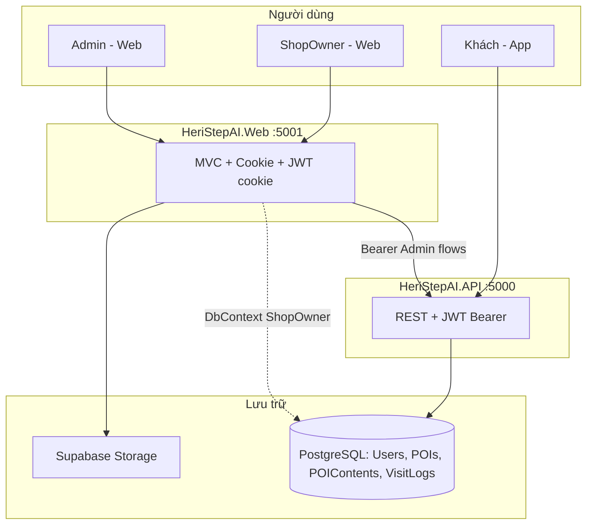
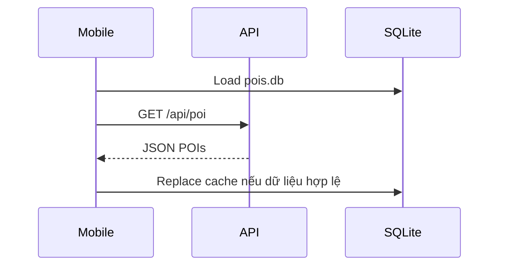
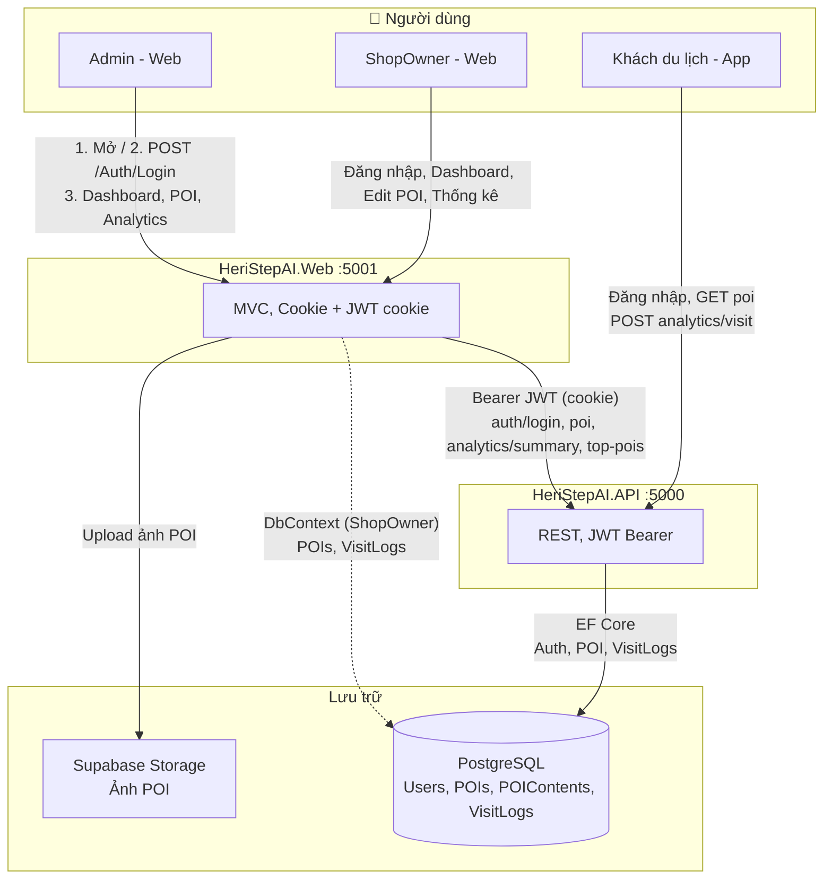
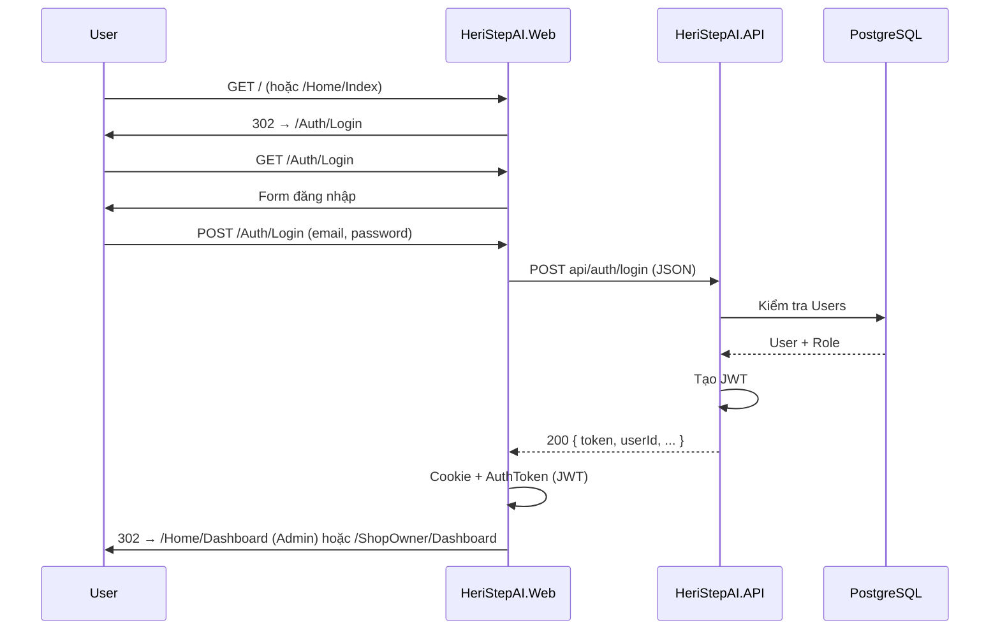
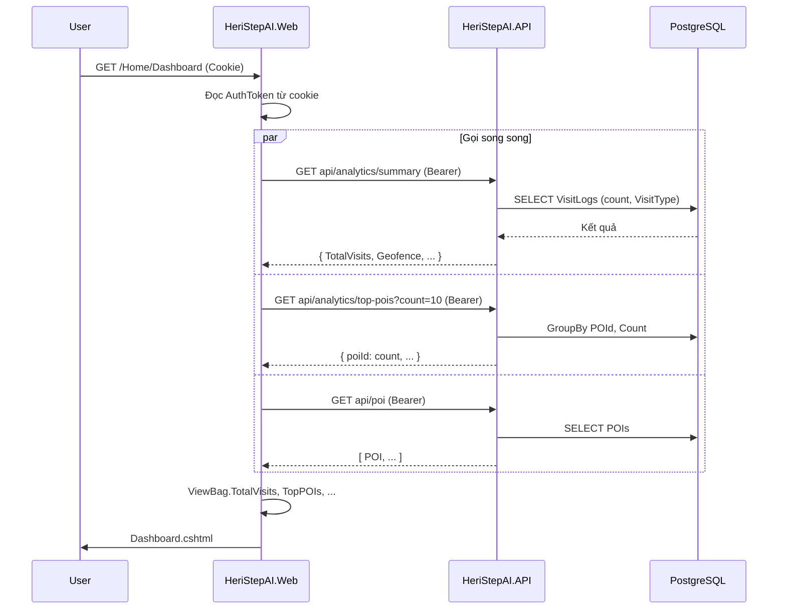
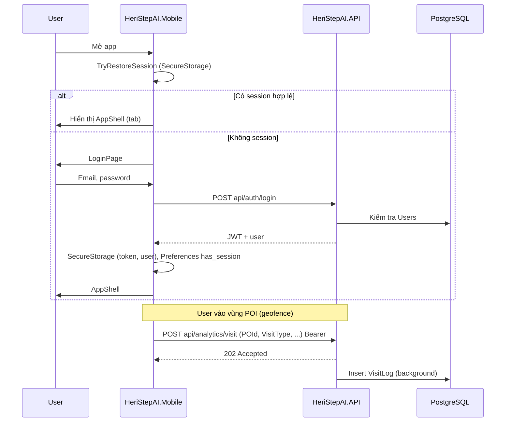
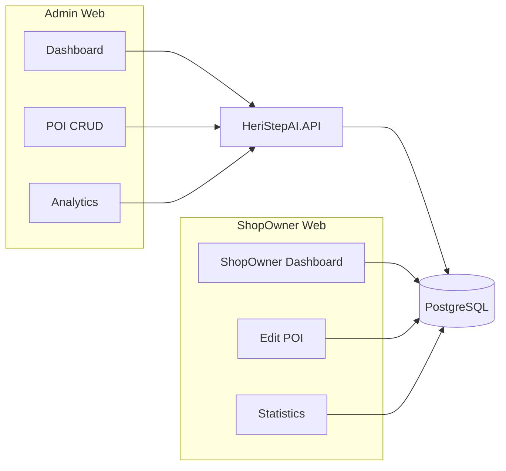

# Product Requirements Document (PRD) — HeriStepAI v1.0

| Thuộc tính | Giá trị |
|------------|---------|
| **Phiên bản** | 1.0 (buildable — theo codebase) |
| **Ngày** | 2026-03-14 |
| **Trạng thái** | Đã chuẩn hóa theo template BA (Context–Role–Task–Output) |

---

## — Context —

Đã có **UI + codebase** trong repo: **HeriStepAI** gồm `HeriStepAI.API`, `HeriStepAI.Web`, `HeriStepAI.Mobile`.

**Mục tiêu tài liệu:** chuyển những gì **đang có** trong UI/code thành PRD **có thể build / không suy diễn** cho dev và AI.

**Phạm vi được xem xét (từ brief BA mẫu):**

1. Đăng nhập Admin (và các vai trò Web/Mobile hiện có).
2. Quản lý POI (theo màn hình Web Admin + API — **không** bao gồm major/minor WC/vé/… nếu chưa có trong repo).
3. Tour — **trong repo hiện tại**: tour được **gợi ý trên Mobile** (`TourGeneratorService`), chi tiết tour (`TourDetailPage`), “Bắt đầu tour” lọc POI trên bản đồ; **chưa** có module Web CRUD Tour riêng.

**Ràng buộc:** PRD **bám UI/flow hiện có**; chỗ chưa rõ hoặc chưa implement → **Open Questions / Assumptions** hoặc **Future Enhancements**.

---

---

## 1. Overview & Goals

### 1.1 Tổng quan sản phẩm

HeriStepAI là hệ thống **thuyết minh / khám phá địa điểm** kết hợp **GPS & geofencing**, **bản đồ**, **nội dung đa ngôn ngữ**, **TTS**, và **ghi nhận lượt ghé** (`VisitLogs`) phục vụ **Admin**, **ShopOwner** (Web) và **khách du lịch** (Mobile).

### 1.2 Mục tiêu (Goals)

| ID | Goal | Đo lường gợi ý |
|----|------|----------------|
| **G-01** | Khách **nghe thuyết minh** khi vào vùng POI (geofence) hoặc khi tương tác bản đồ | Visit có `VisitType = Geofence` / `MapClick` |
| **G-02** | **Vận hành nội dung POI** (ảnh, mô tả, đa ngôn ngữ) qua Web | CRUD POI thành công; ảnh lên Supabase |
| **G-03** | **Thống kê** từ dữ liệu thật (dashboard, analytics) | Truy vấn `VisitLogs`; summary / top POI |
| **G-04** | **Offline-first POI** trên Mobile | Sync API → SQLite; không xóa cache khi API null/empty |

---

## 2. In-scope / Out-of-scope (MVP theo repo)

### 2.1 Trong phạm vi (đã có trong codebase)

| # | Module | Mô tả ngắn |
|---|--------|------------|
| 1 | **Auth (Web)** | Đăng nhập email/password → API `auth/login` → Cookie + JWT `AuthToken`; redirect Admin vs ShopOwner |
| 2 | **Auth (Mobile)** | Đăng nhập/đăng ký (nếu bật) → JWT `SecureStorage` |
| 3 | **Admin Web** | Dashboard (API), POI CRUD (API), Analytics (API), upload ảnh Supabase |
| 4 | **ShopOwner Web** | Dashboard / Edit / Statistics — **DbContext trực tiếp** PostgreSQL |
| 5 | **API** | JWT, POI, POIContent (trong payload), analytics/visit → `VisitLogs`, analytics summary/top/statistics |
| 6 | **Mobile** | AppShell, Map (Leaflet WebView), POI list/detail, **Tour gợi ý + TourDetail + Bắt đầu tour**, Settings, SQLite cache |
| 7 | **Dữ liệu** | PostgreSQL: `Users`, `POIs`, `POIContents`, `VisitLogs` (nghiệp vụ); bảng `Analytics` entity **legacy, không dùng** |

### 2.2 Ngoài phạm vi (hiện không có trong repo — không mô tả như đã ship)

| Mục | Ghi chú |
|-----|---------|
| **Admin “Tour Management”** kiểu CRUD + sắp thứ tự POI lưu DB | Tour trên app là **generate client-side** + `TourId` tùy chọn trên POI trong API; không có màn Web quản lý tour độc lập |
| **POI major/minor** (WC, bán vé, gửi xe, bến thuyền) | Chưa có trong model/UI; đang dùng `Category` (POICategory) + `FoodType` (ẩm thực) |
| **Thanh toán / booking** | Không có |
| **SLA / DR đầy đủ** | Ngoài phạm vi PRD kỹ thuật vận hành |

---

## 3. Personas & Roles

| Role | Giá trị trong hệ thống | Kênh | Quyền chính |
|------|------------------------|------|-------------|
| **Admin** | `Role = 1` (claim) | Web | Full POI qua API, analytics, tạo POI kèm tài khoản ShopOwner (flow Create hiện có) |
| **ShopOwner** | `Role = 2` | Web | Chỉ POI `OwnerId` = mình; DbContext |
| **Khách (Tourist)** | `Role = 3` (mobile user) | Mobile | Xem POI, map, tour, geofence, visit log |
| **Anonymous** | — | Mobile/API | Một số GET POI có thể public (theo cấu hình API) |

---

## 4. Danh mục màn hình & hành vi UI (theo code)

### 4.1 Web (`HeriStepAI.Web`)

| Màn / nhóm | Route chính | State / hành vi |
|------------|-------------|------------------|
| Login | `/Auth/Login` | Form; lỗi hiển thị `ViewBag.Error`; redirect khi OK |
| Admin Dashboard | `/Home/Dashboard` | Loading metrics qua API; lỗi → giá trị rỗng / 0 (theo controller) |
| POI Index | `/POI` | Danh sách; badge category/food; lỗi `TempData` |
| POI Create | `/POI/Create` | Tạo owner + POI + nội dung; upload ảnh |
| POI Edit / Details / Delete | `/POI/...` | CRUD qua API client |
| Analytics | `/Analytics` | Admin; top POI + breakdown (API) |
| ShopOwner Dashboard / Edit / Statistics | `/ShopOwner/...` | DbContext; 403/NotFound nếu không sở hữu POI |

### 4.2 Mobile (`HeriStepAI.Mobile`)

| Màn | Hành vi chính |
|-----|----------------|
| `AuthPage` | Login/register; lỗi validation |
| `MainPage` | Tour cards từ `TourGeneratorService`; chọn tour → `TourDetailPage` |
| `TourDetailPage` | Danh sách POI tour; **Bắt đầu Tour** → `TourSelectionService` → `//MapPage` |
| `MapPage` | WebView map; geofence; visit log; loading map async |
| `POIListPage` / `POIDetailPage` | List/detail; TTS |
| `SettingsPage` | Ngôn ngữ, logout |

**State chung:** loading / empty / error — theo từng ViewModel (sync POI, API fail vẫn có thể hiện SQLite).

---

## 5. User Stories

| ID | Module | User story | Priority |
|----|--------|------------|----------|
| **US-01** | Auth Web | Là **Admin hoặc ShopOwner**, tôi đăng nhập bằng email/mật khẩu để vào đúng dashboard vai trò của mình. | Must |
| **US-02** | Admin POI | Là **Admin**, tôi xem danh sách POI và trạng thái active để vận hành hệ thống. | Must |
| **US-03** | Admin POI | Là **Admin**, tôi tạo POI mới (có thể kèm tạo ShopOwner) và upload ảnh để khách thấy trên app. | Must |
| **US-04** | Admin POI | Là **Admin**, tôi sửa/xóa/toggle active POI để cập nhật nội dung. | Must |
| **US-05** | Admin Analytics | Là **Admin**, tôi xem tổng quan lượt ghé và top POI (từ `VisitLogs`) để ra quyết định. | Should |
| **US-06** | ShopOwner | Là **ShopOwner**, tôi chỉ thấy và sửa POI của mình và xem thống kê visit. | Must |
| **US-07** | Mobile Auth | Là **khách**, tôi đăng nhập để token được gửi kèm request visit/analytics. | Must |
| **US-08** | Mobile POI | Là **khách**, tôi xem danh sách/bản đồ POI ngay cả khi offline (cache SQLite). | Must |
| **US-09** | Mobile Geofence | Là **khách**, khi vào vùng POI tôi được thuyết minh và hệ thống ghi nhận visit (nếu API khả dụng). | Must |
| **US-10** | Mobile Tour | Là **khách**, tôi chọn tour gợi ý, xem chi tiết và **bắt đầu tour** để bản đồ chỉ tập POI trong tour. | Should |

---

## 6. Functional Requirements (FR)

### 6.1 Xác thực & phiên

| ID | Yêu cầu |
|----|---------|
| **FR-AUTH-01** | Web: POST login form → gọi `POST /api/auth/login` → set cookie session + `AuthToken` (JWT). |
| **FR-AUTH-02** | Web: sau login, **Admin** → `/Home/Dashboard`; **ShopOwner** → `/ShopOwner/Dashboard`. |
| **FR-AUTH-03** | Mobile: lưu JWT an toàn (`SecureStorage`); restore session khi mở app. |
| **FR-AUTH-04** | API: mật khẩu hash BCrypt; JWT TTL theo cấu hình (vd. 24h). |

### 6.2 POI (Admin qua API)

| ID | Yêu cầu |
|----|---------|
| **FR-POI-01** | Admin load danh sách POI từ `GET /api/poi` (deserialize JSON). |
| **FR-POI-02** | Admin tạo/sửa/xóa POI qua `POST/PUT/DELETE /api/poi` (và route con theo API thực tế). |
| **FR-POI-03** | Ảnh: upload lên Supabase từ Web, lưu `ImageUrl` vào POI. |
| **FR-POI-04** | Hỗ trợ trường: category (`POICategory` int), `FoodType`, giá `PriceMin/Max`, `TourId` optional, `EstimatedMinutes`, đa ngôn ngữ qua `Contents`. |

### 6.3 ShopOwner (Web + DbContext)

| ID | Yêu cầu |
|----|---------|
| **FR-SHOP-01** | Chỉ truy cập POI có `OwnerId` = user hiện tại. |
| **FR-SHOP-02** | Statistics/Dashboard aggregate từ `VisitLogs` + POI của owner. |

### 6.4 Analytics & visit

| ID | Yêu cầu |
|----|---------|
| **FR-ANA-01** | Mọi metric dashboard/API **tính từ `VisitLogs`** (không dùng bảng entity `Analytics`). |
| **FR-ANA-02** | Mobile/API: `POST .../analytics/visit` ghi `VisitLog` với `VisitType` (Geofence, MapClick, QRCode). |

### 6.5 Mobile — Tour (như đã code)

| ID | Yêu cầu |
|----|---------|
| **FR-TOUR-01** | `TourGeneratorService` tạo danh sách tour từ POI (nhóm theo food type / heuristics hiện có). |
| **FR-TOUR-02** | `StartTour` gán `TourSelectionService.SelectedTour` và điều hướng `//MapPage`. |
| **FR-TOUR-03** | `MapPageViewModel` ưu tiên `SelectedTour.POIs` nếu có; không thì full POI SQLite. |

### 6.6 API (REST) — tối thiểu

| ID | Yêu cầu |
|----|---------|
| **FR-API-01** | `POST /api/auth/login`, `POST /api/auth/register` (nếu mobile dùng). |
| **FR-API-02** | `GET/POST/PUT/DELETE /api/poi`, `GET /api/poi/{id}`, `GET /api/poi/{id}/content/{lang}`, `GET /api/poi/my-pois` (ShopOwner). |
| **FR-API-03** | Analytics: `GET .../analytics/summary`, `.../top-pois`, `.../visit`, statistics theo POI. |

---

## 7. Acceptance Criteria (Given – When – Then)

| US ID | Given | When | Then |
|-------|-------|------|------|
| **US-01** | Tôi đang ở `/Auth/Login` | Nhập email/password hợp lệ và submit | Redirect đúng Admin hoặc ShopOwner dashboard; cookie auth có |
| **US-01** | Credentials sai | Submit | Ở lại login; thông báo lỗi |
| **US-03** | Tôi là Admin | Submit form Create POI đủ field + owner mới | API tạo user Role=2 và POI gắn `OwnerId`; thông báo thành công |
| **US-04** | POI tồn tại | Admin toggle active | Trạng thái `IsActive` cập nhật qua API; app phản ánh sau sync |
| **US-06** | Tôi là ShopOwner | Mở Edit POI của người khác | NotFound / không cho sửa |
| **US-08** | Đã sync SQLite trước đó | Mở app không mạng | Vẫn thấy danh sách POI từ `pois.db` |
| **US-09** | GPS trong vòng `Radius` | Geofence trigger | Phát narration (hoặc queue); gọi visit log (best-effort) |
| **US-10** | Đang ở TourDetail | Bấm **Bắt đầu Tour** | `SelectedTour` được set; điều hướng Map; POI trên map là tập tour **nếu** `LoadPOIsAsync` chạy sau khi tour đã set (xem Open Questions) |

---

## 8. Non-functional Requirements (tối thiểu)

| ID | Loại | Yêu cầu |
|----|------|---------|
| **NFR-01** | Bảo mật | JWT bảo vệ endpoint nhạy cảm; không log mật khẩu; secret qua env |
| **NFR-02** | Validation | Web/Mobile validate input bắt buộc; API trả 4xx với message có thể hiển thị |
| **NFR-03** | Lỗi | API lỗi → Web dùng `TempData`/ViewBag; Mobile không block UX vì visit log fail |
| **NFR-04** | Logging | Log server console / debug; mobile `AppLog` / Debug |
| **NFR-05** | Performance | Dashboard Admin gọi song song nhiều API; map HTML generate async tránh ANR |
| **NFR-06** | i18n | Mobile: `LocalizationService` cho label; POI content theo ngôn ngữ |

---

## 9. Data Requirements (field-level)

### 9.1 POI (API `HeriStepAI.API.Models.POI` — cho UI/Web/Mobile sync)

| Field | Kiểu | Ghi chú UI |
|-------|------|------------|
| `Id` | int | PK |
| `Name` | string | Bắt buộc hiển thị |
| `Description` | string | Chi tiết |
| `Latitude`, `Longitude` | double | Bản đồ / geofence |
| `Address` | string? | Địa chỉ |
| `Radius` | double | mét — vòng geofence, mặc định 50 |
| `Priority` | int | Sắp xếp gợi ý |
| `OwnerId` | int? | ShopOwner |
| `ImageUrl` | string? | Ảnh |
| `MapLink` | string? | Link ngoài (nếu dùng) |
| `IsActive` | bool | Ẩn/hiện |
| `Rating`, `ReviewCount` | double?, int | UI giới thiệu |
| `Category` | int | Enum `POICategory` |
| `TourId` | int? | Gợi ý nhóm; không thay cho “Tour CRUD” |
| `EstimatedMinutes` | int | Thời gian ước tính |
| `FoodType` | int | 0–6 theo model API |
| `PriceMin`, `PriceMax` | long | VND |
| `Contents` | list | `POIContent` |

### 9.2 POIContent

| Field | Kiểu | Ghi chú |
|-------|------|---------|
| `Language` | string | vd. `vi`, `en` |
| `TextContent` | string | TTS / hiển thị |
| `AudioUrl` | string? | Ưu tiên phát file nếu có |

### 9.3 VisitLog (analytics)

| Field | Kiểu | Ghi chú |
|-------|------|---------|
| `POId` | int | FK POI |
| `UserId` | string? | Nullable |
| `VisitTime` | DateTime | UTC |
| `Latitude`, `Longitude` | double? | |
| `VisitType` | enum | Geofence, MapClick, QRCode |
| `DurationSeconds` | int? | |

### 9.4 Tour (Mobile model — **không** là entity PostgreSQL trong PRD này)

| Field | Mô tả |
|-------|--------|
| `Id`, `Name`, `Description` | Hiển thị card tour |
| `EstimatedMinutes`, `POICount`, `PriceMin/Max` | Thống kê gợi ý |
| `POIs` (runtime list) | Thứ tự POI trong tour trên client |

---

## 10. API Assumptions (interface — không bắt buộc implement trong PRD)

Base: `/api/...` — versioning do team quy ước.

| Method | Path | Mục đích |
|--------|------|----------|
| POST | `/auth/login` | JWT + user info |
| POST | `/auth/register` | Đăng ký mobile (nếu bật) |
| GET | `/poi` | Danh sách POI |
| GET | `/poi/{id}` | Chi tiết |
| POST/PUT/DELETE | `/poi`, `/poi/{id}` | CRUD (authorize) |
| GET | `/poi/{id}/content/{language}` | Nội dung theo ngôn ngữ |
| GET | `/poi/my-pois` | ShopOwner |
| POST | `/analytics/visit` | Ghi visit |
| GET | `/analytics/summary`, `/analytics/top-pois`, … | Dashboard |

---

## 11. Dependencies & Risks

| Loại | Mô tả |
|------|--------|
| **Phụ thuộc** | PostgreSQL (Supabase/local); Supabase Storage; port API/Web; cấu hình JWT |
| **Rủi ro R-01** | Hai nguồn Web: Admin → API, ShopOwner → DbContext — logic trùng lặp / lệch version |
| **Rủi ro R-02** | Sync SQLite full-replace — cần kiểm tra khi số POI lớn |
| **Rủi ro R-03** | Tour + Map: thứ tự khởi tạo Map có thể làm lọc POI tour không khớp mong đợi |

---

## 12. Open Questions & Assumptions

| ID | Nội dung |
|----|----------|
| **OQ-01** | Brief BA đề xuất **major/minor POI** (WC, bán vé, …): **chưa có** trong model — cần thiết kế enum/DB hay gộp vào `Category`? |
| **OQ-02** | **Tour CRUD trên Web** + thứ tự POI lưu server: có trong roadmap không? Hiện tour chủ yếu **client-generated**. |
| **OQ-03** | `TourId` trên POI: quy tắc gán và đồng bộ với app tour generator? |
| **AS-01** | Giả định: production dùng HTTPS; dev có thể HTTP local |
| **AS-02** | Giả định: email user unique (đăng nhập) |

---

## 13. Future Enhancements (ngoài scope hiện tại — không bắt buộc dev)

- Module **Admin Tour Builder**: tạo tour, kéo-thả thứ tự POI, lưu DB, API `GET/POST /tours`.
- Taxonomy **major/minor** điểm phụ trợ du lịch (WC, vé, gửi xe, bến thuyền).
- **Incremental sync** SQLite; retry queue visit offline.
- Xóa hẳn migration bảng legacy `Analytics` khỏi schema khi đồng thuận DBA.

---

## 14. Tài liệu liên quan

| File | Nội dung |
|------|----------|
| `docs/system-flow-detailed.md` | Luồng Web/API/Mobile |
| `docs/architecture-web-app-flow.md` | Cấu trúc project |
| `docs/system-flow-mermaid.md` | Sơ đồ Mermaid |
| `README.md` | Chạy local |

---

## Phụ lục A — Sơ đồ tham chiếu (Mermaid)

> Render: VS Code extension, GitHub, [mermaid.live](https://mermaid.live).

### A.1 Tổng quan thành phần

### A.2 Mobile: sync POI

---

## Phụ lục B -  System Flow (Mermaid full)

# Sơ đồ flow hệ thống HeriStepAI (Mermaid)

Mở file này trong editor hỗ trợ Mermaid (VS Code với extension, GitHub, GitLab, Notion, draw.io có thể import Mermaid) hoặc paste đoạn code dưới vào https://mermaid.live/.

---

## Sơ đồ 1: Tổng quan thành phần và luồng dữ liệu

### Giải thích chi tiết – Sơ đồ 1

| Thành phần | Ý nghĩa |
|------------|--------|
| **Users** | Ba loại người dùng: **Admin** (quản trị toàn hệ thống qua web), **ShopOwner** (chủ điểm POI, quản lý POI qua web), **Khách du lịch** (dùng app mobile để xem POI và ghi visit). |
| **HeriStepAI.Web :5001** | Ứng dụng web MVC chạy cổng 5001. Dùng **cookie** để lưu session và lưu **JWT trong cookie** (AuthToken) sau khi đăng nhập. Admin và ShopOwner đều truy cập qua đây. |
| **HeriStepAI.API :5000** | API REST chạy cổng 5000. Mọi request từ Web (Admin) và App đều xác thực bằng **JWT Bearer** trong header. |
| **PostgreSQL** | Cơ sở dữ liệu chính: bảng **Users** (đăng nhập, role), **POIs** (điểm tham quan), **POIContents** (nội dung đa ngôn ngữ), **VisitLogs** (lịch sử khách ghé thăm). Có thể dùng Supabase hoặc PostgreSQL local. |
| **Supabase Storage** | Lưu **ảnh POI**. Web upload ảnh khi Admin/ShopOwner tạo hoặc sửa POI; URL ảnh lưu trong DB. |

**Các mũi tên (luồng):**

- **Admin → Web:** (1) Mở trang chủ `/`, (2) POST `/Auth/Login` để đăng nhập, (3) Sau khi đăng nhập xem Dashboard, quản lý POI, xem Analytics.
- **ShopOwner → Web:** Đăng nhập tương tự, sau đó dùng Dashboard riêng, chỉnh sửa POI của mình, xem thống kê visit.
- **Khách du lịch → API (qua App):** App không qua Web; gọi API trực tiếp để đăng nhập, GET danh sách POI, POST `analytics/visit` khi vào vùng POI. JWT lưu trong **SecureStorage** trên thiết bị.
- **Web → API:** Khi Admin xem Dashboard/POI/Analytics, Web gửi request với **Bearer JWT** (lấy từ cookie) tới các endpoint: `auth/login`, `poi`, `analytics/summary`, `analytics/top-pois`, `poi/{id}/statistics`.
- **Web -.-→ DB (nét đứt):** **ShopOwner** đọc/ghi **trực tiếp** DB qua **DbContext** trong Web (cùng connection string với API), không đi qua API. Đây là luồng riêng so với Admin.
- **Web → Supabase Storage:** Khi tạo/sửa POI, Web upload ảnh lên bucket Supabase Storage.
- **API → DB:** API dùng **EF Core** để đọc/ghi Users, POI, VisitLogs (đăng nhập, danh sách POI, ghi visit từ App).

---

## Sơ đồ 2: Flow đăng nhập Web (Admin / ShopOwner)

### Giải thích chi tiết – Sơ đồ 2

| Bước | Hành động | Giải thích |
|------|-----------|------------|
| 1 | User gửi **GET /** (hoặc `/Home/Index`) | Truy cập trang chủ. Nếu chưa đăng nhập, Web trả về redirect. |
| 2 | Web trả **302 → /Auth/Login** | Redirect trình duyệt tới trang đăng nhập. |
| 3 | User gửi **GET /Auth/Login** | Trình duyệt request trang form đăng nhập. |
| 4 | Web trả **form đăng nhập** | Hiển thị form email + password (Razor view). |
| 5 | User gửi **POST /Auth/Login** (email, password) | Submit form. Web nhận dữ liệu từ form. |
| 6 | Web gọi **POST api/auth/login** (JSON) | Web chuyển tiếp sang API (gửi email, password dạng JSON). API là nơi kiểm tra user. |
| 7 | API truy vấn **DB (Users)** | Kiểm tra email tồn tại, verify password (hash), lấy role (Admin/ShopOwner). |
| 8 | DB trả **User + Role** | API biết user hợp lệ và role để phân quyền. |
| 9 | API **tạo JWT** | Ký token chứa userId, role, expiry. |
| 10 | API trả **200 { token, userId, ... }** | Web nhận JWT và thông tin user. |
| 11 | Web ghi **Cookie + AuthToken (JWT)** | Lưu JWT vào cookie (httpOnly nếu có) để các request sau gửi kèm. |
| 12 | Web trả **302** tới Dashboard | **Admin** → `/Home/Dashboard`, **ShopOwner** → `/ShopOwner/Dashboard`. Trình duyệt chuyển sang trang tương ứng. |

---

## Sơ đồ 3: Flow Dashboard Admin (Web → API)

### Giải thích chi tiết – Sơ đồ 3

| Bước | Hành động | Giải thích |
|------|-----------|------------|
| 1 | User gửi **GET /Home/Dashboard** (kèm Cookie) | Admin đã đăng nhập; trình duyệt gửi cookie chứa session/JWT. |
| 2 | Web **đọc AuthToken từ cookie** | Web lấy JWT từ cookie để gửi lên API dưới dạng header `Authorization: Bearer <token>`. |
| 3 | Web gọi **ba API song song** (par) | Để Dashboard load nhanh, Web gửi đồng thời 3 request thay vì gọi tuần tự. |
| 3a | **GET api/analytics/summary** (Bearer) | Lấy tổng quan: tổng lượt visit, phân loại theo VisitType (Geofence, Manual, …). API truy vấn VisitLogs (count, group by VisitType) rồi trả JSON. |
| 3b | **GET api/analytics/top-pois?count=10** (Bearer) | Lấy top 10 POI có nhiều visit nhất. API group by POId, count, sort, trả về danh sách. |
| 3c | **GET api/poi** (Bearer) | Lấy danh sách POI (để hiển thị bảng, dropdown, v.v.). API SELECT POIs từ DB. |
| 4 | API truy vấn **DB** (VisitLogs, POIs) | Mỗi endpoint dùng EF Core đọc bảng tương ứng. |
| 5 | Web nhận 3 response, gán **ViewBag** | ViewBag.TotalVisits, ViewBag.TopPOIs, danh sách POI để truyền sang view. |
| 6 | Web render **Dashboard.cshtml** | View Razor dùng dữ liệu trong ViewBag/Model để hiển thị số liệu, biểu đồ, bảng POI cho Admin. |

---

## Sơ đồ 4: Flow App Mobile – Đăng nhập và ghi visit

### Giải thích chi tiết – Sơ đồ 4

| Bước | Hành động | Giải thích |
|------|-----------|------------|
| 1 | User **mở app** | Ứng dụng mobile (HeriStepAI.Mobile) khởi động. |
| 2 | App gọi **TryRestoreSession (SecureStorage)** | App đọc JWT và thông tin user từ **SecureStorage** (keychain/keystore). Nếu token còn hạn và hợp lệ → coi như đã đăng nhập. |
| 3a | **Có session hợp lệ** | App chuyển thẳng tới **AppShell** (màn hình chính với tab), không hiện màn hình đăng nhập. |
| 3b | **Không session** | Hiển thị **LoginPage**. User nhập email, password. App gọi **POST api/auth/login**. API kiểm tra DB, trả JWT + user. App lưu token và user vào **SecureStorage**, đánh dấu Preferences (has_session), rồi chuyển sang AppShell. |
| 4 | **User vào vùng POI (geofence)** | App dùng GPS/geofencing; khi user vào vùng bán kính quanh POI, app coi là “đã ghé thăm”. |
| 5 | App gửi **POST api/analytics/visit** (POId, VisitType, …) với **Bearer** | Gửi POI id, loại visit (Geofence/Manual), có thể kèm thời gian. API xác thực JWT, nhận payload. |
| 6 | API trả **202 Accepted** | API chấp nhận request, có thể ghi DB đồng bộ hoặc hàng đợi. |
| 7 | API **Insert VisitLog** (có thể background) | Ghi một dòng vào bảng VisitLogs (UserId, POId, VisitType, Timestamp, …) để sau này Web (Admin/ShopOwner) xem thống kê. |

---

## Sơ đồ 5: Phân tách nguồn dữ liệu (Web)

### Giải thích chi tiết – Sơ đồ 5

Sơ đồ này nhấn mạnh **hai cách Web lấy dữ liệu** tùy vai trò:

| Nhánh | Thành phần | Nguồn dữ liệu | Giải thích |
|-------|------------|----------------|------------|
| **Admin Web** | Dashboard (D), POI CRUD (P), Analytics (AN) | **Luôn qua API** | Admin dùng các trang Web (Dashboard, quản lý POI, Analytics). Web **không** đọc DB trực tiếp; mỗi trang gọi **HeriStepAI.API** với Bearer JWT. API dùng EF Core đọc/ghi **PostgreSQL**. Cách này thống nhất logic nghiệp vụ ở API, dễ bảo trì và tái dùng cho App. |
| **ShopOwner Web** | ShopOwner Dashboard (SD), Edit POI (SE), Statistics (ST) | **Trực tiếp DB** | ShopOwner chỉ xem/sửa POI và thống kê **của mình**. Web dùng **DbContext** (cùng connection string với API) để truy vấn trực tiếp **PostgreSQL** (bảng POIs, VisitLogs, …), **không** gọi API. Giảm số request qua API và tận dụng filter theo ShopOwnerId trong Web. |

**Tóm tắt:** Admin → Web → **API** → DB; ShopOwner → Web → **DB** trực tiếp. App luôn dùng API → DB.

---

**Chú thích:**
- **Admin:** Cookie + JWT trong cookie; mọi request Dashboard/POI/Analytics đều gọi API với Bearer.
- **ShopOwner:** Đọc/ghi DB qua DbContext (cùng DB với API), không gọi API cho Dashboard/Edit/Statistics.
- **App:** JWT trong SecureStorage; gọi API trực tiếp (auth, poi, analytics/visit).

## Phụ lục B — System Flow (Mermaid full)

# Sơ đồ flow hệ thống HeriStepAI (Mermaid)

Mở file này trong editor hỗ trợ Mermaid (VS Code với extension, GitHub, GitLab, Notion, draw.io có thể import Mermaid) hoặc paste đoạn code dưới vào https://mermaid.live/.

---

## Sơ đồ 1: Tổng quan thành phần và luồng dữ liệu

### Giải thích chi tiết – Sơ đồ 1

| Thành phần | Ý nghĩa |
|------------|--------|
| **Users** | Ba loại người dùng: **Admin** (quản trị toàn hệ thống qua web), **ShopOwner** (chủ điểm POI, quản lý POI qua web), **Khách du lịch** (dùng app mobile để xem POI và ghi visit). |
| **HeriStepAI.Web :5001** | Ứng dụng web MVC chạy cổng 5001. Dùng **cookie** để lưu session và lưu **JWT trong cookie** (AuthToken) sau khi đăng nhập. Admin và ShopOwner đều truy cập qua đây. |
| **HeriStepAI.API :5000** | API REST chạy cổng 5000. Mọi request từ Web (Admin) và App đều xác thực bằng **JWT Bearer** trong header. |
| **PostgreSQL** | Cơ sở dữ liệu chính: bảng **Users** (đăng nhập, role), **POIs** (điểm tham quan), **POIContents** (nội dung đa ngôn ngữ), **VisitLogs** (lịch sử khách ghé thăm). Có thể dùng Supabase hoặc PostgreSQL local. |
| **Supabase Storage** | Lưu **ảnh POI**. Web upload ảnh khi Admin/ShopOwner tạo hoặc sửa POI; URL ảnh lưu trong DB. |

**Các mũi tên (luồng):**

- **Admin → Web:** (1) Mở trang chủ `/`, (2) POST `/Auth/Login` để đăng nhập, (3) Sau khi đăng nhập xem Dashboard, quản lý POI, xem Analytics.
- **ShopOwner → Web:** Đăng nhập tương tự, sau đó dùng Dashboard riêng, chỉnh sửa POI của mình, xem thống kê visit.
- **Khách du lịch → API (qua App):** App không qua Web; gọi API trực tiếp để đăng nhập, GET danh sách POI, POST `analytics/visit` khi vào vùng POI. JWT lưu trong **SecureStorage** trên thiết bị.
- **Web → API:** Khi Admin xem Dashboard/POI/Analytics, Web gửi request với **Bearer JWT** (lấy từ cookie) tới các endpoint: `auth/login`, `poi`, `analytics/summary`, `analytics/top-pois`, `poi/{id}/statistics`.
- **Web -.-→ DB (nét đứt):** **ShopOwner** đọc/ghi **trực tiếp** DB qua **DbContext** trong Web (cùng connection string với API), không đi qua API. Đây là luồng riêng so với Admin.
- **Web → Supabase Storage:** Khi tạo/sửa POI, Web upload ảnh lên bucket Supabase Storage.
- **API → DB:** API dùng **EF Core** để đọc/ghi Users, POI, VisitLogs (đăng nhập, danh sách POI, ghi visit từ App).

---

## Sơ đồ 2: Flow đăng nhập Web (Admin / ShopOwner)

### Giải thích chi tiết – Sơ đồ 2

| Bước | Hành động | Giải thích |
|------|-----------|------------|
| 1 | User gửi **GET /** (hoặc `/Home/Index`) | Truy cập trang chủ. Nếu chưa đăng nhập, Web trả về redirect. |
| 2 | Web trả **302 → /Auth/Login** | Redirect trình duyệt tới trang đăng nhập. |
| 3 | User gửi **GET /Auth/Login** | Trình duyệt request trang form đăng nhập. |
| 4 | Web trả **form đăng nhập** | Hiển thị form email + password (Razor view). |
| 5 | User gửi **POST /Auth/Login** (email, password) | Submit form. Web nhận dữ liệu từ form. |
| 6 | Web gọi **POST api/auth/login** (JSON) | Web chuyển tiếp sang API (gửi email, password dạng JSON). API là nơi kiểm tra user. |
| 7 | API truy vấn **DB (Users)** | Kiểm tra email tồn tại, verify password (hash), lấy role (Admin/ShopOwner). |
| 8 | DB trả **User + Role** | API biết user hợp lệ và role để phân quyền. |
| 9 | API **tạo JWT** | Ký token chứa userId, role, expiry. |
| 10 | API trả **200 { token, userId, ... }** | Web nhận JWT và thông tin user. |
| 11 | Web ghi **Cookie + AuthToken (JWT)** | Lưu JWT vào cookie (httpOnly nếu có) để các request sau gửi kèm. |
| 12 | Web trả **302** tới Dashboard | **Admin** → `/Home/Dashboard`, **ShopOwner** → `/ShopOwner/Dashboard`. Trình duyệt chuyển sang trang tương ứng. |

---

## Sơ đồ 3: Flow Dashboard Admin (Web → API)

### Giải thích chi tiết – Sơ đồ 3

| Bước | Hành động | Giải thích |
|------|-----------|------------|
| 1 | User gửi **GET /Home/Dashboard** (kèm Cookie) | Admin đã đăng nhập; trình duyệt gửi cookie chứa session/JWT. |
| 2 | Web **đọc AuthToken từ cookie** | Web lấy JWT từ cookie để gửi lên API dưới dạng header `Authorization: Bearer <token>`. |
| 3 | Web gọi **ba API song song** (par) | Để Dashboard load nhanh, Web gửi đồng thời 3 request thay vì gọi tuần tự. |
| 3a | **GET api/analytics/summary** (Bearer) | Lấy tổng quan: tổng lượt visit, phân loại theo VisitType (Geofence, Manual, …). API truy vấn VisitLogs (count, group by VisitType) rồi trả JSON. |
| 3b | **GET api/analytics/top-pois?count=10** (Bearer) | Lấy top 10 POI có nhiều visit nhất. API group by POId, count, sort, trả về danh sách. |
| 3c | **GET api/poi** (Bearer) | Lấy danh sách POI (để hiển thị bảng, dropdown, v.v.). API SELECT POIs từ DB. |
| 4 | API truy vấn **DB** (VisitLogs, POIs) | Mỗi endpoint dùng EF Core đọc bảng tương ứng. |
| 5 | Web nhận 3 response, gán **ViewBag** | ViewBag.TotalVisits, ViewBag.TopPOIs, danh sách POI để truyền sang view. |
| 6 | Web render **Dashboard.cshtml** | View Razor dùng dữ liệu trong ViewBag/Model để hiển thị số liệu, biểu đồ, bảng POI cho Admin. |

---

## Sơ đồ 4: Flow App Mobile – Đăng nhập và ghi visit

### Giải thích chi tiết – Sơ đồ 4

| Bước | Hành động | Giải thích |
|------|-----------|------------|
| 1 | User **mở app** | Ứng dụng mobile (HeriStepAI.Mobile) khởi động. |
| 2 | App gọi **TryRestoreSession (SecureStorage)** | App đọc JWT và thông tin user từ **SecureStorage** (keychain/keystore). Nếu token còn hạn và hợp lệ → coi như đã đăng nhập. |
| 3a | **Có session hợp lệ** | App chuyển thẳng tới **AppShell** (màn hình chính với tab), không hiện màn hình đăng nhập. |
| 3b | **Không session** | Hiển thị **LoginPage**. User nhập email, password. App gọi **POST api/auth/login**. API kiểm tra DB, trả JWT + user. App lưu token và user vào **SecureStorage**, đánh dấu Preferences (has_session), rồi chuyển sang AppShell. |
| 4 | **User vào vùng POI (geofence)** | App dùng GPS/geofencing; khi user vào vùng bán kính quanh POI, app coi là “đã ghé thăm”. |
| 5 | App gửi **POST api/analytics/visit** (POId, VisitType, …) với **Bearer** | Gửi POI id, loại visit (Geofence/Manual), có thể kèm thời gian. API xác thực JWT, nhận payload. |
| 6 | API trả **202 Accepted** | API chấp nhận request, có thể ghi DB đồng bộ hoặc hàng đợi. |
| 7 | API **Insert VisitLog** (có thể background) | Ghi một dòng vào bảng VisitLogs (UserId, POId, VisitType, Timestamp, …) để sau này Web (Admin/ShopOwner) xem thống kê. |

---

## Sơ đồ 5: Phân tách nguồn dữ liệu (Web)

### Giải thích chi tiết – Sơ đồ 5

Sơ đồ này nhấn mạnh **hai cách Web lấy dữ liệu** tùy vai trò:

| Nhánh | Thành phần | Nguồn dữ liệu | Giải thích |
|-------|------------|----------------|------------|
| **Admin Web** | Dashboard (D), POI CRUD (P), Analytics (AN) | **Luôn qua API** | Admin dùng các trang Web (Dashboard, quản lý POI, Analytics). Web **không** đọc DB trực tiếp; mỗi trang gọi **HeriStepAI.API** với Bearer JWT. API dùng EF Core đọc/ghi **PostgreSQL**. Cách này thống nhất logic nghiệp vụ ở API, dễ bảo trì và tái dùng cho App. |
| **ShopOwner Web** | ShopOwner Dashboard (SD), Edit POI (SE), Statistics (ST) | **Trực tiếp DB** | ShopOwner chỉ xem/sửa POI và thống kê **của mình**. Web dùng **DbContext** (cùng connection string với API) để truy vấn trực tiếp **PostgreSQL** (bảng POIs, VisitLogs, …), **không** gọi API. Giảm số request qua API và tận dụng filter theo ShopOwnerId trong Web. |

**Tóm tắt:** Admin → Web → **API** → DB; ShopOwner → Web → **DB** trực tiếp. App luôn dùng API → DB.

---

**Chú thích:**
- **Admin:** Cookie + JWT trong cookie; mọi request Dashboard/POI/Analytics đều gọi API với Bearer.
- **ShopOwner:** Đọc/ghi DB qua DbContext (cùng DB với API), không gọi API cho Dashboard/Edit/Statistics.
- **App:** JWT trong SecureStorage; gọi API trực tiếp (auth, poi, analytics/visit).

