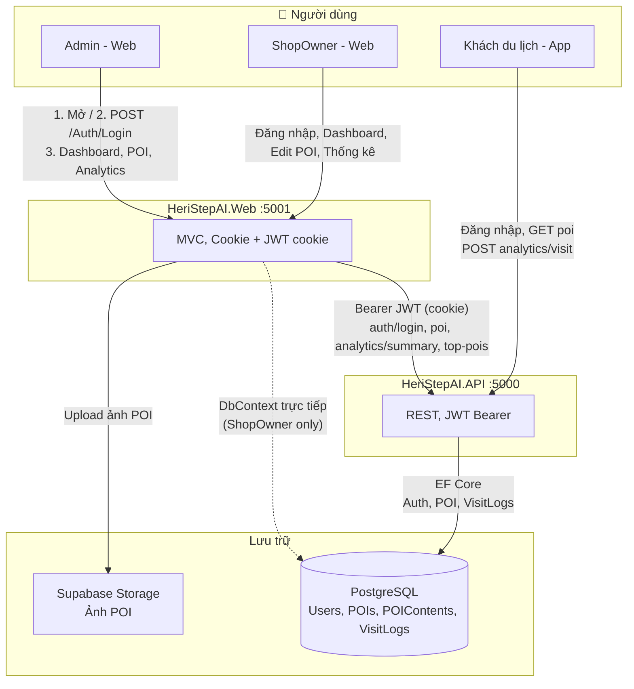
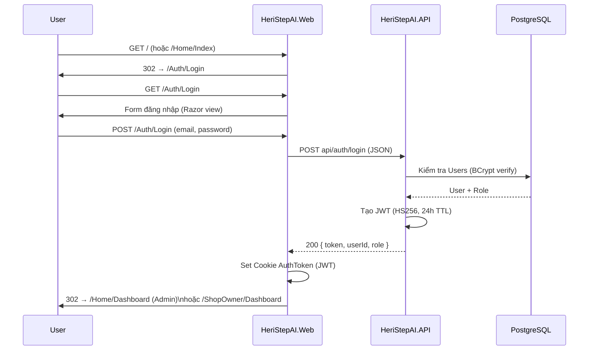
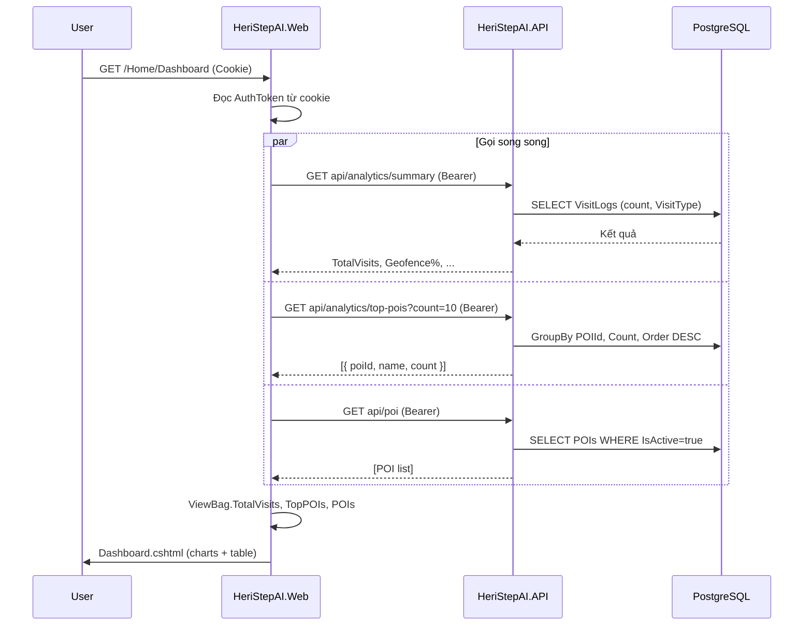
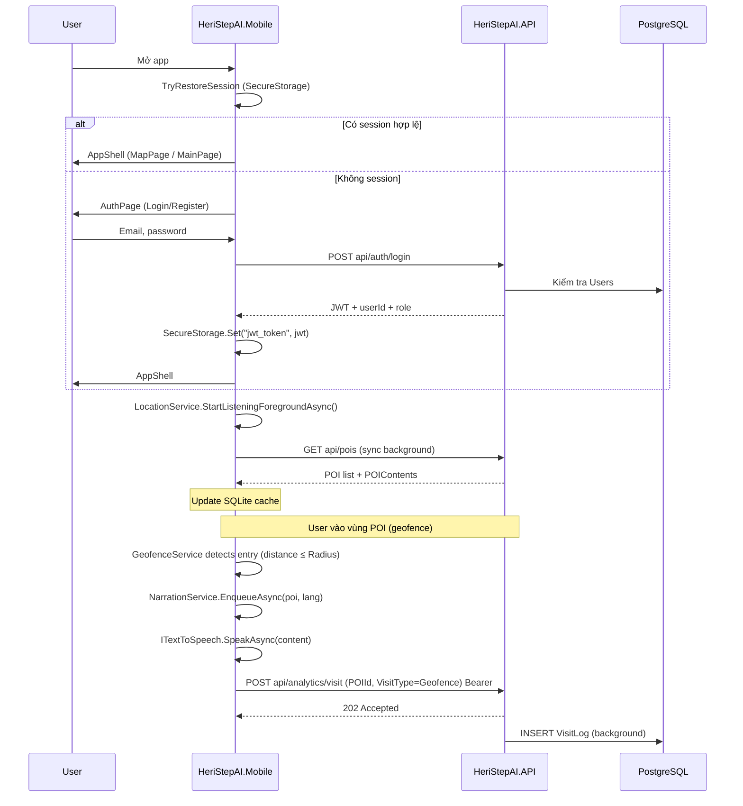
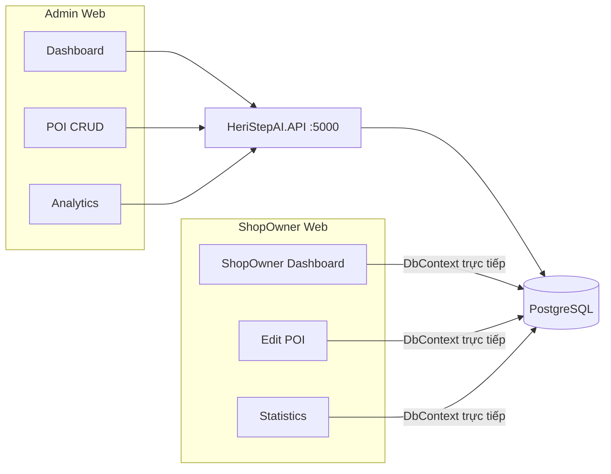
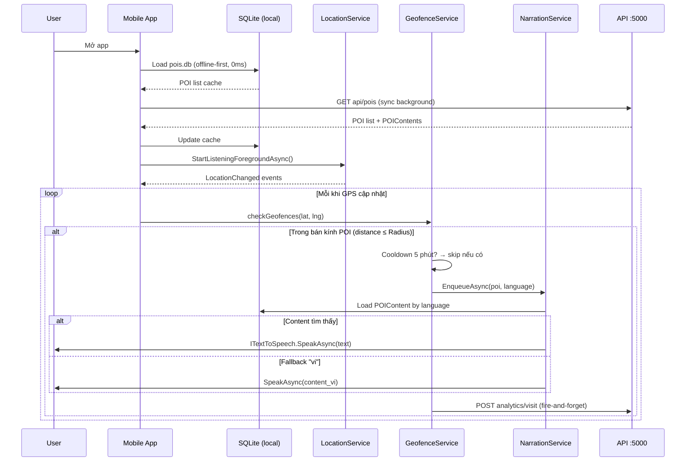
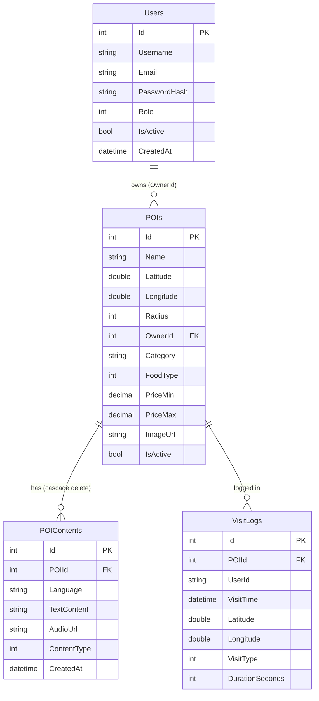
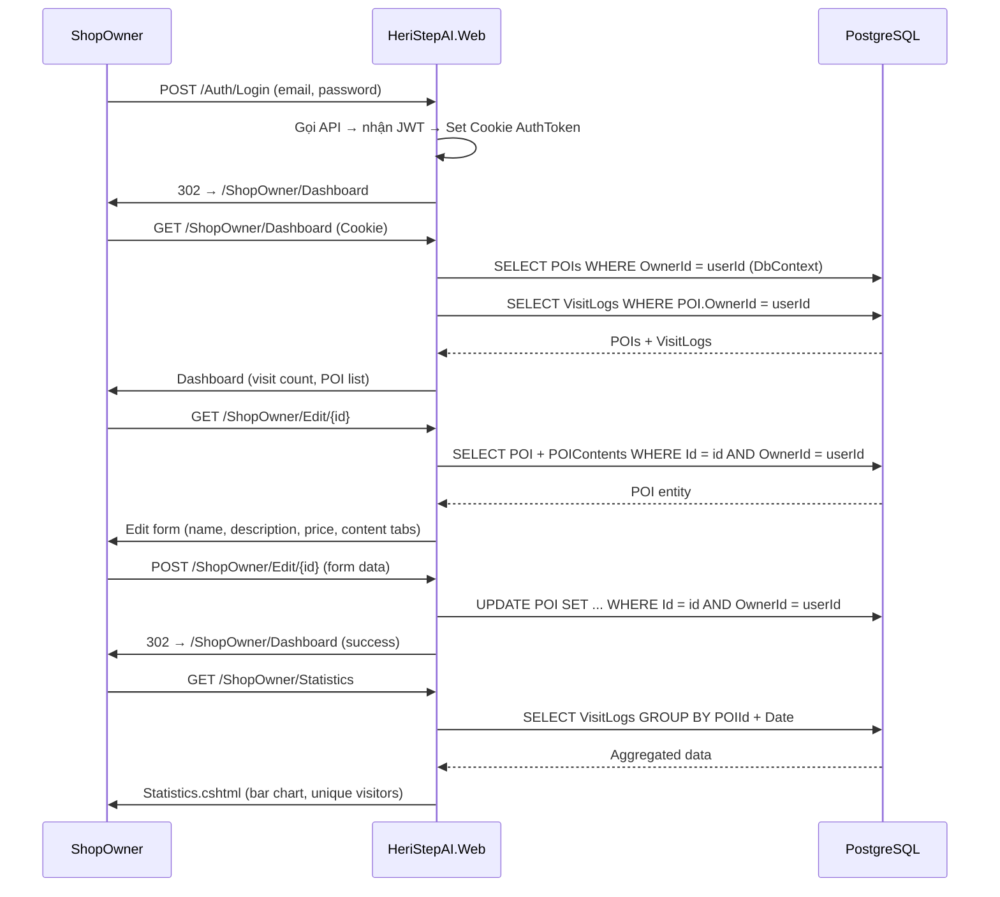

# Product Requirements Document (PRD)

**Sản phẩm:** HeriStepAI  
**Phiên bản tài liệu:** 1.0  
**Ngày:** 2026-03-14
**Trạng thái:** Đã hoàn thành cơ bản có thể hoạt động

---

## 1. Tóm tắt điều hành

### 1.1 Tầm nhìn

HeriStepAI là hệ thống **thuyết minh tự động** phục vụ khách du lịch khi đến gần các **điểm quan tâm (POI)** — cửa hàng, điểm ăn uống. Hệ thống kết hợp **GPS / geofencing**, **bản đồ**, **nội dung đa ngôn ngữ**, **TTS / âm thanh**, và **thống kê lượt ghé** cho quản trị viên và chủ cửa hàng của từng hàng quán.

### 1.2 Phạm vi sản phẩm

| Thành phần            | Mô tả ngắn                                                                                                  |
| --------------------- | ----------------------------------------------------------------------------------------------------------- |
| **HeriStepAI.API**    | REST API: xác thực JWT, POI, analytics, truy cập database.                                                  |
| **HeriStepAI.Web**    | Web MVC: Admin (dashboard, POI, analytics qua API); ShopOwner (dashboard, sửa POI, thống kê qua DbContext). |
| **HeriStepAI.Mobile** | App .NET MAUI (Android/iOS): bản đồ, danh sách POI, thuyết minh, ghi visit, cache SQLite.                   |

### 1.3 Đối tượng sử dụng chính

1. **Khách du lịch** — dùng app mobile.
2. **Quản trị viên (Admin)** — dùng web để quản lý toàn hệ thống POI và xem analytics.
3. **Chủ điểm / ShopOwner** — dùng web để xem và chỉnh sửa POI của mình, xem thống kê visit.

---

## 2. Mục tiêu & chỉ số thành công

### 2.1 Mục tiêu kinh doanh / sản phẩm

- Cung cấp trải nghiệm **khám phá địa điểm** không cần quét mã thủ công khi đã bật vị trí (geofence).  
- Cho phép **vận hành nội dung** (POI, ảnh, thuyết minh đa ngôn ngữ) tập trung qua web.  
- Thu thập **dữ liệu visit** (geofence, tương tác bản đồ, QR, …) để báo cáo.

### 2.2 Chỉ số gợi ý (có thể đo sau khi triển khai)

| Chỉ số                                 | Mô tả                                                           |
| -------------------------------------- | --------------------------------------------------------------- |
| Tỷ lệ sync POI thành công trên app     | % phiên mở app có ít nhất một lần sync API → SQLite thành công. |
| Số visit ghi nhận / ngày               | Tổng bản ghi `VisitLogs` hợp lệ.                                |
| Thời gian phản hồi API POI / analytics | P95 dưới ngưỡng SLA nội bộ (định nghĩa khi vận hành).           |

---

## 3. Personas & vai trò

| Vai trò              | Mô tả                                                                               | Kênh   |
| -------------------- | ----------------------------------------------------------------------------------- | ------ |
| **Admin**            | Toàn quyền quản lý POI, xem tổng quan analytics, truy cập trang Analytics chi tiết. | Web    |
| **ShopOwner**        | Chỉ quản lý POI gắn với tài khoản mình; xem dashboard & thống kê riêng.             | Web    |
| **Khách (End user)** | Đăng ký/đăng nhập (nếu bật), xem bản đồ & danh sách, nghe thuyết minh, tạo visit.   | Mobile |

**Phân quyền:** JWT claims (Role); Web redirect theo role sau đăng nhập; API bảo vệ endpoint theo policy tương ứng.

---

## 4. Yêu cầu chức năng

### 4.1 Xác thực & phiên làm việc

| ID          | Yêu cầu                                                                                  | Ghi chú                       |
| ----------- | ---------------------------------------------------------------------------------------- | ----------------------------- |
| **AUTH-01** | Người dùng đăng nhập bằng email + mật khẩu qua API.                                      | API kiểm tra DB (BCrypt).     |
| **AUTH-02** | Web Admin/ShopOwner: sau login lưu cookie session + JWT trong cookie để gọi API (Admin). | Bearer từ cookie `AuthToken`. |
| **AUTH-03** | Mobile: lưu JWT và thông tin user trong SecureStorage; khôi phục phiên khi mở lại app.   | `TryRestoreSession`.          |
| **AUTH-04** | Phân luồng sau login: Admin → Dashboard quản trị; ShopOwner → ShopOwner Dashboard.       | Đã mô tả trong flow Web.      |

### 4.2 Quản lý POI (Admin — Web + API)

| ID          | Yêu cầu                                                                         |
| ----------- | ------------------------------------------------------------------------------- |
| **POI-A01** | Xem danh sách POI (từ API).                                                     |
| **POI-A02** | Tạo / sửa / xóa (hoặc vô hiệu hóa theo nghiệp vụ hiện tại) POI qua Web gọi API. |
| **POI-A03** | Upload ảnh POI lên **Supabase Storage**; URL lưu trong bản ghi POI.             |
| **POI-A04** | Quản lý nội dung đa ngôn ngữ (`POIContent`) theo mô hình DB hiện có.            |

### 4.3 ShopOwner (Web)

| ID          | Yêu cầu                                                                                             |
| ----------- | --------------------------------------------------------------------------------------------------- |
| **SHOP-01** | Dashboard hiển thị thông tin tóm tắt cho chủ điểm (dữ liệu qua **DbContext** trực tiếp PostgreSQL). |
| **SHOP-02** | Chỉnh sửa POI thuộc quyền sở hữu của ShopOwner.                                                     |
| **SHOP-03** | Trang thống kê (visit / POI) theo dữ liệu local DB, không bắt buộc đi qua API cho luồng này.        |

### 4.4 Analytics & báo cáo (Admin)

| ID         | Yêu cầu                                                                               |
| ---------- | ------------------------------------------------------------------------------------- |
| **ANA-01** | Dashboard: tổng visit, phân loại theo `VisitType` (Geofence, MapClick, QRCode, …).    |
| **ANA-02** | Top N POI theo số lượt visit.                                                         |
| **ANA-03** | Trang Analytics: thống kê theo POI (endpoint `poi/{id}/statistics` hoặc tương đương). |

**Ghi chú dữ liệu:** Dashboard và API analytics **tổng hợp trực tiếp từ bảng `VisitLogs`** (GROUP BY, COUNT, filter theo ngày/POI). **Không dùng** bảng entity `Analytics` trong logic nghiệp vụ hiện tại (có thể vẫn tồn tại trong migration EF cũ nhưng không ghi/đọc).

### 4.5 Ứng dụng Mobile — Khách du lịch

| ID         | Yêu cầu                                                                                                                                                                       |
| ---------- | ----------------------------------------------------------------------------------------------------------------------------------------------------------------------------- |
| **MOB-01** | Đăng nhập / đăng ký qua API; token cho các request sau.                                                                                                                       |
| **MOB-02** | Đồng bộ danh sách POI từ API vào **SQLite** (`pois.db`: bảng `POI`, `POIContent`).                                                                                            |
| **MOB-03** | Hiển thị **bản đồ** (Leaflet + OpenStreetMap) với các POI.                                                                                                                    |
| **MOB-04** | **Geofencing / theo dõi vị trí**: khi vào vùng POI, kích hoạt luồng thuyết minh / visit (Foreground service trên Android nếu có).                                             |
| **MOB-05** | **TTS / audio** thuyết minh theo nội dung POI / ngôn ngữ.                                                                                                                     |
| **MOB-06** | Gửi **POST analytics/visit** (POId, VisitType, …) với Bearer; API ghi `VisitLogs`.                                                                                            |
| **MOB-07** | **Offline-first cho POI đã sync**: đọc từ SQLite khi không có mạng; sync khi có mạng (theo logic `SyncPOIsFromServerAsync` hiện tại — không ghi đè local nếu API null/empty). |
| **MOB-08** | Màn hình: Trang chủ, Bản đồ, Danh sách địa điểm, Chi tiết POI, Tour (nếu có), Cài đặt.                                                                                        |

### 4.6 API (REST)

| ID         | Yêu cầu                                                           |
| ---------- | ----------------------------------------------------------------- |
| **API-01** | Endpoint auth: login (và register nếu có).                        |
| **API-02** | CRUD / query POI phù hợp với Web & Mobile.                        |
| **API-03** | Analytics: summary, top-pois, visit logging, statistics theo POI. |
| **API-04** | JWT Bearer cho các endpoint cần bảo vệ.                           |

---

## 5. Yêu cầu phi chức năng

| Hạng mục             | Yêu cầu                                                                                            |
| -------------------- | -------------------------------------------------------------------------------------------------- |
| **Nền tảng**         | .NET 8; ASP.NET Core Web API + MVC; .NET MAUI.                                                     |
| **CSDL**             | PostgreSQL (Supabase hoặc self-hosted); EF Core trên API/Web (ShopOwner).                          |
| **Lưu trữ file**     | Ảnh POI qua Supabase Storage.                                                                      |
| **Mobile local DB**  | SQLite (`sqlite-net-pcl`) — chỉ cache POI/POIContent.                                              |
| **Bảo mật**          | Mật khẩu hash (BCrypt); JWT có thời hạn; HTTPS khuyến nghị production; không commit secret (.env). |
| **Bản đồ**           | OpenStreetMap                                                                                      |
| **Khả năng mở rộng** | API tách biệt process; Web có thể scale độc lập; DB là điểm tập trung dữ liệu.                     |

---

## 6. Giả định & phụ thuộc

- API và Web có thể chạy song song (local: API `:5000`, Web `:5001`).  
- Mobile cần cấu hình **Base URL** đúng (emulator: `10.0.2.2`, thiết bị thật: IP máy dev).  
- Tài khoản Supabase (connection string + storage) được cấu hình qua biến môi trường / `appsettings`.  
- Người dùng mobile chấp nhận cấp quyền **vị trí** (và thông báo nền nếu Android yêu cầu).

---

## 7. Ngoài phạm vi (phiên bản hiện tại / ghi chú)

- Chi tiết SLA vận hành 24/7, DR, multi-region (chưa định nghĩa trong PRD này).  
- Thanh toán trong app (trong tương lai) — không nằm trong mô tả codebase hiện tại.

---

## 8. Rủi ro & mở (open issues)

| Rủi ro                                                 | Mitigation gợi ý                                                        |
| ------------------------------------------------------ | ----------------------------------------------------------------------- |
| Hai nguồn dữ liệu Web (API vs DbContext cho ShopOwner) | Tài liệu hóa rõ; dài hạn có thể thống nhất qua API.                     |
| Sync POI: xóa toàn bộ local rồi insert lại             | Cần kiểm tra hiệu năng khi số POI rất lớn; có thể diff/incremental sau. |
| Độ chính xác geofence / pin pin                        | Test thực tế ngoài trời; cấu hình bán kính POI hợp lý.                  |

---

## 9. Tài liệu liên quan trong repo

| Tài liệu                            | Nội dung                           |
| ----------------------------------- | ---------------------------------- |
| `docs/system-flow-detailed.md`      | Luồng chi tiết Web / API / Mobile. |
| `docs/architecture-web-app-flow.md` | Cấu trúc thư mục & integration.    |
| `docs/system-flow-mermaid.md`       | Sơ đồ Mermaid.                     |
| `README.md`                         | Hướng dẫn chạy nhanh.              |

---

## 10. Sơ Đồ Hệ Thống

> Render bằng Mermaid: VS Code (extension), GitHub, GitLab, Notion, hoặc [mermaid.live](https://mermaid.live/).

---

### 10.1 Tổng Quan Thành Phần & Luồng Dữ Liệu

Ba nhóm người dùng (Admin, ShopOwner, Tourist) — ba project độc lập — hai cách Web lấy dữ liệu tùy theo vai trò.

**Chú thích:**
- Admin → Web → **API** → DB (mọi thao tác đều qua API)
- ShopOwner → Web → **DB trực tiếp** qua DbContext (Dashboard/Edit/Statistics)
- Tourist App → **API** trực tiếp (auth, poi, analytics/visit)

---

### 10.2 Flow Đăng Nhập Web (Admin / ShopOwner)

| Bước | Hành động | Ghi chú |
|------|-----------|---------|
| 5 | POST /Auth/Login | Web chuyển tiếp sang API |
| 7 | API verify BCrypt | `AuthService.VerifyPassword()` |
| 9 | Tạo JWT | Claims: NameIdentifier, Name, Email, Role |
| 11 | Set Cookie | `AuthToken` — được gửi kèm mọi request sau |
| 12 | Redirect | Admin → `/Home/Dashboard`; ShopOwner → `/ShopOwner/Dashboard` |

---

### 10.3 Flow Dashboard Admin (Gọi API Song Song)

Admin Dashboard gửi 3 request song song để tối ưu thời gian load.

---

### 10.4 Flow Mobile: Đăng Nhập & Ghi Visit

---

### 10.5 Phân Tách Nguồn Dữ Liệu (Web)

**Tóm tắt:** Admin → Web → **API** → DB; ShopOwner → Web → **DB** trực tiếp; App → **API** → DB.

---

### 10.6 End-to-End: Từ Mở App đến Nghe Thuyết Minh

Luồng đầy đủ từ khi tourist mở app đến khi TTS phát xong, bao gồm offline fallback.

---

### 10.7 Entity Relationship — Database Schema

---

### 10.8 ShopOwner Web Flow (Chi Tiết)

---

