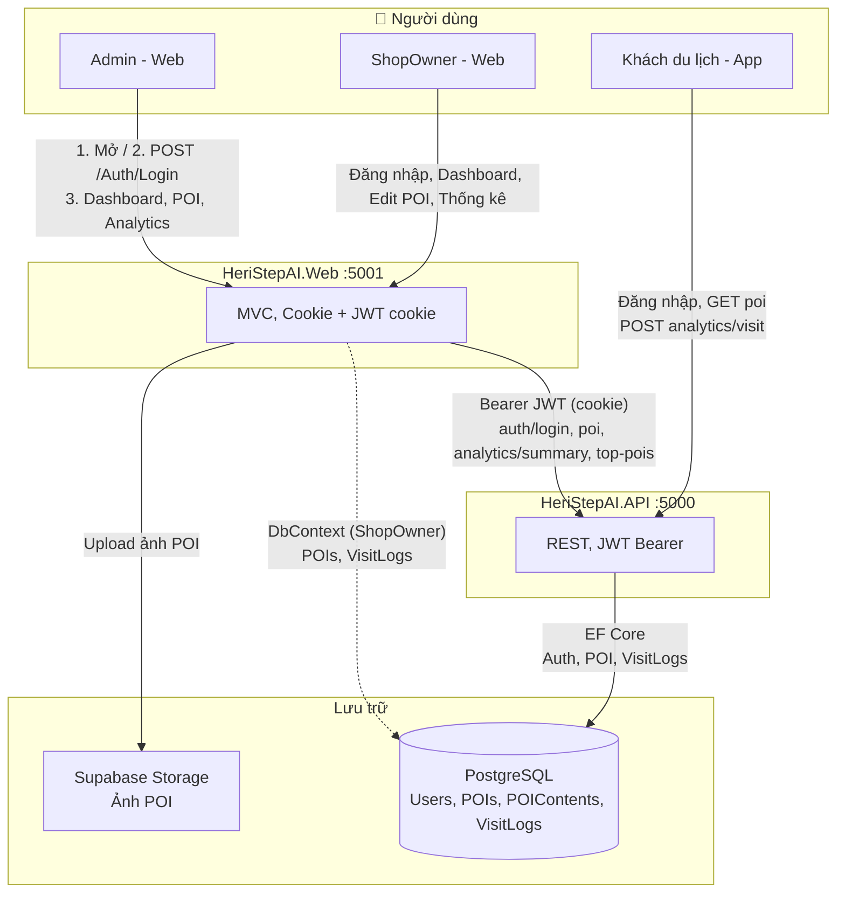
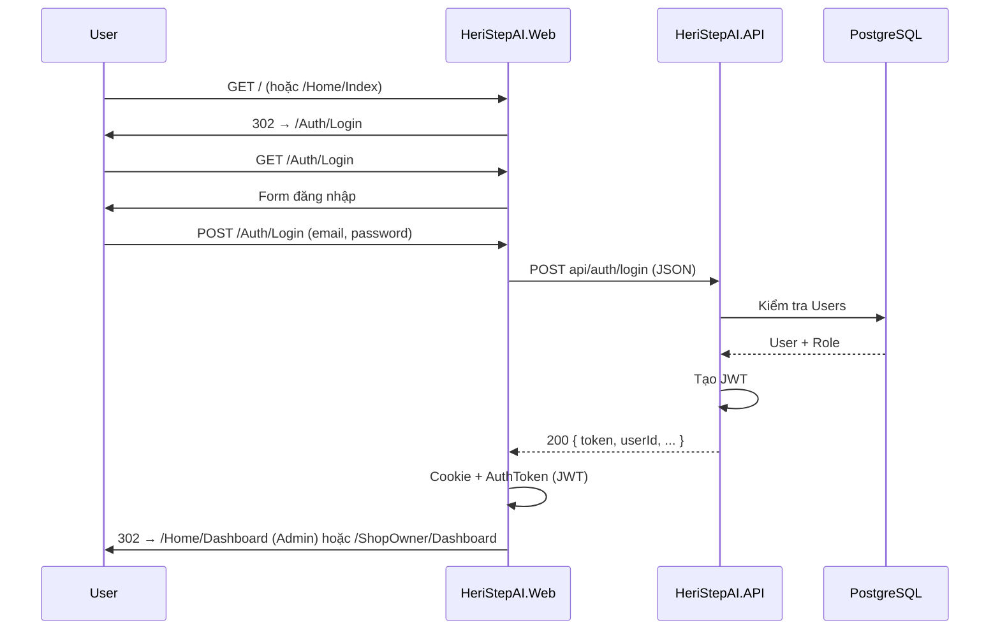
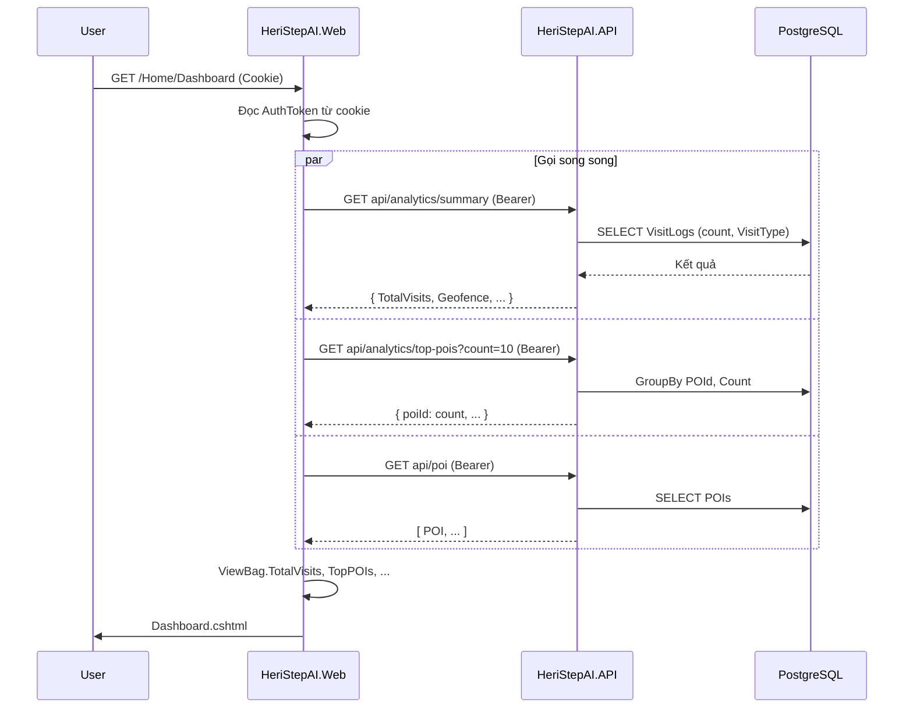
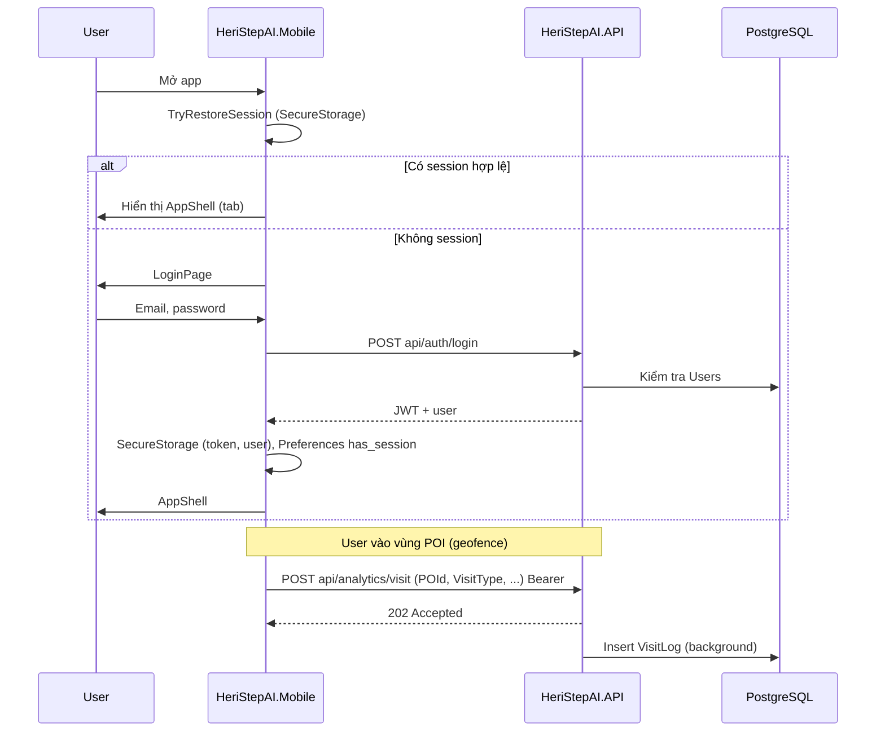
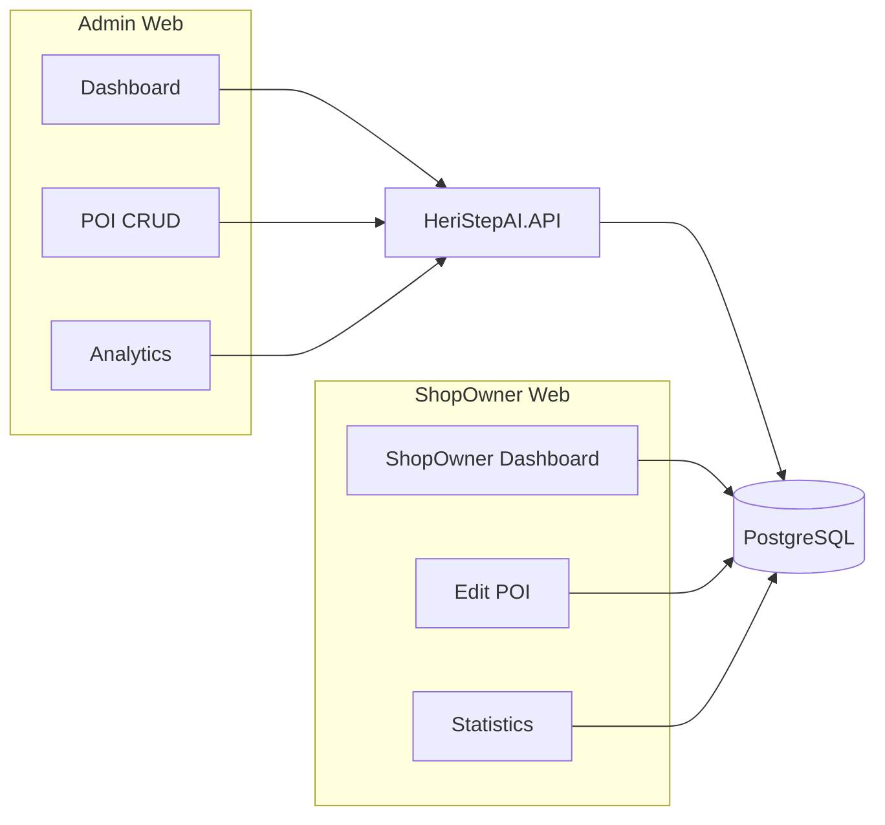

# Sơ đồ flow hệ thống HeriStepAI (Mermaid)

Mở file này trong editor hỗ trợ Mermaid (VS Code với extension, GitHub, GitLab, Notion, draw.io có thể import Mermaid) hoặc paste đoạn code dưới vào https://mermaid.live/.

---

## Sơ đồ 1: Tổng quan thành phần và luồng dữ liệu

### Giải thích chi tiết – Sơ đồ 1

| Thành phần | Ý nghĩa |
|------------|--------|
| **Users** | Ba loại người dùng: **Admin** (quản trị toàn hệ thống qua web), **ShopOwner** (chủ điểm POI, quản lý POI qua web), **Khách du lịch** (dùng app mobile để xem POI và ghi visit). |
| **HeriStepAI.Web :5001** | Ứng dụng web MVC chạy cổng 5001. Dùng **cookie** để lưu session và lưu **JWT trong cookie** (AuthToken) sau khi đăng nhập. Admin và ShopOwner đều truy cập qua đây. |
| **HeriStepAI.API :5000** | API REST chạy cổng 5000. Mọi request từ Web (Admin) và App đều xác thực bằng **JWT Bearer** trong header. |
| **PostgreSQL** | Cơ sở dữ liệu chính: bảng **Users** (đăng nhập, role), **POIs** (điểm tham quan), **POIContents** (nội dung đa ngôn ngữ), **VisitLogs** (lịch sử khách ghé thăm). Có thể dùng Supabase hoặc PostgreSQL local. |
| **Supabase Storage** | Lưu **ảnh POI**. Web upload ảnh khi Admin/ShopOwner tạo hoặc sửa POI; URL ảnh lưu trong DB. |

**Các mũi tên (luồng):**

- **Admin → Web:** (1) Mở trang chủ `/`, (2) POST `/Auth/Login` để đăng nhập, (3) Sau khi đăng nhập xem Dashboard, quản lý POI, xem Analytics.
- **ShopOwner → Web:** Đăng nhập tương tự, sau đó dùng Dashboard riêng, chỉnh sửa POI của mình, xem thống kê visit.
- **Khách du lịch → API (qua App):** App không qua Web; gọi API trực tiếp để đăng nhập, GET danh sách POI, POST `analytics/visit` khi vào vùng POI. JWT lưu trong **SecureStorage** trên thiết bị.
- **Web → API:** Khi Admin xem Dashboard/POI/Analytics, Web gửi request với **Bearer JWT** (lấy từ cookie) tới các endpoint: `auth/login`, `poi`, `analytics/summary`, `analytics/top-pois`, `poi/{id}/statistics`.
- **Web -.-→ DB (nét đứt):** **ShopOwner** đọc/ghi **trực tiếp** DB qua **DbContext** trong Web (cùng connection string với API), không đi qua API. Đây là luồng riêng so với Admin.
- **Web → Supabase Storage:** Khi tạo/sửa POI, Web upload ảnh lên bucket Supabase Storage.
- **API → DB:** API dùng **EF Core** để đọc/ghi Users, POI, VisitLogs (đăng nhập, danh sách POI, ghi visit từ App).

---

## Sơ đồ 2: Flow đăng nhập Web (Admin / ShopOwner)

### Giải thích chi tiết – Sơ đồ 2

| Bước | Hành động | Giải thích |
|------|-----------|------------|
| 1 | User gửi **GET /** (hoặc `/Home/Index`) | Truy cập trang chủ. Nếu chưa đăng nhập, Web trả về redirect. |
| 2 | Web trả **302 → /Auth/Login** | Redirect trình duyệt tới trang đăng nhập. |
| 3 | User gửi **GET /Auth/Login** | Trình duyệt request trang form đăng nhập. |
| 4 | Web trả **form đăng nhập** | Hiển thị form email + password (Razor view). |
| 5 | User gửi **POST /Auth/Login** (email, password) | Submit form. Web nhận dữ liệu từ form. |
| 6 | Web gọi **POST api/auth/login** (JSON) | Web chuyển tiếp sang API (gửi email, password dạng JSON). API là nơi kiểm tra user. |
| 7 | API truy vấn **DB (Users)** | Kiểm tra email tồn tại, verify password (hash), lấy role (Admin/ShopOwner). |
| 8 | DB trả **User + Role** | API biết user hợp lệ và role để phân quyền. |
| 9 | API **tạo JWT** | Ký token chứa userId, role, expiry. |
| 10 | API trả **200 { token, userId, ... }** | Web nhận JWT và thông tin user. |
| 11 | Web ghi **Cookie + AuthToken (JWT)** | Lưu JWT vào cookie (httpOnly nếu có) để các request sau gửi kèm. |
| 12 | Web trả **302** tới Dashboard | **Admin** → `/Home/Dashboard`, **ShopOwner** → `/ShopOwner/Dashboard`. Trình duyệt chuyển sang trang tương ứng. |

---

## Sơ đồ 3: Flow Dashboard Admin (Web → API)

### Giải thích chi tiết – Sơ đồ 3

| Bước | Hành động | Giải thích |
|------|-----------|------------|
| 1 | User gửi **GET /Home/Dashboard** (kèm Cookie) | Admin đã đăng nhập; trình duyệt gửi cookie chứa session/JWT. |
| 2 | Web **đọc AuthToken từ cookie** | Web lấy JWT từ cookie để gửi lên API dưới dạng header `Authorization: Bearer <token>`. |
| 3 | Web gọi **ba API song song** (par) | Để Dashboard load nhanh, Web gửi đồng thời 3 request thay vì gọi tuần tự. |
| 3a | **GET api/analytics/summary** (Bearer) | Lấy tổng quan: tổng lượt visit, phân loại theo VisitType (Geofence, Manual, …). API truy vấn VisitLogs (count, group by VisitType) rồi trả JSON. |
| 3b | **GET api/analytics/top-pois?count=10** (Bearer) | Lấy top 10 POI có nhiều visit nhất. API group by POId, count, sort, trả về danh sách. |
| 3c | **GET api/poi** (Bearer) | Lấy danh sách POI (để hiển thị bảng, dropdown, v.v.). API SELECT POIs từ DB. |
| 4 | API truy vấn **DB** (VisitLogs, POIs) | Mỗi endpoint dùng EF Core đọc bảng tương ứng. |
| 5 | Web nhận 3 response, gán **ViewBag** | ViewBag.TotalVisits, ViewBag.TopPOIs, danh sách POI để truyền sang view. |
| 6 | Web render **Dashboard.cshtml** | View Razor dùng dữ liệu trong ViewBag/Model để hiển thị số liệu, biểu đồ, bảng POI cho Admin. |

---

## Sơ đồ 4: Flow App Mobile – Đăng nhập và ghi visit

### Giải thích chi tiết – Sơ đồ 4

| Bước | Hành động | Giải thích |
|------|-----------|------------|
| 1 | User **mở app** | Ứng dụng mobile (HeriStepAI.Mobile) khởi động. |
| 2 | App gọi **TryRestoreSession (SecureStorage)** | App đọc JWT và thông tin user từ **SecureStorage** (keychain/keystore). Nếu token còn hạn và hợp lệ → coi như đã đăng nhập. |
| 3a | **Có session hợp lệ** | App chuyển thẳng tới **AppShell** (màn hình chính với tab), không hiện màn hình đăng nhập. |
| 3b | **Không session** | Hiển thị **LoginPage**. User nhập email, password. App gọi **POST api/auth/login**. API kiểm tra DB, trả JWT + user. App lưu token và user vào **SecureStorage**, đánh dấu Preferences (has_session), rồi chuyển sang AppShell. |
| 4 | **User vào vùng POI (geofence)** | App dùng GPS/geofencing; khi user vào vùng bán kính quanh POI, app coi là “đã ghé thăm”. |
| 5 | App gửi **POST api/analytics/visit** (POId, VisitType, …) với **Bearer** | Gửi POI id, loại visit (Geofence/Manual), có thể kèm thời gian. API xác thực JWT, nhận payload. |
| 6 | API trả **202 Accepted** | API chấp nhận request, có thể ghi DB đồng bộ hoặc hàng đợi. |
| 7 | API **Insert VisitLog** (có thể background) | Ghi một dòng vào bảng VisitLogs (UserId, POId, VisitType, Timestamp, …) để sau này Web (Admin/ShopOwner) xem thống kê. |

---

## Sơ đồ 5: Phân tách nguồn dữ liệu (Web)

### Giải thích chi tiết – Sơ đồ 5

Sơ đồ này nhấn mạnh **hai cách Web lấy dữ liệu** tùy vai trò:

| Nhánh | Thành phần | Nguồn dữ liệu | Giải thích |
|-------|------------|----------------|------------|
| **Admin Web** | Dashboard (D), POI CRUD (P), Analytics (AN) | **Luôn qua API** | Admin dùng các trang Web (Dashboard, quản lý POI, Analytics). Web **không** đọc DB trực tiếp; mỗi trang gọi **HeriStepAI.API** với Bearer JWT. API dùng EF Core đọc/ghi **PostgreSQL**. Cách này thống nhất logic nghiệp vụ ở API, dễ bảo trì và tái dùng cho App. |
| **ShopOwner Web** | ShopOwner Dashboard (SD), Edit POI (SE), Statistics (ST) | **Trực tiếp DB** | ShopOwner chỉ xem/sửa POI và thống kê **của mình**. Web dùng **DbContext** (cùng connection string với API) để truy vấn trực tiếp **PostgreSQL** (bảng POIs, VisitLogs, …), **không** gọi API. Giảm số request qua API và tận dụng filter theo ShopOwnerId trong Web. |

**Tóm tắt:** Admin → Web → **API** → DB; ShopOwner → Web → **DB** trực tiếp. App luôn dùng API → DB.

---

**Chú thích:**
- **Admin:** Cookie + JWT trong cookie; mọi request Dashboard/POI/Analytics đều gọi API với Bearer.
- **ShopOwner:** Đọc/ghi DB qua DbContext (cùng DB với API), không gọi API cho Dashboard/Edit/Statistics.
- **App:** JWT trong SecureStorage; gọi API trực tiếp (auth, poi, analytics/visit).
